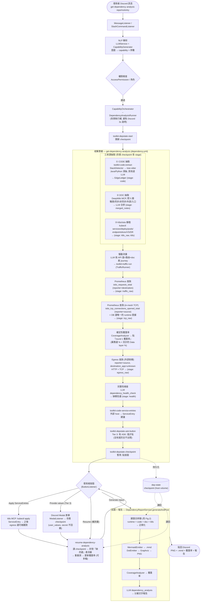
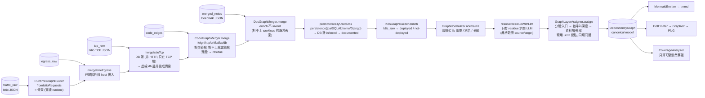

# DepWeaver：使用者下指令後，背後發生什麼

> **DepWeaver** — 基於多源證據融合與對話式補值的微服務相依圖自動建構方法
> A Multi-Evidence Fusion Approach to Automated Microservice Dependency Graph Construction with Conversational Gap-Filling
>
> 設計立場：**確定性優先、LLM 只補殘餘**
>
> 名字裡的 *weave*（織）指的就是核心設計：runtime（Istio 觀測）、code（tree-sitter 抽取）、doc（DeepWiki）三種證據**織成同一張圖**，而不是三選一。工具產出的每一張圖、每一份報告都會帶這個名字（`DependencyGraph.TOOL_NAME`），所以圖離開 Discord 之後——貼進投影片、論文——還認得出來源。
>
> 本文的圖有固定編號，討論時直接叫編號：
>
> | 編號 | 圖名 | 正式版（draw.io） | 本文（Mermaid） |
> |---|---|---|---|
> | **Fig.1** | 端到端流程總覽（Pipeline Overview） | `docs/diagrams/fig1-pipeline-overview.drawio` | ✔ |
> | **Fig.2** | 證據合併鏈（Evidence Merge Chain） | `docs/diagrams/fig2-evidence-merge-chain.drawio` | ✔ |
> | **Fig.3** | 分層相依圖（Layered Dependency Graph） | — 工具自動產出，不手畫 | `docs/train-ticket-greenfield-graph-layered.mmd` |
> | **Fig.4** | 對話補值迴圈（Interactive Gap-Filling Loop） | Fig.1 裡「Provide values」那條分支 | ✔ |
>
> **兩個版本並存、職責不同**：draw.io 是**對外交付的正式圖**（排版可控、可匯出高解析度給投影片/論文）；下面的 Mermaid 是**跟著程式碼維護的活文件**（GitHub 直接渲染、可 grep、可 diff）。改流程時先改 Mermaid，交出去之前同步 draw.io。詳見 `docs/diagrams/README.md`。
>
> 注意界線：**只有這兩張說明用流程圖是 draw.io 手畫的**；Fig.3 那種依賴圖是程式即時生成的（一次可能 50 個節點、每次都不同），維持 Graphviz / Mermaid。

這份文件畫出 `get dependency analysis` 從**使用者在 Discord 打一句話**，到**貼回一張依賴圖 + 覆蓋率 + 報告**的完整流程。內容對照實際程式碼與管線設定（`capability/devops-tool/dependency.yml`、`Service/DependencyAnalysis/*`、`Service/DiscordService/*`、`Service/NLPService/*`），不是示意。

四個關鍵設計：
- **三來源**：runtime（Istio 觀測）、code（tree-sitter 抽取）、doc（DeepWiki）——互補，不是三選一。
- **確定性優先**：圖與覆蓋率盡量用程式碼確定性算，LLM 只處理對不上的殘餘。
- **收集與出圖分離**：收集階段存進 checkpoint（可暫停/補流量/resume），使用者按「Generate report」才從 checkpoint 出圖，不重跑。
- **補值四層、最後才問人**：驅動流量需要語意正確的 payload。① 挖 repo 自己的範例請求 ② 把 4xx 回應餵回去讓 LLM 自己修 ③ **真的推不出來才反問使用者**（Tier 3）④ 連人都給不了才誠實標 UNREACHABLE。

---

## Fig.1 · 端到端流程總覽（Pipeline Overview）

---

## Fig.2 · 證據合併鏈（Evidence Merge Chain）

`postRuntimeGraph` 的核心。

出圖時**確定性**把三來源疊起來，再正規化；LLM 只收殘餘。邊的線型反映信心層級。

**三層信心（`DependencyGraph.addEdge` 取 max，線型對應）**：

| 線型 | 意義 | 來源 |
|---|---|---|
| **實線** | runtime observed（最高信心） | Istio `istio_requests_total` 真的看到；**DB 這種非 HTTP 的相依則是 `istio_tcp_connections_opened_total`**（Istio 只對 HTTP/gRPC 產 requests 指標，資料庫連線是不透明 TCP，只在這條看得到） |
| **虛線 dashed** | code/doc 證實「真的用」（documented） | 有 repository/@Entity/持久化 code、或 doc configured |
| **點線 dotted `?`** | 只宣告、未證實（inferred，最弱） | 只有 datasource URL / pom 宣告，無使用證據 |

未部署節點（K8sGraphBuilder 判定）= 灰底紅框虛線標 `(not deployed)`。

**分層（`GraphLayerAssigner`，確定性）**：出圖前把節點排成上下層——

| 層 | 內容 | 怎麼決定 |
|---|---|---|
| 0 | ingress / 入口服務 | gateway 節點；greenfield 沒有 gateway，就用「沒有人呼叫它」的服務（BoA = frontend） |
| 1..n | 業務服務 | 從入口算**最長路徑**深度。用最長不用最短：一個既被直接呼叫、又在鏈尾被呼叫的服務，要排在鏈的**下面**，否則箭頭會往回指、層次就讀不出來 |
| n+1 | 資料層（db / queue） | 相依鏈的終點，永遠在最深的服務之下 |
| n+2 | 外部 host | 再往下一層 |
| 最後 | `no dependencies found` | 完全沒有邊的節點。不是入口，是「抽取沒抽到東西」——這層本身就是誠實的缺口清單 |

**環是預期的、不是錯誤**：微服務互相呼叫很常見（train-ticket 就有），用 Tarjan SCC 縮點後再分層，同一個環的成員落在同一層——環裡本來就沒有「誰先誰後」。

驗證（train-ticket 52 邊那張）：分層後 **51 條邊 100% 由上往下**（0 條向上、0 條同層穿越），入口層從 31 個節點縮到 12 個真入口，其餘 19 個沒有任何邊的節點被誠實地分到最後一層。對照圖：`docs/train-ticket-greenfield-graph-layered.mmd`。

---

## 各階段對應的程式碼

| 階段 | 觸發/實作 |
|---|---|
| 進入 & NLP | `DiscordService/{MessageListener,SlashCommandListener}` → `NLPService/{LLMService,CapabilityGenerator}` → `CapabilityOrchestrator` |
| 背景執行 | `DiscordService/DependencyAnalysisRunner`（+ `UserContextHolder`），解 Discord 3 秒 ack |
| 管線編排 | `capability/devops-tool/dependency.yml`（`get-` 與 `resume-` 兩個 operation） |
| CODE 抽取 | `CodeExtraction/{StackDetector,TreeSitterExtractor,*.scm,LlmCodeExtractor,EdgeLedger,ConfigExtractor,ExternalHostDetector}` |
| DOC 抽取 | DeepWiki MCP（`toolkit-mcp-*`）+ `prompts/deepwiki_*` |
| K8s/Istio | k8s MCP fork（`toolkit-mcp-call-tool execute_kubectl`）+ `prompts/k8s_runtime_notes.txt` |
| 流量 | `prompts/traffic_scenario_generation.txt` + `Traffic/{TrafficRunner,TrafficScenario}` |
| 對話問人（Tier 3） | `Traffic/AskItem` + `DepstateToolkit.toolkitDepstateAskButton` → `ButtonListener`（開 Modal）→ `DiscordService/ModalListener`（存值 + 自動 resume）；checkpoint 兩個 stage：`pending_asks` / `user_values` |
| runtime/egress | `toolkit-prometheus-query` + `prompts/{istio_runtime_edges,istio_egress_edges}.txt` |
| checkpoint | `DependencyAnalysisStateStore` + `DepstateToolkit`（`dep-state` host volume） |
| 按鈕 | `DiscordService/ButtonListener`（Apply / Resume / Generate report） |
| 建圖 & 報告 | `DependencyReportService.generateAndPost` → `Graph/*` + `prompts/dependency_analysis.txt` |

> 註：**Tier 3「對話問人」是唯一由工具主動開口的一步。** 產生器只有在確定值推不出來時，才在 collection 裡宣告一個空值 + `ASK:` 描述的變數（仍是合法 Postman collection，和 `UNREACHABLE:` 同一種手法）。需要那個值的請求**不會半填就送出**——runner 標成 `[WAIT]` 扣住，等使用者從 Modal 填完，自動 resume 重送。已回答的值存在 checkpoint，整個 run 只問一次。
>
> 註：`resume-dependency-analysis` 是**覆蓋率導向迴圈**——用確定性覆蓋率算出「還沒被觀測到的 service→service 邊」當權威目標，產針對性流量、重量測、更新覆蓋率，可多輪，直到使用者按 Generate report。昂貴階段（repo clone、DeepWiki 問答）從 checkpoint 取回、不重跑。
