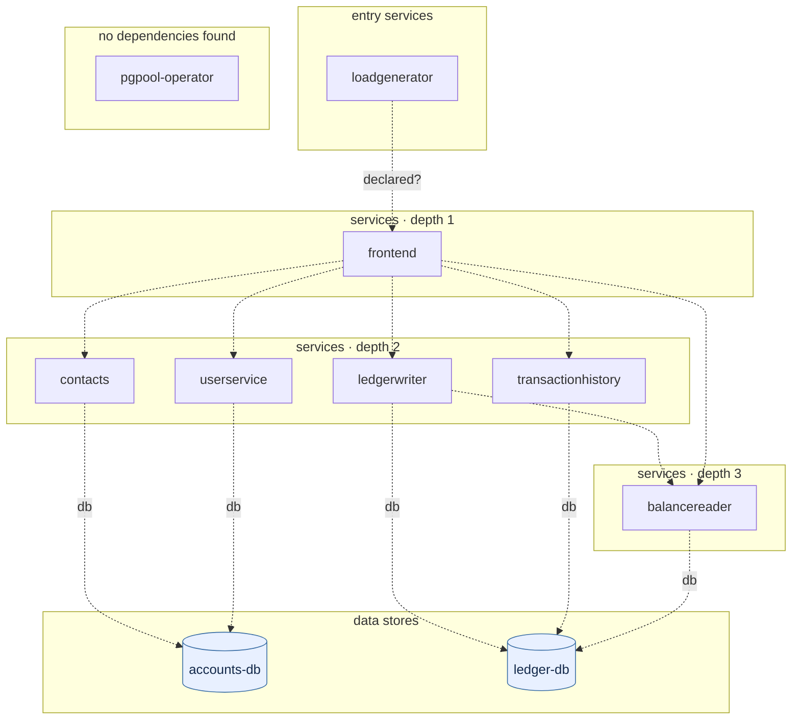

## stacks
- java/spring (FRAMEWORK, from pom.xml)
- python/web (FRAMEWORK, from pyproject.toml)
- javascript (LLM, from 11 .js/.jsx/.ts/.tsx files)   <-- skipped (LLM tier)

## ledger sections
- config = 42
- http-server = 39
- jpa = 12
- url = 8
- persistence = 2
- k8s-workload = 40
- workload-env = 87
- env-address = 37
- service-root = 10
- TOTAL = 277 | files with syntax errors = 0

## graph
- after merge: 10 nodes / 12 edges | after normalize: 10 nodes / 12 edges | unresolved code edges = 6
- persistence services: [balancereader, ledgerwriter, transactionhistory, contacts, userservice]

## nodes (kind, layer)
- accounts-db  [db, L4]
- balancereader  [service, L3]
- contacts  [service, L2]
- frontend  [service, L1]
- ledger-db  [db, L4]
- ledgerwriter  [service, L2]
- loadgenerator  [service, L0]
- pgpool-operator  [service, L5]
- transactionhistory  [service, L2]
- userservice  [service, L2]

## edges (type, confidence, evidence)
- balancereader -> ledger-db  (db, documented)  code: kubernetes-manifests/balance-reader.yaml
- contacts -> accounts-db  (db, documented)  code: kubernetes-manifests/contacts.yaml
- frontend -> balancereader  (sync-http, documented)  code: src/frontend/frontend.py:667
- frontend -> contacts  (sync-http, documented)  code: src/frontend/frontend.py:672
- frontend -> ledgerwriter  (sync-http, documented)  code: src/frontend/frontend.py:663
- frontend -> transactionhistory  (sync-http, documented)  code: src/frontend/frontend.py:669
- frontend -> userservice  (sync-http, documented)  code: src/frontend/frontend.py:665
- ledgerwriter -> balancereader  (sync-http, documented)  code: src/ledger/ledgerwriter/src/main/java/anthos/samples/bankofanthos/ledgerwriter/LedgerWriterController.java:86
- ledgerwriter -> ledger-db  (db, documented)  code: kubernetes-manifests/ledger-writer.yaml
- loadgenerator -> frontend  (sync-http, inferred)  code: kubernetes-manifests/loadgenerator.yaml
- transactionhistory -> ledger-db  (db, documented)  code: kubernetes-manifests/transaction-history.yaml
- userservice -> accounts-db  (db, documented)  code: kubernetes-manifests/userservice.yaml

## unresolved (source hint / raw target / file:line), first 40
- frontend  =>  http://{}/transactions   @ src/frontend/frontend.py:662
- frontend  =>  http://{}/users   @ src/frontend/frontend.py:664
- frontend  =>  http://{}/balances   @ src/frontend/frontend.py:666
- frontend  =>  http://{}/transactions   @ src/frontend/frontend.py:668
- frontend  =>  http://{}/login   @ src/frontend/frontend.py:670
- frontend  =>  http://   @ src/frontend/frontend.py:685

## mermaid

