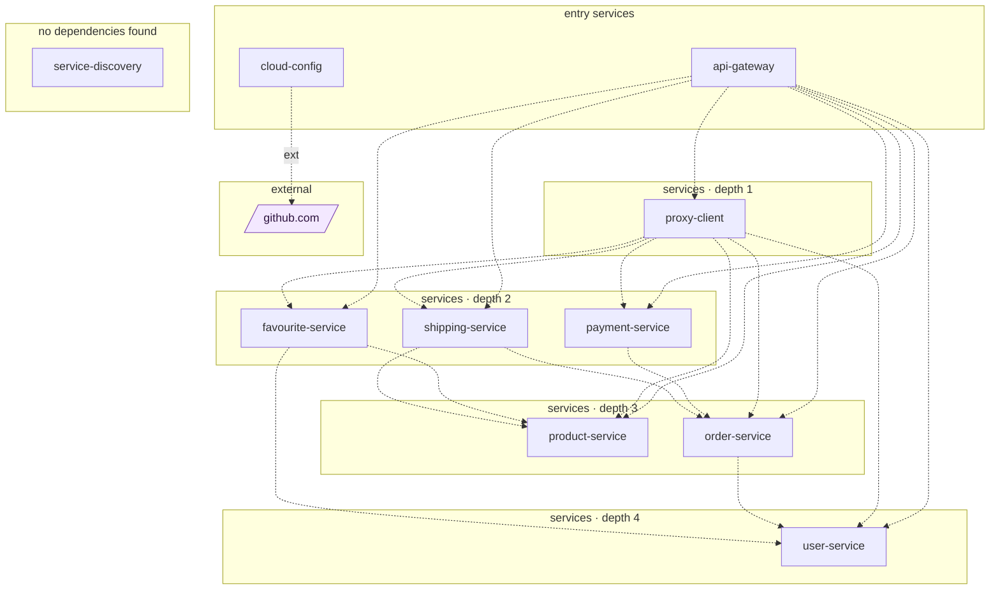

## stacks
- java/spring (FRAMEWORK, from pom.xml)

## ledger sections
- url-constant = 84
- url = 60
- http-server = 128
- jpa = 28
- feign = 33
- compose-service = 21
- config = 46
- service-root = 10
- TOTAL = 410 | files with syntax errors = 0

## graph
- after merge: 11 nodes / 20 edges | after normalize: 11 nodes / 20 edges | unresolved code edges = 0
- persistence services: [product-service, shipping-service, payment-service, favourite-service, order-service, user-service]

## nodes (kind, layer)
- api-gateway  [service, L0]
- cloud-config  [service, L0]
- favourite-service  [service, L2]
- github.com  [external, L5]
- order-service  [service, L3]
- payment-service  [service, L2]
- product-service  [service, L3]
- proxy-client  [service, L1]
- service-discovery  [service, L6]
- shipping-service  [service, L2]
- user-service  [service, L4]

## edges (type, confidence, evidence)
- api-gateway -> favourite-service  (sync-http, documented)  code: api-gateway/src/main/resources/application.yml
- api-gateway -> order-service  (sync-http, documented)  code: api-gateway/src/main/resources/application.yml
- api-gateway -> payment-service  (sync-http, documented)  code: api-gateway/src/main/resources/application.yml
- api-gateway -> product-service  (sync-http, documented)  code: api-gateway/src/main/resources/application.yml
- api-gateway -> proxy-client  (sync-http, documented)  code: api-gateway/src/main/resources/application.yml
- api-gateway -> shipping-service  (sync-http, documented)  code: api-gateway/src/main/resources/application.yml
- api-gateway -> user-service  (sync-http, documented)  code: api-gateway/src/main/resources/application.yml
- cloud-config -> github.com  (external, documented)  code: cloud-config/src/main/resources/application.yml
- favourite-service -> product-service  (sync-http, documented)  code: favourite-service/src/main/java/com/selimhorri/app/constant/AppConstant.java:21
- favourite-service -> user-service  (sync-http, documented)  code: favourite-service/src/main/java/com/selimhorri/app/constant/AppConstant.java:18
- order-service -> user-service  (sync-http, documented)  code: order-service/src/main/java/com/selimhorri/app/constant/AppConstant.java:18
- payment-service -> order-service  (sync-http, documented)  code: payment-service/src/main/java/com/selimhorri/app/constant/AppConstant.java:24
- proxy-client -> favourite-service  (sync-http, documented)  code: proxy-client/src/main/java/com/selimhorri/app/business/favourite/service/FavouriteClientService.java:19
- proxy-client -> order-service  (sync-http, documented)  code: proxy-client/src/main/java/com/selimhorri/app/business/order/service/OrderClientService.java:19
- proxy-client -> payment-service  (sync-http, documented)  code: proxy-client/src/main/java/com/selimhorri/app/business/payment/service/PaymentClientService.java:19
- proxy-client -> product-service  (sync-http, documented)  code: proxy-client/src/main/java/com/selimhorri/app/business/product/service/ProductClientService.java:19
- proxy-client -> shipping-service  (sync-http, documented)  code: proxy-client/src/main/java/com/selimhorri/app/business/orderItem/service/OrderItemClientService.java:19
- proxy-client -> user-service  (sync-http, documented)  code: proxy-client/src/main/java/com/selimhorri/app/business/user/service/UserClientService.java:19
- shipping-service -> order-service  (sync-http, documented)  code: shipping-service/src/main/java/com/selimhorri/app/constant/AppConstant.java:24
- shipping-service -> product-service  (sync-http, documented)  code: shipping-service/src/main/java/com/selimhorri/app/constant/AppConstant.java:21

## unresolved (source hint / raw target / file:line), first 40

## mermaid

