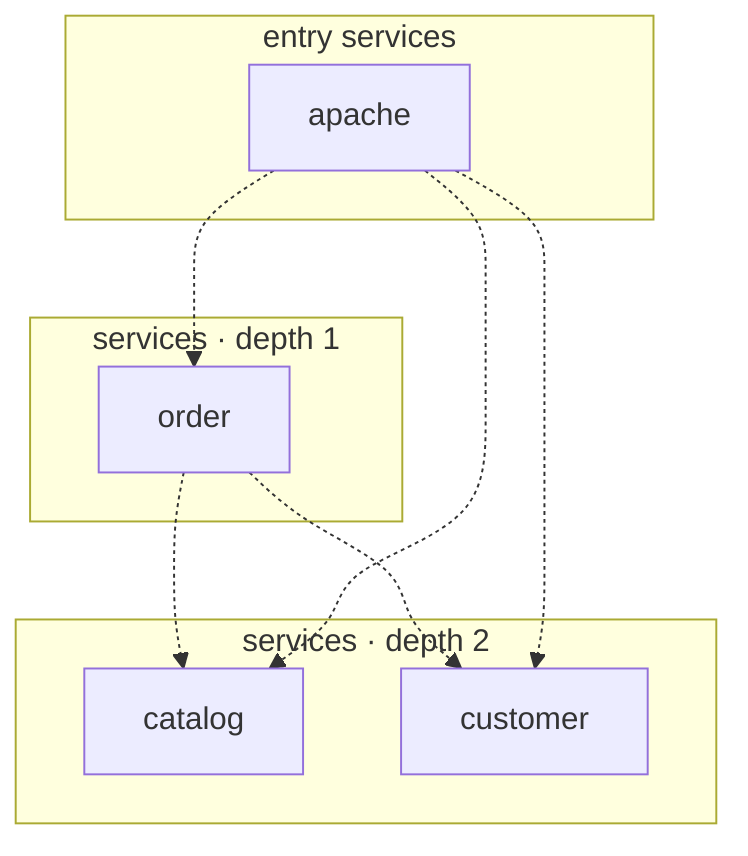

## stacks
- java/spring (FRAMEWORK, from pom.xml)

## ledger sections
- http-server = 20
- jpa = 5
- config = 2
- url = 8
- k8s-workload = 4
- service-root = 4
- TOTAL = 43 | files with syntax errors = 0

## graph
- after merge: 4 nodes / 5 edges | after normalize: 4 nodes / 5 edges | unresolved code edges = 0
- persistence services: [catalog, order, customer]

## nodes (kind, layer)
- apache  [service, L0]
- catalog  [service, L2]
- customer  [service, L2]
- order  [service, L1]

## edges (type, confidence, evidence)
- apache -> catalog  (sync-http, documented)  code: microservice-kubernetes-demo/apache/000-default.conf:17
- apache -> customer  (sync-http, documented)  code: microservice-kubernetes-demo/apache/000-default.conf:20
- apache -> order  (sync-http, documented)  code: microservice-kubernetes-demo/apache/000-default.conf:14
- order -> catalog  (sync-http, documented)  code: microservice-kubernetes-demo/microservice-kubernetes-demo-order/src/main/java/com/ewolff/microservice/order/clients/CatalogClient.java:36
- order -> customer  (sync-http, documented)  code: microservice-kubernetes-demo/microservice-kubernetes-demo-order/src/main/java/com/ewolff/microservice/order/clients/CustomerClient.java:38

## unresolved (source hint / raw target / file:line), first 40

## mermaid

