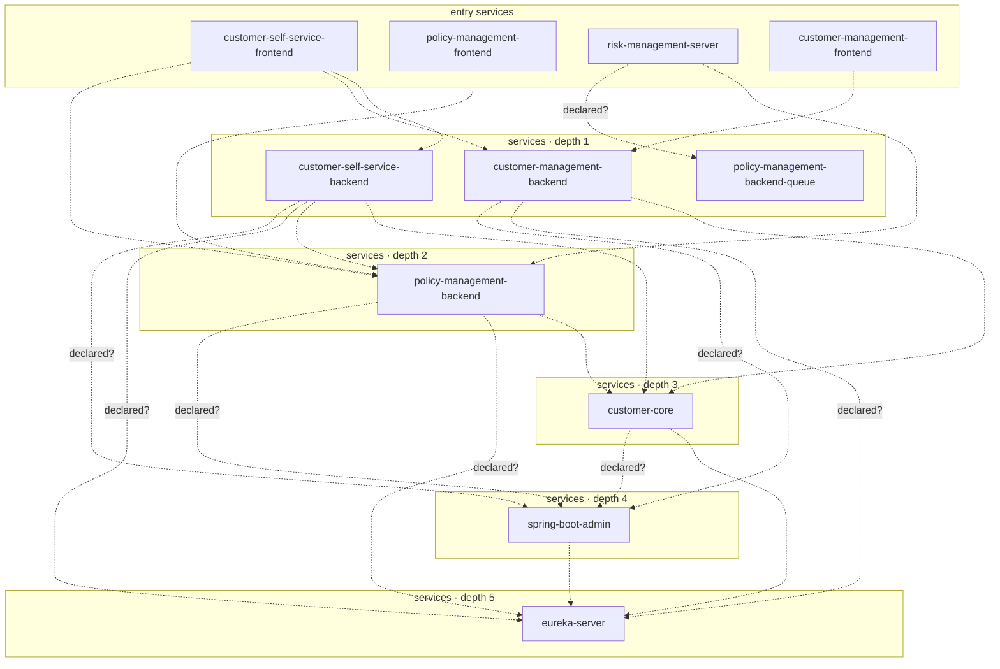

## stacks
- java/spring (FRAMEWORK, from pom.xml)
- javascript (LLM, from 97 .js/.jsx/.ts/.tsx files)   <-- skipped (LLM tier)

## ledger sections
- url = 8
- jpa = 51
- http-server = 45
- url-constant = 1
- feign = 2
- config = 52
- compose-service = 39
- compose-dependency = 33
- env-address = 23
- workload-env = 38
- k8s-workload = 9
- service-root = 12
- TOTAL = 313 | files with syntax errors = 0

## graph
- after merge: 11 nodes / 20 edges | after normalize: 11 nodes / 20 edges | unresolved code edges = 1
- persistence services: [customer-core, customer-management-backend, policy-management-backend, customer-self-service-backend]

## nodes (kind, layer)
- customer-core  [service, L3]
- customer-management-backend  [service, L1]
- customer-management-frontend  [service, L0]
- customer-self-service-backend  [service, L1]
- customer-self-service-frontend  [service, L0]
- eureka-server  [service, L5]
- policy-management-backend  [service, L2]
- policy-management-backend-queue  [service, L1]
- policy-management-frontend  [service, L0]
- risk-management-server  [service, L0]
- spring-boot-admin  [service, L4]

## edges (type, confidence, evidence)
- customer-core -> eureka-server  (sync-http, documented)  code: docker-compose-eureka.yml
- customer-core -> spring-boot-admin  (sync-http, inferred)  code: docker-compose.yml
- customer-management-backend -> customer-core  (sync-http, documented)  code: customer-management-backend/src/main/java/com/lakesidemutual/customermanagement/infrastructure/CustomerCoreClient.java:20
- customer-management-backend -> eureka-server  (sync-http, inferred)  code: docker-compose-eureka.yml
- customer-management-backend -> spring-boot-admin  (sync-http, inferred)  code: docker-compose.yml
- customer-management-frontend -> customer-management-backend  (sync-http, documented)  code: docker-compose-eureka.yml
- customer-self-service-backend -> customer-core  (sync-http, documented)  code: customer-self-service-backend/src/main/java/com/lakesidemutual/customerselfservice/infrastructure/CustomerCoreRemoteProxy.java:33
- customer-self-service-backend -> eureka-server  (sync-http, inferred)  code: docker-compose-eureka.yml
- customer-self-service-backend -> policy-management-backend  (sync-http, documented)  code: docker-compose-eureka.yml
- customer-self-service-backend -> spring-boot-admin  (sync-http, inferred)  code: docker-compose.yml
- customer-self-service-frontend -> customer-management-backend  (sync-http, documented)  code: docker-compose-eureka.yml
- customer-self-service-frontend -> customer-self-service-backend  (sync-http, documented)  code: docker-compose-eureka.yml
- customer-self-service-frontend -> policy-management-backend  (sync-http, documented)  code: docker-compose-eureka.yml
- policy-management-backend -> customer-core  (sync-http, documented)  code: policy-management-backend/src/main/java/com/lakesidemutual/policymanagement/infrastructure/CustomerCoreRemoteProxy.java:29
- policy-management-backend -> eureka-server  (sync-http, inferred)  code: docker-compose-eureka.yml
- policy-management-backend -> spring-boot-admin  (sync-http, inferred)  code: docker-compose.yml
- policy-management-frontend -> policy-management-backend  (sync-http, documented)  code: docker-compose-eureka.yml
- risk-management-server -> policy-management-backend  (sync-http, documented)  code: docker-compose-eureka.yml
- risk-management-server -> policy-management-backend-queue  (sync-http, inferred)  code: kubernetes/manifests/risk-management-server.yaml
- spring-boot-admin -> eureka-server  (sync-http, documented)  code: docker-compose-eureka.yml

## unresolved (source hint / raw target / file:line), first 40
- nginx  =>  http://app_servers   @ customer-core/nginx-loadbalancing/nginx/nginx.conf:19

## mermaid

