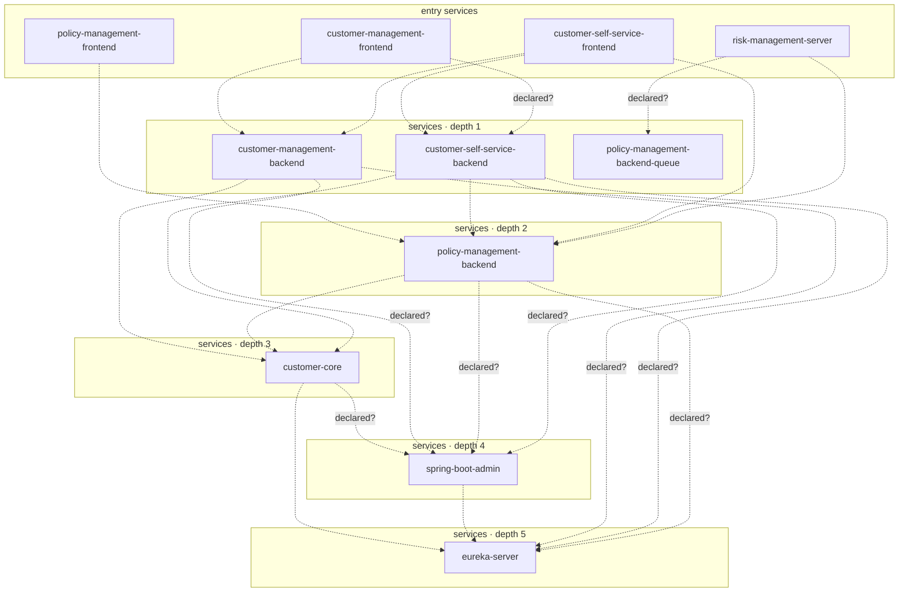

## stacks
- java/spring (FRAMEWORK, from pom.xml)
- javascript (GENERIC, from 97 .js/.mjs/.cjs/.jsx files, package.json; tree-sitter grammar)

## ledger sections
- name-constant = 8
- url = 8
- jpa = 51
- name-ref = 35
- http-server = 45
- url-constant = 1
- feign = 2
- config = 68
- http-client = 10
- compose-service = 39
- compose-dependency = 33
- env-address = 38
- workload-env = 38
- k8s-workload = 9
- k8s-service = 10
- service-root = 12
- module-deps = 11
- TOTAL = 418 | files with syntax errors = 75

## graph
- after merge: 11 nodes / 21 edges | after normalize: 11 nodes / 21 edges | unresolved code edges = 12
- persistence services: [customer-core, customer-management-backend, policy-management-backend, customer-self-service-backend]

## nodes (kind, layer)
- customer-core  [service, L3]
- customer-management-backend  [service, L1]
- customer-management-frontend  [service, L0]
- customer-self-service-backend  [service, L1]
- customer-self-service-frontend  [service, L0]
- eureka-server  [service, L5]
- policy-management-backend  [service, L2]
- policy-management-backend-queue  [service, L1]
- policy-management-frontend  [service, L0]
- risk-management-server  [service, L0]
- spring-boot-admin  [service, L4]

## edges (type, confidence, provenance ref)
- customer-core -> eureka-server  (sync-http, documented)  code: docker-compose-eureka.yml#depends_on
- customer-core -> spring-boot-admin  (sync-http, inferred)  code: customer-core/src/main/resources/application-default.properties
- customer-management-backend -> customer-core  (sync-http, documented)  code: customer-management-backend/src/main/java/com/lakesidemutual/customermanagement/infrastructure/CustomerCoreClient.java:20
- customer-management-backend -> eureka-server  (sync-http, inferred)  code: docker-compose-eureka.yml
- customer-management-backend -> spring-boot-admin  (sync-http, inferred)  code: customer-management-backend/src/main/resources/application-default.properties
- customer-management-frontend -> customer-management-backend  (sync-http, documented)  code: docker-compose-eureka.yml#depends_on
- customer-management-frontend -> customer-self-service-backend  (sync-http, inferred)  code: customer-management-frontend/.env
- customer-self-service-backend -> customer-core  (sync-http, documented)  code: customer-self-service-backend/src/main/java/com/lakesidemutual/customerselfservice/infrastructure/CustomerCoreRemoteProxy.java:33
- customer-self-service-backend -> eureka-server  (sync-http, inferred)  code: docker-compose-eureka.yml
- customer-self-service-backend -> policy-management-backend  (sync-http, documented)  code: docker-compose-eureka.yml#depends_on
- customer-self-service-backend -> spring-boot-admin  (sync-http, inferred)  code: customer-self-service-backend/src/main/resources/application-default.properties
- customer-self-service-frontend -> customer-management-backend  (sync-http, documented)  code: docker-compose-eureka.yml#depends_on
- customer-self-service-frontend -> customer-self-service-backend  (sync-http, documented)  code: docker-compose-eureka.yml#depends_on
- customer-self-service-frontend -> policy-management-backend  (sync-http, documented)  code: docker-compose-eureka.yml#depends_on
- policy-management-backend -> customer-core  (sync-http, documented)  code: policy-management-backend/src/main/java/com/lakesidemutual/policymanagement/infrastructure/CustomerCoreRemoteProxy.java:29
- policy-management-backend -> eureka-server  (sync-http, inferred)  code: docker-compose-eureka.yml
- policy-management-backend -> spring-boot-admin  (sync-http, inferred)  code: policy-management-backend/src/main/resources/application-default.properties
- policy-management-frontend -> policy-management-backend  (sync-http, documented)  code: policy-management-frontend/src/api.js:3
- risk-management-server -> policy-management-backend  (sync-http, documented)  code: docker-compose-eureka.yml#depends_on
- risk-management-server -> policy-management-backend-queue  (sync-http, inferred)  code: kubernetes/manifests/risk-management-server.yaml
- spring-boot-admin -> eureka-server  (sync-http, documented)  code: docker-compose-eureka.yml#depends_on

## unresolved (source hint / raw target / file:line), first 40
- customer-self-service-frontend  =>  null   @ customer-self-service-frontend/src/api/customermanagement.js:17
- customer-self-service-frontend  =>  null   @ customer-self-service-frontend/src/api/policymanagement.js:15
- customer-self-service-frontend  =>  null   @ customer-self-service-frontend/src/api/helpers.js:18
- customer-self-service-frontend  =>  null   @ customer-self-service-frontend/src/api/helpers.js:34
- customer-self-service-frontend  =>  null   @ customer-self-service-frontend/src/api/helpers.js:56
- customer-self-service-frontend  =>  null   @ customer-self-service-frontend/src/api/helpers.js:79
- customer-self-service-frontend  =>  null   @ customer-self-service-frontend/src/api/helpers.js:102
- risk-management-server  =>  /   @ risk-management-server/index.js:68
- policy-management-frontend  =>  null   @ policy-management-frontend/src/api.js:157
- policy-management-frontend  =>  null   @ policy-management-frontend/src/api.js:171
- policy-management-frontend  =>  null   @ policy-management-frontend/src/api.js:193
- proxy  =>  http://app_servers   @ customer-core/nginx-loadbalancing/nginx/nginx.conf:19

## alias questions (name [origin] seen in | candidates)
- policy-management-backend-queue  [graph]  looks like the same service as `policy-management-backend` (one name is the other with a prefix or suffix); both stay on the graph until you say   | candidates: policy-management-backend
- proxy  [code]  the module directory of url at customer-core/nginx-loadbalancing/nginx/nginx.conf:19 — no service on the graph has this name   | candidates: -

## alias answers applied
- none

## mermaid

```mermaid
flowchart TB
%% DepWeaver — microservice dependency graph
%% solid arrow = observed at runtime (Istio) · dashed = declared in code/doc only
%% node shape: [service] ([gateway]) [(db)] {{queue}} [/external/]
  subgraph layer0 ["entry services"]
    direction LR
    customer_self_service_frontend["customer-self-service-frontend"]
    policy_management_frontend["policy-management-frontend"]
    risk_management_server["risk-management-server"]
    customer_management_frontend["customer-management-frontend"]
  end
  subgraph layer1 ["services · depth 1"]
    direction LR
    customer_self_service_backend["customer-self-service-backend"]
    customer_management_backend["customer-management-backend"]
    policy_management_backend_queue["policy-management-backend-queue"]
  end
  subgraph layer2 ["services · depth 2"]
    direction LR
    policy_management_backend["policy-management-backend"]
  end
  subgraph layer3 ["services · depth 3"]
    direction LR
    customer_core["customer-core"]
  end
  subgraph layer4 ["services · depth 4"]
    direction LR
    spring_boot_admin["spring-boot-admin"]
  end
  subgraph layer5 ["services · depth 5"]
    direction LR
    eureka_server["eureka-server"]
  end
  customer_management_backend -.-> customer_core
  policy_management_backend -.-> customer_core
  customer_self_service_backend -.-> customer_core
  policy_management_frontend -.-> policy_management_backend
  customer_core -.-> eureka_server
  customer_management_frontend -.-> customer_management_backend
  customer_self_service_backend -.-> policy_management_backend
  customer_self_service_frontend -.-> customer_self_service_backend
  customer_self_service_frontend -.-> customer_management_backend
  customer_self_service_frontend -.-> policy_management_backend
  spring_boot_admin -.-> eureka_server
  risk_management_server -.-> policy_management_backend
  customer_core -. declared? .-> spring_boot_admin
  customer_management_backend -. declared? .-> spring_boot_admin
  policy_management_backend -. declared? .-> spring_boot_admin
  customer_self_service_backend -. declared? .-> spring_boot_admin
  customer_management_frontend -. declared? .-> customer_self_service_backend
  customer_management_backend -. declared? .-> eureka_server
  customer_self_service_backend -. declared? .-> eureka_server
  policy_management_backend -. declared? .-> eureka_server
  risk_management_server -. declared? .-> policy_management_backend_queue

```

## 規則觸發
計數＝該規則改變了多少個不同的東西（邊、節點、名稱、檔案；同一個東西重複碰到算一次）；括號內最多列 5 個例子。
- rule 1: 12 (not-preadded eureka-server; not-preadded proxy; not-preadded risk-management-client; node customer-self-service-backend; node policy-management-backend)
- rule 2: 0
- rule 3: 0
- rule 4: 1 (table customercore.baseURL=http://customer-core)
- rule 5: 4 (env ACTIVEMQ_HOST=policy-management-backend; env ACTIVEMQ_HOST=policy-management-backend-queue; key host=/; key host=localhost)
- rule 6: 1 (url http://app_servers)
- rule 7: 20 (env customer-core.EUREKA_CLIENT_SERVICEURL_DEFAULTZONE=eureka-server; env customer-management-backend.EUREKA_CLIENT_SERVICEURL_DEFAULTZONE=eureka-server; env customer-management-frontend.REACT_APP_CUSTOMER_MANAGEMENT_BACKEND=customer-management-backend; env customer-self-service-backend.EUREKA_CLIENT_SERVICEURL_DEFAULTZONE=eureka-server; env customer-self-service-backend.POLICYMANAGEMENT_TCPBROKERBINDADDRESS=policy-management-backend)
- rule 8: 12 (loopback localhost:8110; feign-bean-id customercore; config-signal url; loopback localhost; loopback localhost:8761)
- rule 9: 30 (jpa customer-core/src/main/java/com/lakesidemutual/customercore/domain/customer/CustomerProfileEntity.java; jpa customer-core/src/main/java/com/lakesidemutual/customercore/domain/customer/Address.java; jpa customer-core/src/main/java/com/lakesidemutual/customercore/domain/customer/CustomerId.java; jpa customer-core/src/main/java/com/lakesidemutual/customercore/domain/customer/CustomerAggregateRoot.java; jpa customer-management-backend/src/main/java/com/lakesidemutual/customermanagement/domain/interactionlog/InteractionLogAggregateRoot.java)
- rule 10: 0
- rule 11: 1 (k8s-over-compose 12 compose names ignored)
- rule 12: 1 (links proxy->app)
- rule 13: 3 (drop http://lm.com/ccore; drop http://lm.com/ccore/GetCustomerRequest; drop http://lakesdemutual.com/interfaces/xsd)
- rule 14: 20 (edge customer-core->eureka-server; edge customer-management-backend->eureka-server; edge customer-management-frontend->customer-management-backend; edge customer-self-service-backend->eureka-server; edge customer-self-service-backend->policy-management-backend)
- rule 15: 13 (edge customer-self-service-frontend->customer-self-service-backend :8080; edge customer-self-service-frontend->policy-management-backend :8090; edge customer-self-service-frontend->customer-management-backend :8100; edge policy-management-frontend->policy-management-backend :8090; edge customer-core->spring-boot-admin :9000)
- rule 16: 0
- rule 17: 0
- rule 18: 0
- rule 19: 0
- rule 20: 1 (scoped VUE_APP_POLICY_MANAGEMENT_BACKEND=policy-management-backend @policy-management-frontend)
- rule 21: 0
- rule 22: 0
- rule 23: 0
- rule 24: 0
- rule 25: 0
- rule 26: 0
- rule 27: 0
- rule 28: 0
- rule 29: 0
- rule 30: 0
- rule 31: 0
- rule 32: 0
- rule 33: 0
- rule 34: 0
- rule 35: 12 (documented customer-core->eureka-server; documented customer-management-backend->customer-core; documented customer-management-frontend->customer-management-backend; documented customer-self-service-backend->customer-core; documented customer-self-service-backend->policy-management-backend)
- rule 36: 0
- rule 37: 0
- rule 38: 0
- rule 39: 0
- rule 40: 0
- rule 41: 0
- rule 42: 0
- rule 43: 0
- rule 44: 3 (compose-only eureka-server=eureka-server; compose-only nginx=proxy; map nginx=proxy)
- rule 45: 0
- rule 46: 0
