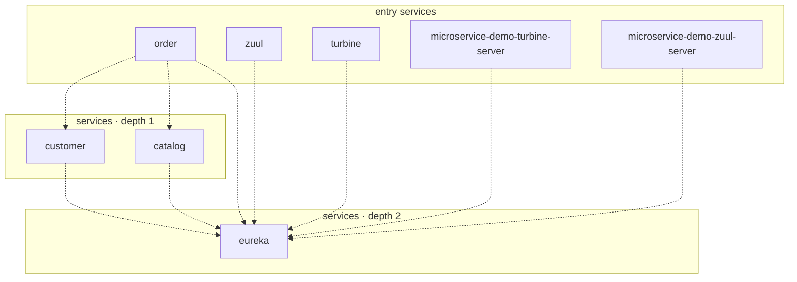

## stacks
- java/spring (FRAMEWORK, from pom.xml)

## ledger sections
- config = 25
- url = 4
- jpa = 5
- http-server = 20
- compose-service = 6
- compose-dependency = 5
- service-root = 13
- TOTAL = 78 | files with syntax errors = 0

## graph
- after merge: 8 nodes / 9 edges | after normalize: 8 nodes / 9 edges | unresolved code edges = 0
- persistence services: [order, catalog, customer]

## nodes (kind, layer)
- catalog  [service, L1]
- customer  [service, L1]
- eureka  [service, L2]
- microservice-demo-turbine-server  [service, L0]
- microservice-demo-zuul-server  [service, L0]
- order  [service, L0]
- turbine  [service, L0]
- zuul  [service, L0]

## edges (type, confidence, evidence)
- catalog -> eureka  (sync-http, documented)  code: docker/docker-compose.yml
- customer -> eureka  (sync-http, documented)  code: docker/docker-compose.yml
- microservice-demo-turbine-server -> eureka  (sync-http, documented)  code: microservice-demo/microservice-demo-turbine-server/src/main/resources/application.yml
- microservice-demo-zuul-server -> eureka  (sync-http, documented)  code: microservice-demo/microservice-demo-zuul-server/src/main/resources/bootstrap.yml
- order -> catalog  (sync-http, documented)  code: microservice-demo/microservice-demo-order/src/main/java/com/ewolff/microservice/order/clients/CatalogClient.java:44
- order -> customer  (sync-http, documented)  code: microservice-demo/microservice-demo-order/src/main/java/com/ewolff/microservice/order/clients/CustomerClient.java:43
- order -> eureka  (sync-http, documented)  code: docker/docker-compose.yml
- turbine -> eureka  (sync-http, documented)  code: docker/docker-compose.yml
- zuul -> eureka  (sync-http, documented)  code: docker/docker-compose.yml

## unresolved (source hint / raw target / file:line), first 40

## mermaid

