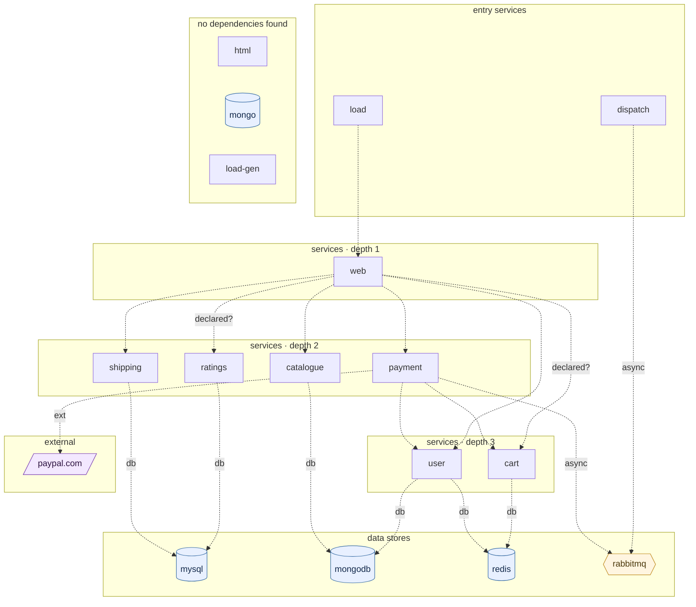

## stacks
- java/spring (FRAMEWORK, from pom.xml)
- php (LLM, from 11 .php files)   <-- skipped (LLM tier)
- javascript (LLM, from 7 .js/.jsx/.ts/.tsx files)   <-- skipped (LLM tier)
- python/web (FRAMEWORK, from requirements.txt)
- go (LLM, from 1 .go files)   <-- skipped (LLM tier)

## ledger sections
- http-server = 10
- url = 11
- jpa = 4
- config = 8
- compose-service = 18
- compose-dependency = 16
- env-address = 2
- workload-env = 2
- k8s-workload = 2
- service-root = 12
- TOTAL = 85 | files with syntax errors = 0

## graph
- after merge: 17 nodes / 18 edges | after normalize: 17 nodes / 18 edges | unresolved code edges = 1
- persistence services: [shipping]

## nodes (kind, layer)
- cart  [service, L3]
- catalogue  [service, L2]
- dispatch  [service, L0]
- html  [service, L6]
- load  [service, L0]
- load-gen  [service, L6]
- mongo  [db, L6]
- mongodb  [db, L4]
- mysql  [db, L4]
- payment  [service, L2]
- paypal.com  [external, L5]
- rabbitmq  [queue, L4]
- ratings  [service, L2]
- redis  [db, L4]
- shipping  [service, L2]
- user  [service, L3]
- web  [service, L1]

## edges (type, confidence, evidence)
- cart -> redis  (db, documented)  code: docker-compose.yaml
- catalogue -> mongodb  (db, documented)  code: docker-compose.yaml
- dispatch -> rabbitmq  (async, documented)  code: docker-compose.yaml
- load -> web  (sync-http, documented)  code: docker-compose-load.yaml
- payment -> cart  (sync-http, documented)  code: payment/payment.py:123
- payment -> paypal.com  (external, documented)  code: payment/payment.py:28
- payment -> rabbitmq  (async, documented)  code: docker-compose.yaml
- payment -> user  (sync-http, documented)  code: payment/payment.py:71
- ratings -> mysql  (db, documented)  code: docker-compose.yaml
- shipping -> mysql  (db, documented)  code: docker-compose.yaml
- user -> mongodb  (db, documented)  code: docker-compose.yaml
- user -> redis  (db, documented)  code: docker-compose.yaml
- web -> cart  (sync-http, inferred)  code: web/default.conf.template:65
- web -> catalogue  (sync-http, documented)  code: docker-compose.yaml
- web -> payment  (sync-http, documented)  code: docker-compose.yaml
- web -> ratings  (sync-http, inferred)  code: web/default.conf.template:77
- web -> shipping  (sync-http, documented)  code: docker-compose.yaml
- web -> user  (sync-http, documented)  code: docker-compose.yaml

## unresolved (source hint / raw target / file:line), first 40
- shipping  =>  http://%s/shipping/   @ shipping/src/main/java/com/instana/robotshop/shipping/Controller.java:23

## mermaid

