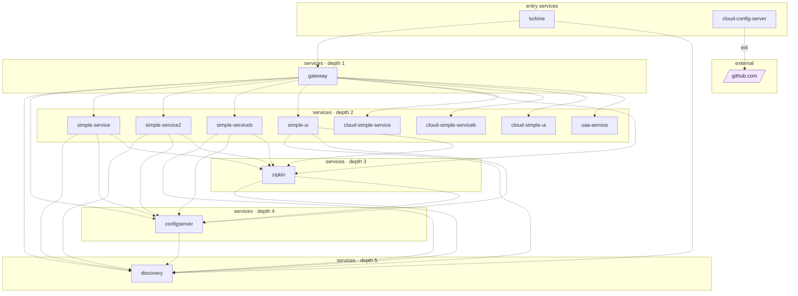

## stacks
- java/spring (FRAMEWORK, from pom.xml)
- javascript (LLM, from 1 .js/.jsx/.ts/.tsx files)   <-- skipped (LLM tier)

## ledger sections
- http-server = 6
- jpa = 1
- http-client = 1
- url = 1
- config = 35
- compose-service = 10
- compose-dependency = 26
- service-root = 18
- TOTAL = 98 | files with syntax errors = 0

## graph
- after merge: 16 nodes / 31 edges | after normalize: 15 nodes / 29 edges | unresolved code edges = 5
- persistence services: [cloud-simple-service]

## nodes (kind, layer)
- cloud-config-server  [service, L0]
- cloud-simple-service  [service, L2]
- cloud-simple-serviceb  [service, L2]
- cloud-simple-ui  [service, L2]
- configserver  [service, L4]
- discovery  [service, L5]
- gateway  [service, L1]
- github.com  [external, L6]
- simple-service  [service, L2]
- simple-service2  [service, L2]
- simple-serviceb  [service, L2]
- simple-ui  [service, L2]
- turbine  [service, L0]
- uaa-service  [service, L2]
- zipkin  [service, L3]

## edges (type, confidence, evidence)
- cloud-config-server -> github.com  (external, documented)  code: cloud-config-server/src/main/resources/application.yaml
- configserver -> discovery  (sync-http, documented)  code: docker/docker-compose.yaml
- gateway -> cloud-simple-service  (sync-http, documented)  code: cloud-api-gateway/src/main/resources/application.yaml
- gateway -> cloud-simple-serviceb  (sync-http, documented)  code: cloud-api-gateway/src/main/resources/application.yaml
- gateway -> cloud-simple-ui  (sync-http, documented)  code: cloud-api-gateway/src/main/resources/application.yaml
- gateway -> configserver  (sync-http, documented)  code: docker/docker-compose.yaml
- gateway -> discovery  (sync-http, documented)  code: docker/docker-compose.yaml
- gateway -> simple-service  (sync-http, documented)  code: docker/docker-compose.yaml
- gateway -> simple-service2  (sync-http, documented)  code: docker/docker-compose.yaml
- gateway -> simple-serviceb  (sync-http, documented)  code: docker/docker-compose.yaml
- gateway -> simple-ui  (sync-http, documented)  code: docker/docker-compose.yaml
- gateway -> uaa-service  (sync-http, documented)  code: cloud-api-gateway/src/main/resources/application.yaml
- gateway -> zipkin  (sync-http, documented)  code: docker/docker-compose.yaml
- simple-service -> configserver  (sync-http, documented)  code: docker/docker-compose.yaml
- simple-service -> discovery  (sync-http, documented)  code: docker/docker-compose.yaml
- simple-service -> zipkin  (sync-http, documented)  code: docker/docker-compose.yaml
- simple-service2 -> configserver  (sync-http, documented)  code: docker/docker-compose.yaml
- simple-service2 -> discovery  (sync-http, documented)  code: docker/docker-compose.yaml
- simple-service2 -> zipkin  (sync-http, documented)  code: docker/docker-compose.yaml
- simple-serviceb -> configserver  (sync-http, documented)  code: docker/docker-compose.yaml
- simple-serviceb -> discovery  (sync-http, documented)  code: docker/docker-compose.yaml
- simple-serviceb -> zipkin  (sync-http, documented)  code: docker/docker-compose.yaml
- simple-ui -> configserver  (sync-http, documented)  code: docker/docker-compose.yaml
- simple-ui -> discovery  (sync-http, documented)  code: docker/docker-compose.yaml
- simple-ui -> zipkin  (sync-http, documented)  code: docker/docker-compose.yaml
- turbine -> discovery  (sync-http, documented)  code: docker/docker-compose.yaml
- turbine -> gateway  (sync-http, documented)  code: docker/docker-compose.yaml
- zipkin -> configserver  (sync-http, documented)  code: docker/docker-compose.yaml
- zipkin -> discovery  (sync-http, documented)  code: docker/docker-compose.yaml

## unresolved (source hint / raw target / file:line), first 40
- simple-ui  =>  null   @ cloud-simple-ui/src/main/java/cloud/simple/service/UserService.java:32
- simple-ui  =>  http://   @ cloud-simple-ui/src/main/java/cloud/simple/service/UserService.java:32
- cloud-hystrix-dashboard  =>  http\://localhost\:8761/eureka/   @ cloud-hystrix-dashboard/src/main/resources/bootstrap.yaml:-1
- cloud-eureka-server  =>  http://${eureka.instance.hostname}:${server.port}/eureka/   @ cloud-eureka-server/src/main/resources/application.yaml:-1
- gateway  =>  ${PREFIX:}resource   @ cloud-api-gateway/src/main/resources/application.yaml:-1

## mermaid

