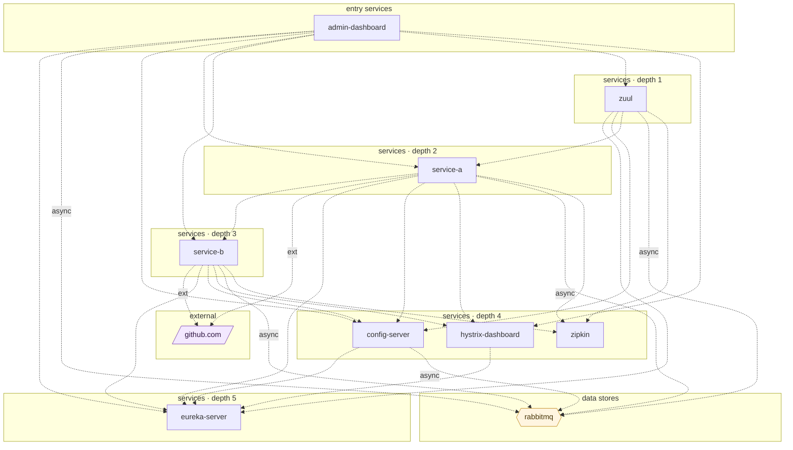

## stacks
- java/spring (FRAMEWORK, from build.gradle)

## ledger sections
- feign = 1
- http-server = 3
- url = 4
- compose-service = 11
- compose-dependency = 26
- service-root = 7
- TOTAL = 52 | files with syntax errors = 0

## graph
- after merge: 10 nodes / 28 edges | after normalize: 10 nodes / 28 edges | unresolved code edges = 0
- persistence services: []

## nodes (kind, layer)
- admin-dashboard  [service, L0]
- config-server  [service, L4]
- eureka-server  [service, L5]
- github.com  [external, L7]
- hystrix-dashboard  [service, L4]
- rabbitmq  [queue, L6]
- service-a  [service, L2]
- service-b  [service, L3]
- zipkin  [service, L4]
- zuul  [service, L1]

## edges (type, confidence, evidence)
- admin-dashboard -> config-server  (sync-http, documented)  code: docker-compose.yml
- admin-dashboard -> eureka-server  (sync-http, documented)  code: docker-compose.yml
- admin-dashboard -> hystrix-dashboard  (sync-http, documented)  code: docker-compose.yml
- admin-dashboard -> rabbitmq  (async, documented)  code: docker-compose.yml
- admin-dashboard -> service-a  (sync-http, documented)  code: docker-compose.yml
- admin-dashboard -> service-b  (sync-http, documented)  code: docker-compose.yml
- admin-dashboard -> zuul  (sync-http, documented)  code: docker-compose.yml
- config-server -> eureka-server  (sync-http, documented)  code: docker-compose.yml
- config-server -> rabbitmq  (async, documented)  code: docker-compose.yml
- hystrix-dashboard -> eureka-server  (sync-http, documented)  code: docker-compose.yml
- service-a -> config-server  (sync-http, documented)  code: docker-compose.yml
- service-a -> eureka-server  (sync-http, documented)  code: docker-compose.yml
- service-a -> github.com  (external, documented)  code: service-a/src/main/java/net/devh/A1ServiceApplication.java:44
- service-a -> hystrix-dashboard  (sync-http, documented)  code: docker-compose.yml
- service-a -> rabbitmq  (async, documented)  code: docker-compose.yml
- service-a -> service-b  (sync-http, documented)  code: service-a/src/main/java/net/devh/feign/ServiceBClient.java:12
- service-a -> zipkin  (sync-http, documented)  code: docker-compose.yml
- service-b -> config-server  (sync-http, documented)  code: docker-compose.yml
- service-b -> eureka-server  (sync-http, documented)  code: docker-compose.yml
- service-b -> github.com  (external, documented)  code: service-b/src/main/java/net/devh/B1ServiceApplication.java:41
- service-b -> hystrix-dashboard  (sync-http, documented)  code: docker-compose.yml
- service-b -> rabbitmq  (async, documented)  code: docker-compose.yml
- service-b -> zipkin  (sync-http, documented)  code: docker-compose.yml
- zuul -> config-server  (sync-http, documented)  code: docker-compose.yml
- zuul -> eureka-server  (sync-http, documented)  code: docker-compose.yml
- zuul -> rabbitmq  (async, documented)  code: docker-compose.yml
- zuul -> service-a  (sync-http, documented)  code: docker-compose.yml
- zuul -> zipkin  (sync-http, documented)  code: docker-compose.yml

## unresolved (source hint / raw target / file:line), first 40

## mermaid

