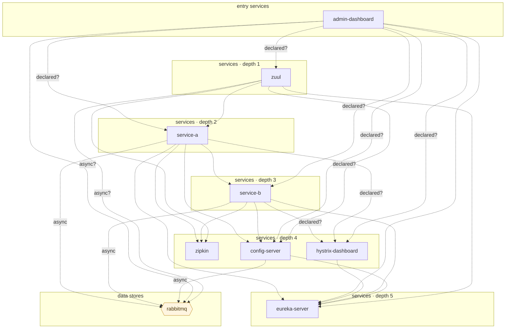

## stacks
- java/spring (FRAMEWORK, from build.gradle)

## ledger sections
- feign = 1
- http-server = 3
- url = 6
- url-metadata = 2
- parsed-dir = 10
- dockerfile-from = 7
- config = 70
- compose-service = 11
- compose-dependency = 26
- compose-port = 16
- service-root = 7
- module-deps = 7
- TOTAL = 166 | files with syntax errors = 0

## graph
- after merge: 9 nodes / 26 edges | after normalize: 9 nodes / 26 edges | unresolved code edges = 0
- persistence services: []

## nodes (kind, layer)
- admin-dashboard  [service, L0]
- config-server  [service, L4]
- eureka-server  [service, L5]
- hystrix-dashboard  [service, L4]
- rabbitmq  [queue, L6]
- service-a  [service, L2]
- service-b  [service, L3]
- zipkin  [service, L4]
- zuul  [service, L1]

## edges (type, confidence, provenance ref)
- admin-dashboard -> config-server  (sync-http, inferred)  code: docker-compose.yml#depends_on
- admin-dashboard -> eureka-server  (sync-http, documented)  code: admin-dashboard/src/main/resources/bootstrap.yml
- admin-dashboard -> hystrix-dashboard  (sync-http, inferred)  code: docker-compose.yml#depends_on
- admin-dashboard -> rabbitmq  (async, inferred)  code: docker-compose.yml#depends_on
- admin-dashboard -> service-a  (sync-http, inferred)  code: docker-compose.yml#depends_on
- admin-dashboard -> service-b  (sync-http, inferred)  code: docker-compose.yml#depends_on
- admin-dashboard -> zuul  (sync-http, inferred)  code: docker-compose.yml#depends_on
- config-server -> eureka-server  (sync-http, documented)  code: docker-compose.yml#depends_on
- config-server -> rabbitmq  (async, documented)  code: docker-compose.yml#depends_on
- hystrix-dashboard -> eureka-server  (sync-http, documented)  code: hystrix-dashboard/src/main/resources/bootstrap.yml
- service-a -> config-server  (sync-http, documented)  code: service-a/Dockerfile
- service-a -> eureka-server  (sync-http, documented)  code: service-a/src/main/resources/bootstrap.yml
- service-a -> hystrix-dashboard  (sync-http, inferred)  code: docker-compose.yml#depends_on
- service-a -> rabbitmq  (async, documented)  code: service-a/src/main/resources/bootstrap.yml
- service-a -> service-b  (sync-http, documented)  code: service-a/src/main/java/net/devh/feign/ServiceBClient.java:12
- service-a -> zipkin  (sync-http, documented)  code: service-a/src/main/resources/bootstrap.yml
- service-b -> config-server  (sync-http, documented)  code: service-b/Dockerfile
- service-b -> eureka-server  (sync-http, documented)  code: service-b/src/main/resources/bootstrap.yml
- service-b -> hystrix-dashboard  (sync-http, inferred)  code: docker-compose.yml#depends_on
- service-b -> rabbitmq  (async, documented)  code: service-b/src/main/resources/bootstrap.yml
- service-b -> zipkin  (sync-http, documented)  code: service-b/src/main/resources/bootstrap.yml
- zuul -> config-server  (sync-http, inferred)  code: docker-compose.yml#depends_on
- zuul -> eureka-server  (sync-http, documented)  code: docker-compose.yml#depends_on
- zuul -> rabbitmq  (async, inferred)  code: docker-compose.yml#depends_on
- zuul -> service-a  (sync-http, documented)  code: docker-compose.yml#depends_on
- zuul -> zipkin  (sync-http, documented)  code: docker-compose.yml#depends_on

## startup order (Compose depends_on that no address backs; not a call, not scored)
- none

## unresolved (source hint / raw target / file:line), first 40

## alias questions (name [origin] seen in | candidates)
- none

## alias answers applied
- none

## mermaid

```mermaid
flowchart TB
%% DepWeaver — microservice dependency graph
%% solid arrow = observed at runtime (Istio) · dashed = declared in code/doc only
%% node shape: [service] ([gateway]) [(db)] {{queue}} [/external/]
  subgraph layer0 ["entry services"]
    direction LR
    admin_dashboard["admin-dashboard"]
  end
  subgraph layer1 ["services · depth 1"]
    direction LR
    zuul["zuul"]
  end
  subgraph layer2 ["services · depth 2"]
    direction LR
    service_a["service-a"]
  end
  subgraph layer3 ["services · depth 3"]
    direction LR
    service_b["service-b"]
  end
  subgraph layer4 ["services · depth 4"]
    direction LR
    zipkin["zipkin"]
    config_server["config-server"]
    hystrix_dashboard["hystrix-dashboard"]
  end
  subgraph layer5 ["services · depth 5"]
    direction LR
    eureka_server["eureka-server"]
  end
  subgraph layer6 ["data stores"]
    direction LR
    rabbitmq{{"rabbitmq"}}:::queue
  end
  service_a -.-> service_b
  service_a -.-> config_server
  service_b -.-> config_server
  service_a -.-> eureka_server
  service_a -. async .-> rabbitmq
  service_a -.-> zipkin
  admin_dashboard -.-> eureka_server
  hystrix_dashboard -.-> eureka_server
  service_b -.-> eureka_server
  service_b -.-> zipkin
  service_b -. async .-> rabbitmq
  config_server -.-> eureka_server
  config_server -. async .-> rabbitmq
  service_b -. declared? .-> hystrix_dashboard
  service_a -. declared? .-> hystrix_dashboard
  admin_dashboard -. async? .-> rabbitmq
  admin_dashboard -. declared? .-> config_server
  admin_dashboard -. declared? .-> service_a
  admin_dashboard -. declared? .-> service_b
  admin_dashboard -. declared? .-> zuul
  admin_dashboard -. declared? .-> hystrix_dashboard
  zuul -.-> eureka_server
  zuul -. declared? .-> config_server
  zuul -.-> service_a
  zuul -. async? .-> rabbitmq
  zuul -.-> zipkin
classDef queue fill:#fff5e0,stroke:#c08a1e,color:#4a370a;

```

## 規則觸發
計數＝該規則改變了多少個不同的東西（邊、節點、名稱、檔案；同一個東西重複碰到算一次）；括號內最多列 5 個例子。
- rule 1: 0
- rule 2: 0
- rule 3: 0
- rule 4: 0
- rule 5: 13 (key spring.cloud.config.discovery.service-id=config-server; key spring.rabbitmq.host=localhost; key eureka.instance.hostname=localhost; key spring.rabbitmq.host=rabbitmq; key eureka.instance.hostname=service-a)
- rule 6: 0
- rule 7: 0
- rule 8: 8 (config-signal server.port; loopback localhost; config-signal eureka.client.registerWithEureka; config-signal eureka.client.fetchRegistry; config-signal eureka.instance.prefer-ip-address)
- rule 9: 0
- rule 10: 0
- rule 11: 9 (node rabbitmq; node zipkin; node eureka-server; node config-server; node service-b)
- rule 12: 28 (v1 docker-compose.yml; links config-server->eureka-server; links config-server->rabbitmq; links service-b->eureka-server; links service-b->config-server)
- rule 13: 0
- rule 14: 0
- rule 15: 6 (edge service-a->eureka-server :8761; edge admin-dashboard->eureka-server :8761; edge hystrix-dashboard->eureka-server :8761; edge service-b->eureka-server :8761; edge zuul->eureka-server :8761)
- rule 16: 0
- rule 17: 0
- rule 18: 0
- rule 19: 0
- rule 20: 0
- rule 21: 0
- rule 22: 0
- rule 23: 0
- rule 24: 0
- rule 25: 0
- rule 26: 0
- rule 27: 0
- rule 28: 0
- rule 29: 1 (drop https://github.com/yidongnan)
- rule 30: 0
- rule 31: 0
- rule 32: 0
- rule 33: 0
- rule 34: 0
- rule 35: 26 (inferred config-server->eureka-server; inferred config-server->rabbitmq; inferred service-b->eureka-server; inferred service-b->config-server; inferred service-b->hystrix-dashboard)
- rule 36: 0
- rule 37: 0
- rule 38: 0
- rule 39: 0
- rule 40: 0
- rule 41: 0
- rule 42: 0
- rule 43: 0
- rule 44: 7 (image service-a=service-a; image eureka-server=eureka-server; image admin-dashboard=admin-dashboard; image hystrix-dashboard=hystrix-dashboard; image service-b=service-b)
- rule 45: 0
- rule 46: 0
- rule 47: 2 (not-use-site service-a/src/main/java/net/devh/A1ServiceApplication.java:44 https://github.com/yidongnan/spring-cloud-netflix-example; not-use-site service-b/src/main/java/net/devh/B1ServiceApplication.java:41 https://github.com/yidongnan/spring-cloud-netflix-example)
- rule 48: 0
- rule 49: 0
- rule 50: 0
- rule 51: 0
- rule 52: 0
- rule 53: 2 (dockerfile service-a/Dockerfile http://config-server:8100/health; dockerfile service-b/Dockerfile http://config-server:8100/health)
- rule 54: 0
- rule 55: 0
- rule 56: 0
- rule 57: 7 (documents service-a/src/main/resources/bootstrap.yml 2; documents eureka-server/src/main/resources/bootstrap.yml 2; documents admin-dashboard/src/main/resources/bootstrap.yml 2; documents hystrix-dashboard/src/main/resources/bootstrap.yml 2; documents service-b/src/main/resources/bootstrap.yml 2)
- rule 58: 0
- rule 59: 0
- rule 60: 0
- rule 61: 0
