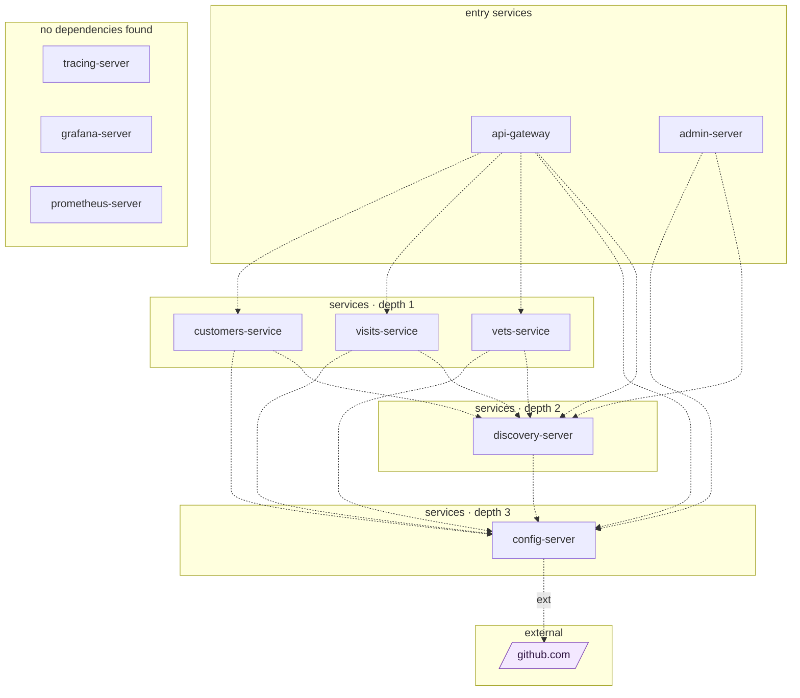

## stacks
- java/spring (FRAMEWORK, from pom.xml)
- javascript (LLM, from 19 .js/.jsx/.ts/.tsx files)   <-- skipped (LLM tier)

## ledger sections
- http-server = 13
- jpa = 12
- http-client = 2
- url = 2
- config = 4
- compose-service = 10
- compose-dependency = 11
- service-root = 9
- TOTAL = 63 | files with syntax errors = 0

## graph
- after merge: 11 nodes / 15 edges | after normalize: 11 nodes / 15 edges | unresolved code edges = 1
- persistence services: [vets-service, customers-service, visits-service]

## nodes (kind, layer)
- admin-server  [service, L0]
- api-gateway  [service, L0]
- config-server  [service, L3]
- customers-service  [service, L1]
- discovery-server  [service, L2]
- github.com  [external, L4]
- grafana-server  [service, L5]
- prometheus-server  [service, L5]
- tracing-server  [service, L5]
- vets-service  [service, L1]
- visits-service  [service, L1]

## edges (type, confidence, evidence)
- admin-server -> config-server  (sync-http, documented)  code: docker-compose.yml
- admin-server -> discovery-server  (sync-http, documented)  code: docker-compose.yml
- api-gateway -> config-server  (sync-http, documented)  code: docker-compose.yml
- api-gateway -> customers-service  (sync-http, documented)  code: spring-petclinic-api-gateway/src/main/java/org/springframework/samples/petclinic/api/application/CustomersServiceClient.java:36
- api-gateway -> discovery-server  (sync-http, documented)  code: docker-compose.yml
- api-gateway -> vets-service  (sync-http, documented)  code: spring-petclinic-api-gateway/src/main/resources/application.yml
- api-gateway -> visits-service  (sync-http, documented)  code: spring-petclinic-api-gateway/src/main/java/org/springframework/samples/petclinic/api/application/VisitsServiceClient.java:36
- config-server -> github.com  (external, documented)  code: spring-petclinic-config-server/src/main/resources/bootstrap.yml
- customers-service -> config-server  (sync-http, documented)  code: docker-compose.yml
- customers-service -> discovery-server  (sync-http, documented)  code: docker-compose.yml
- discovery-server -> config-server  (sync-http, documented)  code: docker-compose.yml
- vets-service -> config-server  (sync-http, documented)  code: docker-compose.yml
- vets-service -> discovery-server  (sync-http, documented)  code: docker-compose.yml
- visits-service -> config-server  (sync-http, documented)  code: docker-compose.yml
- visits-service -> discovery-server  (sync-http, documented)  code: docker-compose.yml

## unresolved (source hint / raw target / file:line), first 40
- api-gateway  =>  null   @ spring-petclinic-api-gateway/src/main/java/org/springframework/samples/petclinic/api/application/VisitsServiceClient.java:43

## mermaid

