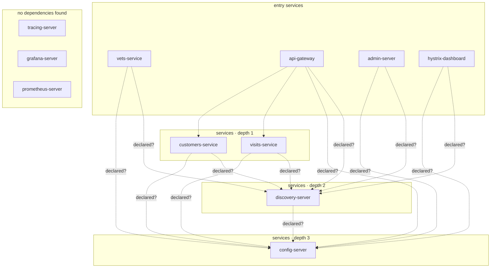

## stacks
- java/spring (FRAMEWORK, from pom.xml)
- javascript (GENERIC, from 19 .js/.mjs/.cjs/.jsx files; tree-sitter grammar)

## ledger sections
- http-server = 13
- jpa = 12
- http-client = 3
- url = 2
- config = 9
- compose-service = 11
- compose-dependency = 13
- service-root = 10
- module-deps = 8
- TOTAL = 81 | files with syntax errors = 0

## graph
- after merge: 11 nodes / 15 edges | after normalize: 11 nodes / 15 edges | unresolved code edges = 0
- persistence services: [vets-service, customers-service, visits-service]

## nodes (kind, layer)
- admin-server  [service, L0]
- api-gateway  [service, L0]
- config-server  [service, L3]
- customers-service  [service, L1]
- discovery-server  [service, L2]
- grafana-server  [service, L4]
- hystrix-dashboard  [service, L0]
- prometheus-server  [service, L4]
- tracing-server  [service, L4]
- vets-service  [service, L0]
- visits-service  [service, L1]

## edges (type, confidence, provenance ref)
- admin-server -> config-server  (sync-http, inferred)  code: docker-compose.yml#depends_on
- admin-server -> discovery-server  (sync-http, inferred)  code: docker-compose.yml#depends_on
- api-gateway -> config-server  (sync-http, inferred)  code: docker-compose.yml#depends_on
- api-gateway -> customers-service  (sync-http, documented)  code: spring-petclinic-api-gateway/src/main/java/org/springframework/samples/petclinic/api/application/CustomersServiceClient.java:33
- api-gateway -> discovery-server  (sync-http, inferred)  code: docker-compose.yml#depends_on
- api-gateway -> visits-service  (sync-http, documented)  code: spring-petclinic-api-gateway/src/main/java/org/springframework/samples/petclinic/api/application/VisitsServiceClient.java:46
- customers-service -> config-server  (sync-http, inferred)  code: docker-compose.yml#depends_on
- customers-service -> discovery-server  (sync-http, inferred)  code: docker-compose.yml#depends_on
- discovery-server -> config-server  (sync-http, inferred)  code: docker-compose.yml#depends_on
- hystrix-dashboard -> config-server  (sync-http, inferred)  code: docker-compose.yml#depends_on
- hystrix-dashboard -> discovery-server  (sync-http, inferred)  code: docker-compose.yml#depends_on
- vets-service -> config-server  (sync-http, inferred)  code: docker-compose.yml#depends_on
- vets-service -> discovery-server  (sync-http, inferred)  code: docker-compose.yml#depends_on
- visits-service -> config-server  (sync-http, inferred)  code: docker-compose.yml#depends_on
- visits-service -> discovery-server  (sync-http, inferred)  code: docker-compose.yml#depends_on

## unresolved (source hint / raw target / file:line), first 40

## alias questions (name [origin] seen in | candidates)
- none

## alias answers applied
- none

## mermaid

```mermaid
flowchart TB
%% DepWeaver — microservice dependency graph
%% solid arrow = observed at runtime (Istio) · dashed = declared in code/doc only
%% node shape: [service] ([gateway]) [(db)] {{queue}} [/external/]
  subgraph layer0 ["entry services"]
    direction LR
    vets_service["vets-service"]
    api_gateway["api-gateway"]
    admin_server["admin-server"]
    hystrix_dashboard["hystrix-dashboard"]
  end
  subgraph layer1 ["services · depth 1"]
    direction LR
    customers_service["customers-service"]
    visits_service["visits-service"]
  end
  subgraph layer2 ["services · depth 2"]
    direction LR
    discovery_server["discovery-server"]
  end
  subgraph layer3 ["services · depth 3"]
    direction LR
    config_server["config-server"]
  end
  subgraph layer4 ["no dependencies found"]
    direction LR
    tracing_server["tracing-server"]
    grafana_server["grafana-server"]
    prometheus_server["prometheus-server"]
  end
  api_gateway -.-> customers_service
  api_gateway -.-> visits_service
  discovery_server -. declared? .-> config_server
  customers_service -. declared? .-> config_server
  customers_service -. declared? .-> discovery_server
  visits_service -. declared? .-> config_server
  visits_service -. declared? .-> discovery_server
  vets_service -. declared? .-> config_server
  vets_service -. declared? .-> discovery_server
  api_gateway -. declared? .-> config_server
  api_gateway -. declared? .-> discovery_server
  admin_server -. declared? .-> config_server
  admin_server -. declared? .-> discovery_server
  hystrix_dashboard -. declared? .-> config_server
  hystrix_dashboard -. declared? .-> discovery_server

```

## 規則觸發
計數＝該規則改變了多少個不同的東西（邊、節點、名稱、檔案；同一個東西重複碰到算一次）；括號內最多列 5 個例子。
- rule 1: 0
- rule 2: 1 (climb docker)
- rule 3: 0
- rule 4: 0
- rule 5: 0
- rule 6: 0
- rule 7: 0
- rule 8: 0
- rule 9: 6 (jpa spring-petclinic-vets-service/src/main/java/org/springframework/samples/petclinic/vets/model/Vet.java; jpa spring-petclinic-vets-service/src/main/java/org/springframework/samples/petclinic/vets/model/Specialty.java; jpa spring-petclinic-customers-service/src/main/java/org/springframework/samples/petclinic/customers/model/Pet.java; jpa spring-petclinic-customers-service/src/main/java/org/springframework/samples/petclinic/customers/model/Owner.java; jpa spring-petclinic-customers-service/src/main/java/org/springframework/samples/petclinic/customers/model/PetType.java)
- rule 10: 0
- rule 11: 11 (node config-server; node discovery-server; node customers-service; node visits-service; node vets-service)
- rule 12: 0
- rule 13: 0
- rule 14: 0
- rule 15: 0
- rule 16: 5 (edge admin-server->discovery-server; edge vets-service->discovery-server; edge api-gateway->discovery-server; edge customers-service->discovery-server; edge visits-service->discovery-server)
- rule 17: 0
- rule 18: 0
- rule 19: 0
- rule 20: 0
- rule 21: 0
- rule 22: 0
- rule 23: 0
- rule 24: 0
- rule 25: 0
- rule 26: 0
- rule 27: 0
- rule 28: 0
- rule 29: 0
- rule 30: 0
- rule 31: 0
- rule 32: 0
- rule 33: 0
- rule 34: 0
- rule 35: 13 (inferred discovery-server->config-server; inferred customers-service->config-server; inferred customers-service->discovery-server; inferred visits-service->config-server; inferred visits-service->discovery-server)
- rule 36: 0
- rule 37: 0
- rule 38: 0
- rule 39: 0
- rule 40: 0
- rule 41: 0
- rule 42: 0
- rule 43: 0
- rule 44: 18 (map grafana=grafana-server; map prometheus=prometheus-server; image spring-petclinic-config-server=config-server; map spring-petclinic-config-server=config-server; image spring-petclinic-discovery-server=discovery-server)
- rule 45: 0
- rule 46: 0
- rule 51: 11 (browser spring-petclinic-api-gateway/src/main/resources/static/scripts/pet-form/pet-form.js:8; browser spring-petclinic-api-gateway/src/main/resources/static/scripts/pet-form/pet-form.js:13; browser spring-petclinic-api-gateway/src/main/resources/static/scripts/visits/visits.controller.js:11; browser spring-petclinic-api-gateway/src/main/resources/static/scripts/visits/visits.controller.js:21; browser spring-petclinic-api-gateway/src/main/resources/static/scripts/visits/visits.js:8)
