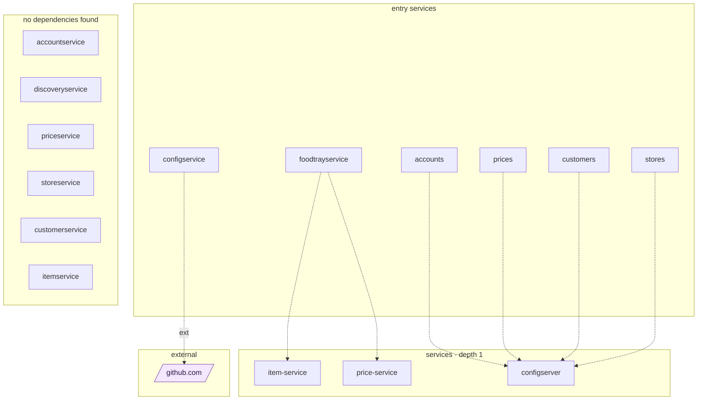

## stacks
- java/spring (FRAMEWORK, from pom.xml)

## ledger sections
- jpa = 10
- feign = 2
- http-server = 6
- config = 14
- compose-service = 5
- compose-dependency = 4
- service-root = 8
- TOTAL = 49 | files with syntax errors = 0

## graph
- after merge: 16 nodes / 7 edges | after normalize: 16 nodes / 7 edges | unresolved code edges = 0
- persistence services: [accountservice, priceservice, storeservice, customerservice, itemservice]

## nodes (kind, layer)
- accounts  [service, L0]
- accountservice  [service, L3]
- configserver  [service, L1]
- configservice  [service, L0]
- customers  [service, L0]
- customerservice  [service, L3]
- discoveryservice  [service, L3]
- foodtrayservice  [service, L0]
- github.com  [external, L2]
- item-service  [service, L1]
- itemservice  [service, L3]
- price-service  [service, L1]
- prices  [service, L0]
- priceservice  [service, L3]
- stores  [service, L0]
- storeservice  [service, L3]

## edges (type, confidence, evidence)
- accounts -> configserver  (sync-http, documented)  code: Docker/docker-compose.yml
- configservice -> github.com  (external, documented)  code: ConfigService/src/main/resources/application.yml
- customers -> configserver  (sync-http, documented)  code: Docker/docker-compose.yml
- foodtrayservice -> item-service  (sync-http, documented)  code: FoodTrayService/src/main/java/com/github/joffryferrater/foodtrayservice/repository/ItemServiceRepository.java:15
- foodtrayservice -> price-service  (sync-http, documented)  code: FoodTrayService/src/main/java/com/github/joffryferrater/foodtrayservice/repository/PriceServiceRepository.java:15
- prices -> configserver  (sync-http, documented)  code: Docker/docker-compose.yml
- stores -> configserver  (sync-http, documented)  code: Docker/docker-compose.yml

## unresolved (source hint / raw target / file:line), first 40

## mermaid

