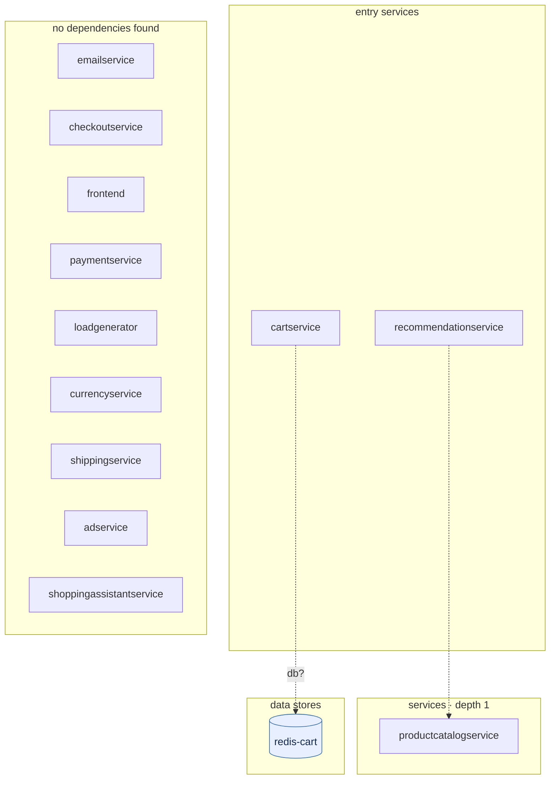

## stacks
- go (LLM, from 29 .go files)   <-- skipped (LLM tier)
- python/web (FRAMEWORK, from requirements.txt)
- csharp (LLM, from 8 .cs files)   <-- skipped (LLM tier)
- javascript (LLM, from 6 .js/.jsx/.ts/.tsx files)   <-- skipped (LLM tier)
- java (GENERIC, from build.gradle)

## ledger sections
- http-server = 1
- config = 18
- k8s-workload = 39
- env-address = 46
- workload-env = 51
- service-root = 12
- TOTAL = 167 | files with syntax errors = 0

## graph
- after merge: 13 nodes / 2 edges | after normalize: 13 nodes / 2 edges | unresolved code edges = 0
- persistence services: []

## nodes (kind, layer)
- adservice  [service, L3]
- cartservice  [service, L0]
- checkoutservice  [service, L3]
- currencyservice  [service, L3]
- emailservice  [service, L3]
- frontend  [service, L3]
- loadgenerator  [service, L3]
- paymentservice  [service, L3]
- productcatalogservice  [service, L1]
- recommendationservice  [service, L0]
- redis-cart  [db, L2]
- shippingservice  [service, L3]
- shoppingassistantservice  [service, L3]

## edges (type, confidence, evidence)
- cartservice -> redis-cart  (db, inferred)  code: kubernetes-manifests/cartservice.yaml
- recommendationservice -> productcatalogservice  (sync-http, documented)  code: src/recommendationservice/recommendation_server.py:131

## unresolved (source hint / raw target / file:line), first 40

## mermaid

