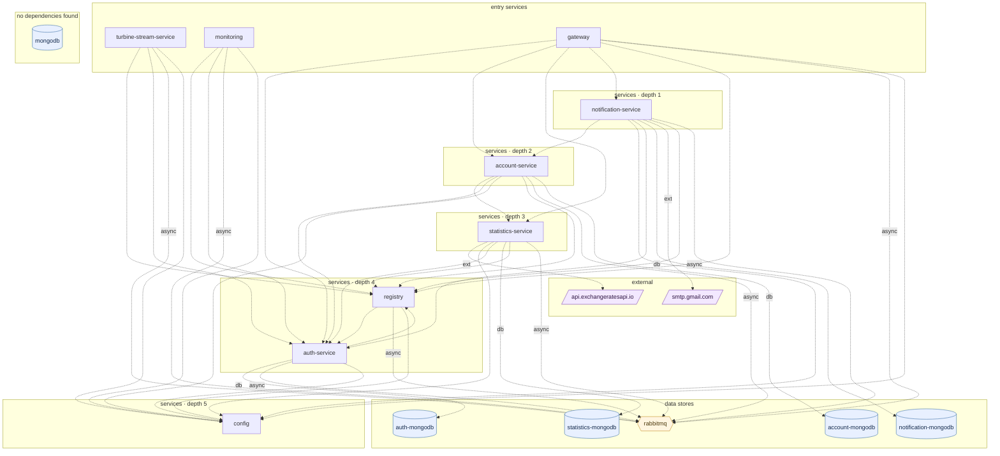

## stacks
- java/spring (FRAMEWORK, from pom.xml)
- javascript (LLM, from 8 .js/.jsx/.ts/.tsx files)   <-- skipped (LLM tier)

## ledger sections
- jpa = 4
- http-server = 16
- feign = 5
- config = 45
- compose-dependency = 8
- service-root = 10
- TOTAL = 88 | files with syntax errors = 0

## graph
- after merge: 17 nodes / 41 edges | after normalize: 17 nodes / 41 edges | unresolved code edges = 0
- persistence services: [statistics-service, account-service, notification-service, auth-service]

## nodes (kind, layer)
- account-mongodb  [db, L6]
- account-service  [service, L2]
- api.exchangeratesapi.io  [external, L7]
- auth-mongodb  [db, L6]
- auth-service  [service, L4]
- config  [service, L5]
- gateway  [service, L0]
- mongodb  [db, L8]
- monitoring  [service, L0]
- notification-mongodb  [db, L6]
- notification-service  [service, L1]
- rabbitmq  [queue, L6]
- registry  [service, L4]
- smtp.gmail.com  [external, L7]
- statistics-mongodb  [db, L6]
- statistics-service  [service, L3]
- turbine-stream-service  [service, L0]

## edges (type, confidence, evidence)
- account-service -> account-mongodb  (db, documented)  code: config/src/main/resources/shared/account-service.yml
- account-service -> auth-service  (sync-http, documented)  code: account-service/src/main/java/com/piggymetrics/account/client/AuthServiceClient.java:9
- account-service -> config  (sync-http, documented)  code: account-service/src/main/resources/bootstrap.yml
- account-service -> rabbitmq  (async, documented)  code: config/src/main/resources/shared/application.yml
- account-service -> registry  (sync-http, documented)  code: config/src/main/resources/shared/application.yml
- account-service -> statistics-service  (sync-http, documented)  code: account-service/src/main/java/com/piggymetrics/account/client/StatisticsServiceClient.java:10
- auth-service -> auth-mongodb  (db, documented)  code: config/src/main/resources/shared/auth-service.yml
- auth-service -> config  (sync-http, documented)  code: docker-compose.yml
- auth-service -> rabbitmq  (async, documented)  code: config/src/main/resources/shared/application.yml
- auth-service -> registry  (sync-http, documented)  code: config/src/main/resources/shared/application.yml
- gateway -> account-service  (sync-http, documented)  code: config/src/main/resources/shared/gateway.yml
- gateway -> auth-service  (sync-http, documented)  code: config/src/main/resources/shared/gateway.yml
- gateway -> config  (sync-http, documented)  code: docker-compose.yml
- gateway -> notification-service  (sync-http, documented)  code: config/src/main/resources/shared/gateway.yml
- gateway -> rabbitmq  (async, documented)  code: config/src/main/resources/shared/application.yml
- gateway -> registry  (sync-http, documented)  code: config/src/main/resources/shared/application.yml
- gateway -> statistics-service  (sync-http, documented)  code: config/src/main/resources/shared/gateway.yml
- monitoring -> auth-service  (sync-http, documented)  code: config/src/main/resources/shared/application.yml
- monitoring -> config  (sync-http, documented)  code: docker-compose.yml
- monitoring -> rabbitmq  (async, documented)  code: config/src/main/resources/shared/application.yml
- monitoring -> registry  (sync-http, documented)  code: config/src/main/resources/shared/application.yml
- notification-service -> account-service  (sync-http, documented)  code: notification-service/src/main/java/com/piggymetrics/notification/client/AccountServiceClient.java:9
- notification-service -> auth-service  (sync-http, documented)  code: config/src/main/resources/shared/notification-service.yml
- notification-service -> config  (sync-http, documented)  code: notification-service/src/main/resources/bootstrap.yml
- notification-service -> notification-mongodb  (db, documented)  code: config/src/main/resources/shared/notification-service.yml
- notification-service -> rabbitmq  (async, documented)  code: config/src/main/resources/shared/application.yml
- notification-service -> registry  (sync-http, documented)  code: config/src/main/resources/shared/application.yml
- notification-service -> smtp.gmail.com  (external, documented)  code: config/src/main/resources/shared/notification-service.yml
- registry -> auth-service  (sync-http, documented)  code: config/src/main/resources/shared/application.yml
- registry -> config  (sync-http, documented)  code: registry/src/main/resources/bootstrap.yml
- registry -> rabbitmq  (async, documented)  code: config/src/main/resources/shared/application.yml
- statistics-service -> api.exchangeratesapi.io  (external, documented)  code: statistics-service/src/main/java/com/piggymetrics/statistics/client/ExchangeRatesClient.java:10
- statistics-service -> auth-service  (sync-http, documented)  code: config/src/main/resources/shared/statistics-service.yml
- statistics-service -> config  (sync-http, documented)  code: statistics-service/src/main/resources/bootstrap.yml
- statistics-service -> rabbitmq  (async, documented)  code: config/src/main/resources/shared/application.yml
- statistics-service -> registry  (sync-http, documented)  code: config/src/main/resources/shared/application.yml
- statistics-service -> statistics-mongodb  (db, documented)  code: config/src/main/resources/shared/statistics-service.yml
- turbine-stream-service -> auth-service  (sync-http, documented)  code: config/src/main/resources/shared/application.yml
- turbine-stream-service -> config  (sync-http, documented)  code: turbine-stream-service/src/main/resources/bootstrap.yml
- turbine-stream-service -> rabbitmq  (async, documented)  code: config/src/main/resources/shared/application.yml
- turbine-stream-service -> registry  (sync-http, documented)  code: config/src/main/resources/shared/application.yml

## unresolved (source hint / raw target / file:line), first 40

## mermaid

