## stacks
- java/spring (FRAMEWORK, from pom.xml)
- javascript (LLM, from 71 .js/.jsx/.ts/.tsx files)   <-- skipped (LLM tier)
- python/web (FRAMEWORK, from requirements.txt)
- go (LLM, from 2 .go files)   <-- skipped (LLM tier)

## ledger sections
- jpa = 59
- http-server = 201
- http-client = 65
- url = 31
- config = 178
- compose-service = 142
- compose-dependency = 2
- k8s-workload = 272
- env-address = 4
- workload-env = 3
- service-root = 50
- TOTAL = 1007 | files with syntax errors = 0

## graph
- after merge: 100 nodes / 121 edges | after normalize: 100 nodes / 121 edges | unresolved code edges = 31
- persistence services: [ts-contacts-service, ts-notification-service, ts-config-service, ts-assurance-service, ts-order-other-service, ts-route-service, ts-price-service, ts-security-service, ts-consign-service, ts-train-service, ts-order-service, ts-food-service, ts-station-food-service, ts-train-food-service, ts-food-delivery-service, ts-consign-price-service, ts-wait-order-service, ts-common, ts-station-service, ts-auth-service, ts-user-service, ts-payment-service, ts-inside-payment-service, ts-delivery-service, ts-travel2-service, ts-travel-service]

## nodes (kind, layer)
- github.com  [external, L9]
- jaeger  [service, L10]
- redis  [db, L10]
- rest-service-external  [service, L4]
- smtp.163.com  [external, L9]
- ts-account-mongo  [db, L10]
- ts-admin-basic-info-service  [service, L2]
- ts-admin-order-service  [service, L2]
- ts-admin-route-service  [service, L2]
- ts-admin-travel-service  [service, L2]
- ts-admin-user-service  [service, L2]
- ts-assurance-mongo  [db, L10]
- ts-assurance-mysql  [db, L8]
- ts-assurance-service  [service, L2]
- ts-auth-mongo  [db, L10]
- ts-auth-mysql  [db, L8]
- ts-auth-service  [service, L3]
- ts-avatar-service  [service, L2]
- ts-basic-service  [service, L5]
- ts-cancel-service  [service, L2]
- ts-common  [service, L0]
- ts-config-mongo  [db, L10]
- ts-config-mysql  [db, L8]
- ts-config-service  [service, L2]
- ts-consign-mongo  [db, L10]
- ts-consign-mysql  [db, L8]
- ts-consign-price-mongo  [db, L10]
- ts-consign-price-mysql  [db, L8]
- ts-consign-price-service  [service, L2]
- ts-consign-service  [service, L3]
- ts-contacts-mongo  [db, L10]
- ts-contacts-mysql  [db, L8]
- ts-contacts-service  [service, L3]
- ts-delivery-mysql  [db, L8]
- ts-delivery-service  [service, L0]
- ts-execute-service  [service, L2]
- ts-food-delivery-mysql  [db, L8]
- ts-food-delivery-service  [service, L0]
- ts-food-map-mongo  [db, L10]
- ts-food-map-service  [service, L10]
- ts-food-mongo  [db, L10]
- ts-food-mysql  [db, L8]
- ts-food-service  [service, L3]
- ts-gateway-service  [service, L1]
- ts-inside-payment-mongo  [db, L10]
- ts-inside-payment-mysql  [db, L8]
- ts-inside-payment-service  [service, L3]
- ts-login-service  [service, L10]
- ts-news-service  [service, L10]
- ts-notification-mysql  [db, L8]
- ts-notification-service  [service, L3]
- ts-order-mongo  [db, L10]
- ts-order-other-mongo  [db, L10]
- ts-order-other-mysql  [db, L8]
- ts-order-other-service  [service, L6]
- ts-order-service  [service, L6]
- ts-payment-mongo  [db, L10]
- ts-payment-mysql  [db, L8]
- ts-payment-service  [service, L4]
- ts-preserve-other-service  [service, L2]
- ts-preserve-service  [service, L2]
- ts-price-mongo  [db, L10]
- ts-price-service  [service, L6]
- ts-rebook-service  [service, L2]
- ts-register-service  [service, L3]
- ts-route-mongo  [db, L10]
- ts-route-plan-service  [service, L3]
- ts-route-service  [service, L6]
- ts-seat-service  [service, L5]
- ts-security-mongo  [db, L10]
- ts-security-mysql  [db, L8]
- ts-security-service  [service, L2]
- ts-sso-service  [service, L10]
- ts-station-food-service  [service, L4]
- ts-station-mongo  [db, L10]
- ts-station-mysql  [db, L8]
- ts-station-service  [service, L7]
- ts-ticket-office-mongo  [db, L10]
- ts-ticket-office-service  [service, L10]
- ts-ticketinfo-service  [service, L10]
- ts-train-food-mysql  [db, L8]
- ts-train-food-service  [service, L4]
- ts-train-mongo  [db, L10]
- ts-train-mysql  [db, L8]
- ts-train-service  [service, L6]
- ts-travel-mongo  [db, L10]
- ts-travel-mysql  [db, L8]
- ts-travel-plan-service  [service, L2]
- ts-travel-service  [service, L4]
- ts-travel2-mongo  [db, L10]
- ts-travel2-mysql  [db, L8]
- ts-travel2-service  [service, L4]
- ts-ui-dashboard  [service, L0]
- ts-user-mongo  [db, L10]
- ts-user-mysql  [db, L8]
- ts-user-service  [service, L2]
- ts-verification-code-service  [service, L2]
- ts-voucher-mysql  [db, L8]
- ts-voucher-service  [service, L0]
- ts-wait-order-service  [service, L0]

## edges (type, confidence, evidence)
- ts-admin-basic-info-service -> ts-contacts-service  (sync-http, documented)  code: ts-admin-basic-info-service/src/main/java/adminbasic/service/AdminBasicInfoServiceImpl.java:44
- ts-admin-order-service -> ts-order-other-service  (sync-http, documented)  code: ts-admin-order-service/src/main/java/adminorder/service/AdminOrderServiceImpl.java:66
- ts-admin-order-service -> ts-order-service  (sync-http, documented)  code: ts-admin-order-service/src/main/java/adminorder/service/AdminOrderServiceImpl.java:48
- ts-admin-route-service -> ts-route-service  (sync-http, documented)  code: ts-admin-route-service/src/main/java/adminroute/service/AdminRouteServiceImpl.java:40
- ts-admin-route-service -> ts-station-service  (sync-http, documented)  code: ts-admin-route-service/src/main/java/adminroute/service/AdminRouteServiceImpl.java:103
- ts-admin-travel-service -> ts-station-service  (sync-http, documented)  code: ts-admin-travel-service/src/main/java/admintravel/service/AdminTravelServiceImpl.java:233
- ts-admin-travel-service -> ts-travel-service  (sync-http, documented)  code: ts-admin-travel-service/src/main/java/admintravel/service/AdminTravelServiceImpl.java:49
- ts-admin-travel-service -> ts-travel2-service  (sync-http, documented)  code: ts-admin-travel-service/src/main/java/admintravel/service/AdminTravelServiceImpl.java:67
- ts-admin-user-service -> ts-register-service  (sync-http, documented)  code: ts-admin-user-service/src/main/java/adminuser/service/AdminUserServiceImpl.java:115
- ts-assurance-service -> ts-assurance-mysql  (db, documented)  code: ts-assurance-service/src/main/resources/application.yml
- ts-auth-service -> ts-auth-mysql  (db, documented)  code: ts-auth-service/src/main/resources/application.yaml
- ts-basic-service -> ts-price-service  (sync-http, documented)  code: ts-basic-service/src/main/java/fdse/microservice/service/BasicServiceImpl.java:461
- ts-basic-service -> ts-route-service  (sync-http, documented)  code: ts-basic-service/src/main/java/fdse/microservice/service/BasicServiceImpl.java:407
- ts-basic-service -> ts-station-service  (sync-http, documented)  code: ts-basic-service/src/main/java/fdse/microservice/service/BasicServiceImpl.java:345
- ts-basic-service -> ts-train-service  (sync-http, documented)  code: ts-basic-service/src/main/java/fdse/microservice/service/BasicServiceImpl.java:376
- ts-cancel-service -> ts-notification-service  (sync-http, documented)  code: ts-cancel-service/src/main/java/cancel/service/CancelServiceImpl.java:148
- ts-cancel-service -> ts-order-other-service  (sync-http, documented)  code: ts-cancel-service/src/main/java/cancel/service/CancelServiceImpl.java:269
- ts-cancel-service -> ts-order-service  (sync-http, documented)  code: ts-cancel-service/src/main/java/cancel/service/CancelServiceImpl.java:245
- ts-common -> github.com  (external, documented)  code: ts-common/src/main/java/edu/fudan/common/config/SwaggerConfig.java:40
- ts-config-service -> ts-config-mysql  (db, documented)  code: ts-config-service/src/main/resources/application.yml
- ts-consign-price-service -> ts-consign-price-mysql  (db, documented)  code: ts-consign-price-service/src/main/resources/application.yml
- ts-consign-service -> ts-consign-mysql  (db, documented)  code: ts-consign-service/src/main/resources/application.yml
- ts-contacts-service -> ts-contacts-mysql  (db, documented)  code: ts-contacts-service/src/main/resources/application.yml
- ts-delivery-service -> ts-delivery-mysql  (db, documented)  code: ts-delivery-service/src/main/resources/application.yml
- ts-food-delivery-service -> ts-food-delivery-mysql  (db, documented)  code: ts-food-delivery-service/src/main/resources/application.yml
- ts-food-service -> ts-food-mysql  (db, documented)  code: ts-food-service/src/main/resources/application.yml
- ts-food-service -> ts-station-food-service  (sync-http, documented)  code: ts-food-service/src/main/java/foodsearch/service/FoodServiceImpl.java:286
- ts-food-service -> ts-station-service  (sync-http, documented)  code: ts-food-service/src/main/resources/application.yml
- ts-food-service -> ts-train-food-service  (sync-http, documented)  code: ts-food-service/src/main/resources/application.yml
- ts-food-service -> ts-travel-service  (sync-http, documented)  code: ts-food-service/src/main/resources/application.yml
- ts-gateway-service -> ts-admin-basic-info-service  (sync-http, documented)  code: ts-gateway-service/src/main/resources/application.yml
- ts-gateway-service -> ts-admin-order-service  (sync-http, documented)  code: ts-gateway-service/src/main/resources/application.yml
- ts-gateway-service -> ts-admin-route-service  (sync-http, documented)  code: ts-gateway-service/src/main/resources/application.yml
- ts-gateway-service -> ts-admin-travel-service  (sync-http, documented)  code: ts-gateway-service/src/main/resources/application.yml
- ts-gateway-service -> ts-admin-user-service  (sync-http, documented)  code: ts-gateway-service/src/main/resources/application.yml
- ts-gateway-service -> ts-assurance-service  (sync-http, documented)  code: ts-gateway-service/src/main/resources/application.yml
- ts-gateway-service -> ts-auth-service  (sync-http, documented)  code: ts-gateway-service/src/main/resources/application.yml
- ts-gateway-service -> ts-avatar-service  (sync-http, documented)  code: ts-gateway-service/src/main/resources/application.yml
- ts-gateway-service -> ts-basic-service  (sync-http, documented)  code: ts-gateway-service/src/main/resources/application.yml
- ts-gateway-service -> ts-cancel-service  (sync-http, documented)  code: ts-gateway-service/src/main/resources/application.yml
- ts-gateway-service -> ts-config-service  (sync-http, documented)  code: ts-gateway-service/src/main/resources/application.yml
- ts-gateway-service -> ts-consign-price-service  (sync-http, documented)  code: ts-gateway-service/src/main/resources/application.yml
- ts-gateway-service -> ts-consign-service  (sync-http, documented)  code: ts-gateway-service/src/main/resources/application.yml
- ts-gateway-service -> ts-contacts-service  (sync-http, documented)  code: ts-gateway-service/src/main/resources/application.yml
- ts-gateway-service -> ts-execute-service  (sync-http, documented)  code: ts-gateway-service/src/main/resources/application.yml
- ts-gateway-service -> ts-food-service  (sync-http, documented)  code: ts-gateway-service/src/main/resources/application.yml
- ts-gateway-service -> ts-inside-payment-service  (sync-http, documented)  code: ts-gateway-service/src/main/resources/application.yml
- ts-gateway-service -> ts-notification-service  (sync-http, documented)  code: ts-gateway-service/src/main/resources/application.yml
- ts-gateway-service -> ts-order-other-service  (sync-http, documented)  code: ts-gateway-service/src/main/resources/application.yml
- ts-gateway-service -> ts-order-service  (sync-http, documented)  code: ts-gateway-service/src/main/resources/application.yml
- ts-gateway-service -> ts-payment-service  (sync-http, documented)  code: ts-gateway-service/src/main/resources/application.yml
- ts-gateway-service -> ts-preserve-other-service  (sync-http, documented)  code: ts-gateway-service/src/main/resources/application.yml
- ts-gateway-service -> ts-preserve-service  (sync-http, documented)  code: ts-gateway-service/src/main/resources/application.yml
- ts-gateway-service -> ts-price-service  (sync-http, documented)  code: ts-gateway-service/src/main/resources/application.yml
- ts-gateway-service -> ts-rebook-service  (sync-http, documented)  code: ts-gateway-service/src/main/resources/application.yml
- ts-gateway-service -> ts-route-plan-service  (sync-http, documented)  code: ts-gateway-service/src/main/resources/application.yml
- ts-gateway-service -> ts-route-service  (sync-http, documented)  code: ts-gateway-service/src/main/resources/application.yml
- ts-gateway-service -> ts-seat-service  (sync-http, documented)  code: ts-gateway-service/src/main/resources/application.yml
- ts-gateway-service -> ts-security-service  (sync-http, documented)  code: ts-gateway-service/src/main/resources/application.yml
- ts-gateway-service -> ts-station-food-service  (sync-http, documented)  code: ts-gateway-service/src/main/resources/application.yml
- ts-gateway-service -> ts-station-service  (sync-http, documented)  code: ts-gateway-service/src/main/resources/application.yml
- ts-gateway-service -> ts-train-food-service  (sync-http, documented)  code: ts-gateway-service/src/main/resources/application.yml
- ts-gateway-service -> ts-train-service  (sync-http, documented)  code: ts-gateway-service/src/main/resources/application.yml
- ts-gateway-service -> ts-travel-plan-service  (sync-http, documented)  code: ts-gateway-service/src/main/resources/application.yml
- ts-gateway-service -> ts-travel-service  (sync-http, documented)  code: ts-gateway-service/src/main/resources/application.yml
- ts-gateway-service -> ts-travel2-service  (sync-http, documented)  code: ts-gateway-service/src/main/resources/application.yml
- ts-gateway-service -> ts-user-service  (sync-http, documented)  code: ts-gateway-service/src/main/resources/application.yml
- ts-gateway-service -> ts-verification-code-service  (sync-http, documented)  code: ts-gateway-service/src/main/resources/application.yml
- ts-inside-payment-service -> rest-service-external  (sync-http, documented)  code: ts-inside-payment-service/src/main/java/inside_payment/async/AsyncTask.java:27
- ts-inside-payment-service -> ts-inside-payment-mysql  (db, documented)  code: ts-inside-payment-service/src/main/resources/application.yml
- ts-inside-payment-service -> ts-payment-service  (sync-http, documented)  code: ts-inside-payment-service/src/main/java/inside_payment/service/InsidePaymentServiceImpl.java:110
- ts-notification-service -> smtp.163.com  (external, documented)  code: ts-notification-service/src/main/resources/application.yml
- ts-notification-service -> ts-notification-mysql  (db, documented)  code: ts-notification-service/src/main/resources/application.yml
- ts-order-other-service -> ts-order-other-mysql  (db, documented)  code: ts-order-other-service/src/main/resources/application.yml
- ts-order-other-service -> ts-station-service  (sync-http, documented)  code: ts-order-other-service/src/main/java/other/service/OrderOtherServiceImpl.java:227
- ts-order-service -> ts-station-service  (sync-http, documented)  code: ts-order-service/src/main/java/order/service/OrderServiceImpl.java:212
- ts-payment-service -> ts-payment-mysql  (db, documented)  code: ts-payment-service/src/main/resources/application.yml
- ts-preserve-other-service -> ts-basic-service  (sync-http, documented)  code: ts-preserve-other-service/src/main/java/preserveOther/service/PreserveOtherServiceImpl.java:132
- ts-preserve-other-service -> ts-consign-service  (sync-http, documented)  code: ts-preserve-other-service/src/main/java/preserveOther/service/PreserveOtherServiceImpl.java:427
- ts-preserve-other-service -> ts-food-service  (sync-http, documented)  code: ts-preserve-other-service/src/main/java/preserveOther/service/PreserveOtherServiceImpl.java:413
- ts-preserve-other-service -> ts-order-other-service  (sync-http, documented)  code: ts-preserve-other-service/src/main/java/preserveOther/service/PreserveOtherServiceImpl.java:397
- ts-preserve-other-service -> ts-seat-service  (sync-http, documented)  code: ts-preserve-other-service/src/main/java/preserveOther/service/PreserveOtherServiceImpl.java:277
- ts-preserve-other-service -> ts-travel2-service  (sync-http, documented)  code: ts-preserve-other-service/src/main/java/preserveOther/service/PreserveOtherServiceImpl.java:367
- ts-preserve-service -> ts-basic-service  (sync-http, documented)  code: ts-preserve-service/src/main/java/preserve/service/PreserveServiceImpl.java:129
- ts-preserve-service -> ts-consign-service  (sync-http, documented)  code: ts-preserve-service/src/main/java/preserve/service/PreserveServiceImpl.java:425
- ts-preserve-service -> ts-food-service  (sync-http, documented)  code: ts-preserve-service/src/main/java/preserve/service/PreserveServiceImpl.java:411
- ts-preserve-service -> ts-order-service  (sync-http, documented)  code: ts-preserve-service/src/main/java/preserve/service/PreserveServiceImpl.java:396
- ts-preserve-service -> ts-seat-service  (sync-http, documented)  code: ts-preserve-service/src/main/java/preserve/service/PreserveServiceImpl.java:278
- ts-preserve-service -> ts-travel-service  (sync-http, documented)  code: ts-preserve-service/src/main/java/preserve/service/PreserveServiceImpl.java:365
- ts-rebook-service -> ts-inside-payment-service  (sync-http, documented)  code: ts-rebook-service/src/main/java/rebook/service/RebookServiceImpl.java:445
- ts-rebook-service -> ts-seat-service  (sync-http, documented)  code: ts-rebook-service/src/main/java/rebook/service/RebookServiceImpl.java:251
- ts-route-plan-service -> ts-travel-service  (sync-http, documented)  code: ts-route-plan-service/src/main/java/plan/service/RoutePlanServiceImpl.java:205
- ts-route-plan-service -> ts-travel2-service  (sync-http, documented)  code: ts-route-plan-service/src/main/java/plan/service/RoutePlanServiceImpl.java:215
- ts-seat-service -> ts-order-other-service  (sync-http, documented)  code: ts-seat-service/src/main/java/seat/service/SeatServiceImpl.java:73
- ts-seat-service -> ts-order-service  (sync-http, documented)  code: ts-seat-service/src/main/java/seat/service/SeatServiceImpl.java:60
- ts-security-service -> ts-order-other-service  (sync-http, documented)  code: ts-security-service/src/main/resources/application.yml
- ts-security-service -> ts-order-service  (sync-http, documented)  code: ts-security-service/src/main/resources/application.yml
- ts-security-service -> ts-security-mysql  (db, documented)  code: ts-security-service/src/main/resources/application.yml
- ts-station-service -> ts-station-mysql  (db, documented)  code: ts-station-service/src/main/resources/application.yml
- ts-train-food-service -> ts-train-food-mysql  (db, documented)  code: ts-train-food-service/src/main/resources/application.yml
- ts-train-service -> ts-train-mysql  (db, documented)  code: ts-train-service/src/main/resources/application.yml
- ts-travel-plan-service -> ts-route-plan-service  (sync-http, documented)  code: ts-travel-plan-service/src/main/java/travelplan/service/TravelPlanServiceImpl.java:257
- ts-travel-plan-service -> ts-seat-service  (sync-http, documented)  code: ts-travel-plan-service/src/main/java/travelplan/service/TravelPlanServiceImpl.java:244
- ts-travel-plan-service -> ts-travel-service  (sync-http, documented)  code: ts-travel-plan-service/src/main/java/travelplan/service/TravelPlanServiceImpl.java:294
- ts-travel-plan-service -> ts-travel2-service  (sync-http, documented)  code: ts-travel-plan-service/src/main/java/travelplan/service/TravelPlanServiceImpl.java:307
- ts-travel-service -> ts-basic-service  (sync-http, documented)  code: ts-travel-service/src/main/java/travel/service/TravelServiceImpl.java:347
- ts-travel-service -> ts-order-service  (sync-http, documented)  code: ts-travel-service/src/main/resources/application.yml
- ts-travel-service -> ts-route-service  (sync-http, documented)  code: ts-travel-service/src/main/resources/application.yml
- ts-travel-service -> ts-seat-service  (sync-http, documented)  code: ts-travel-service/src/main/java/travel/service/TravelServiceImpl.java:552
- ts-travel-service -> ts-train-service  (sync-http, documented)  code: ts-travel-service/src/main/resources/application.yml
- ts-travel-service -> ts-travel-mysql  (db, documented)  code: ts-travel-service/src/main/resources/application.yml
- ts-travel2-service -> ts-basic-service  (sync-http, documented)  code: ts-travel2-service/src/main/java/travel2/service/TravelServiceImpl.java:264
- ts-travel2-service -> ts-seat-service  (sync-http, documented)  code: ts-travel2-service/src/main/java/travel2/service/TravelServiceImpl.java:463
- ts-travel2-service -> ts-travel2-mysql  (db, documented)  code: ts-travel2-service/src/main/resources/application.yml
- ts-ui-dashboard -> ts-gateway-service  (sync-http, documented)  code: ts-ui-dashboard/nginx.conf:41
- ts-user-service -> ts-auth-service  (sync-http, documented)  code: ts-user-service/src/main/java/user/service/impl/UserServiceImpl.java:94
- ts-user-service -> ts-user-mysql  (db, documented)  code: ts-user-service/src/main/resources/application.yaml
- ts-voucher-service -> ts-order-other-service  (sync-http, documented)  code: ts-voucher-service/server.py:52
- ts-voucher-service -> ts-order-service  (sync-http, documented)  code: ts-voucher-service/server.py:51
- ts-voucher-service -> ts-voucher-mysql  (db, documented)  code: deployment/docker-compose-manifests/docker-compose-with-jaeger.yml
- ts-wait-order-service -> ts-preserve-service  (sync-http, documented)  code: ts-wait-order-service/src/main/java/waitorder/utils/PollThread.java:75

## unresolved (source hint / raw target / file:line), first 40
- ts-admin-user-service  =>  http://   @ ts-admin-user-service/src/main/java/adminuser/service/AdminUserServiceImpl.java:37
- ts-cancel-service  =>  http://   @ ts-cancel-service/src/main/java/cancel/service/CancelServiceImpl.java:42
- ts-order-other-service  =>  http://   @ ts-order-other-service/src/main/java/other/service/OrderOtherServiceImpl.java:42
- ts-preserve-service  =>  http://   @ ts-preserve-service/src/main/java/preserve/service/PreserveServiceImpl.java:45
- ts-security-service  =>  http://   @ ts-security-service/src/main/java/security/service/SecurityServiceImpl.java:47
- ts-consign-service  =>  http://   @ ts-consign-service/src/main/java/consign/service/ConsignServiceImpl.java:42
- ts-order-service  =>  http://   @ ts-order-service/src/main/java/order/service/OrderServiceImpl.java:44
- ts-food-service  =>  http://   @ ts-food-service/src/main/java/foodsearch/service/FoodServiceImpl.java:50
- ts-rebook-service  =>  http://   @ ts-rebook-service/src/main/java/rebook/service/RebookServiceImpl.java:44
- ts-admin-basic-info-service  =>  http://   @ ts-admin-basic-info-service/src/main/java/adminbasic/service/AdminBasicInfoServiceImpl.java:36
- ts-food-delivery-service  =>  http://   @ ts-food-delivery-service/src/main/java/food_delivery/service/FoodDeliveryServiceImpl.java:40
- ts-wait-order-service  =>  http://   @ ts-wait-order-service/src/main/java/waitorder/utils/PollThread.java:71
- ts-basic-service  =>  http://   @ ts-basic-service/src/main/java/fdse/microservice/service/BasicServiceImpl.java:36
- ts-preserve-other-service  =>  http://   @ ts-preserve-other-service/src/main/java/preserveOther/service/PreserveOtherServiceImpl.java:42
- ts-auth-service  =>  http://   @ ts-auth-service/src/main/java/auth/service/impl/TokenServiceImpl.java:55
- ts-user-service  =>  http://   @ ts-user-service/src/main/java/user/service/impl/UserServiceImpl.java:42
- ts-route-plan-service  =>  http://   @ ts-route-plan-service/src/main/java/plan/service/RoutePlanServiceImpl.java:35
- ts-inside-payment-service  =>  http://   @ ts-inside-payment-service/src/main/java/inside_payment/service/InsidePaymentServiceImpl.java:42
- ts-seat-service  =>  http://   @ ts-seat-service/src/main/java/seat/service/SeatServiceImpl.java:37
- ts-execute-service  =>  http://   @ ts-execute-service/src/main/java/execute/serivce/ExecuteServiceImpl.java:36
- ts-travel-plan-service  =>  http://   @ ts-travel-plan-service/src/main/java/travelplan/service/TravelPlanServiceImpl.java:46
- ts-travel2-service  =>  http://   @ ts-travel2-service/src/main/java/travel2/service/TravelServiceImpl.java:47
- ts-travel-service  =>  http://   @ ts-travel-service/src/main/java/travel/service/TravelServiceImpl.java:52
- ts-admin-order-service  =>  http://   @ ts-admin-order-service/src/main/java/adminorder/service/AdminOrderServiceImpl.java:35
- ts-admin-travel-service  =>  http://   @ ts-admin-travel-service/src/main/java/admintravel/service/AdminTravelServiceImpl.java:38
- ts-admin-route-service  =>  http://   @ ts-admin-route-service/src/main/java/adminroute/service/AdminRouteServiceImpl.java:32
- ts-route-service  =>  jdbc:mysql://10.176.122.1:3306/ts?useSSL=false   @ ts-route-service/src/main/resources/application.yml:-1
- ts-price-service  =>  jdbc:mysql://10.176.122.1:3306/ts?useSSL=false   @ ts-price-service/src/main/resources/application.yml:-1
- ts-order-service  =>  jdbc:mysql://10.176.122.1:3306/ts?useSSL=false   @ ts-order-service/src/main/resources/application.yml:-1
- ts-station-food-service  =>  jdbc:mysql://10.176.122.1:3306/ts?useSSL=false   @ ts-station-food-service/src/main/resources/application.yml:-1
- ts-wait-order-service  =>  jdbc:mysql://10.176.122.1:3306/ts?useSSL=false   @ ts-wait-order-service/src/main/resources/application.yml:-1

## mermaid

```mermaid
flowchart TB
%% DepWeaver — microservice dependency graph
%% solid arrow = observed at runtime (Istio) · dashed = declared in code/doc only
%% node shape: [service] ([gateway]) [(db)] {{queue}} [/external/]
  subgraph layer0 ["entry services"]
    direction LR
    ts_voucher_service["ts-voucher-service"]
    ts_ui_dashboard["ts-ui-dashboard"]
    ts_wait_order_service["ts-wait-order-service"]
    ts_common["ts-common"]
    ts_food_delivery_service["ts-food-delivery-service"]
    ts_delivery_service["ts-delivery-service"]
  end
  subgraph layer1 ["services · depth 1"]
    direction LR
    ts_gateway_service["ts-gateway-service"]
  end
  subgraph layer2 ["services · depth 2"]
    direction LR
    ts_admin_basic_info_service["ts-admin-basic-info-service"]
    ts_admin_order_service["ts-admin-order-service"]
    ts_admin_route_service["ts-admin-route-service"]
    ts_admin_travel_service["ts-admin-travel-service"]
    ts_admin_user_service["ts-admin-user-service"]
    ts_assurance_service["ts-assurance-service"]
    ts_cancel_service["ts-cancel-service"]
    ts_config_service["ts-config-service"]
    ts_consign_price_service["ts-consign-price-service"]
    ts_execute_service["ts-execute-service"]
    ts_preserve_other_service["ts-preserve-other-service"]
    ts_preserve_service["ts-preserve-service"]
    ts_rebook_service["ts-rebook-service"]
    ts_security_service["ts-security-service"]
    ts_user_service["ts-user-service"]
    ts_travel_plan_service["ts-travel-plan-service"]
    ts_verification_code_service["ts-verification-code-service"]
    ts_avatar_service["ts-avatar-service"]
  end
  subgraph layer3 ["services · depth 3"]
    direction LR
    ts_consign_service["ts-consign-service"]
    ts_contacts_service["ts-contacts-service"]
    ts_food_service["ts-food-service"]
    ts_inside_payment_service["ts-inside-payment-service"]
    ts_auth_service["ts-auth-service"]
    ts_notification_service["ts-notification-service"]
    ts_route_plan_service["ts-route-plan-service"]
    ts_register_service["ts-register-service"]
  end
  subgraph layer4 ["services · depth 4"]
    direction LR
    ts_payment_service["ts-payment-service"]
    ts_travel2_service["ts-travel2-service"]
    ts_travel_service["ts-travel-service"]
    rest_service_external["rest-service-external"]
    ts_train_food_service["ts-train-food-service"]
    ts_station_food_service["ts-station-food-service"]
  end
  subgraph layer5 ["services · depth 5"]
    direction LR
    ts_basic_service["ts-basic-service"]
    ts_seat_service["ts-seat-service"]
  end
  subgraph layer6 ["services · depth 6"]
    direction LR
    ts_order_other_service["ts-order-other-service"]
    ts_order_service["ts-order-service"]
    ts_price_service["ts-price-service"]
    ts_route_service["ts-route-service"]
    ts_train_service["ts-train-service"]
  end
  subgraph layer7 ["services · depth 7"]
    direction LR
    ts_station_service["ts-station-service"]
  end
  subgraph layer8 ["data stores"]
    direction LR
    ts_voucher_mysql[("ts-voucher-mysql")]:::db
    ts_contacts_mysql[("ts-contacts-mysql")]:::db
    ts_notification_mysql[("ts-notification-mysql")]:::db
    ts_config_mysql[("ts-config-mysql")]:::db
    ts_assurance_mysql[("ts-assurance-mysql")]:::db
    ts_order_other_mysql[("ts-order-other-mysql")]:::db
    ts_security_mysql[("ts-security-mysql")]:::db
    ts_consign_mysql[("ts-consign-mysql")]:::db
    ts_train_mysql[("ts-train-mysql")]:::db
    ts_food_mysql[("ts-food-mysql")]:::db
    ts_train_food_mysql[("ts-train-food-mysql")]:::db
    ts_food_delivery_mysql[("ts-food-delivery-mysql")]:::db
    ts_consign_price_mysql[("ts-consign-price-mysql")]:::db
    ts_station_mysql[("ts-station-mysql")]:::db
    ts_auth_mysql[("ts-auth-mysql")]:::db
    ts_user_mysql[("ts-user-mysql")]:::db
    ts_payment_mysql[("ts-payment-mysql")]:::db
    ts_inside_payment_mysql[("ts-inside-payment-mysql")]:::db
    ts_delivery_mysql[("ts-delivery-mysql")]:::db
    ts_travel2_mysql[("ts-travel2-mysql")]:::db
    ts_travel_mysql[("ts-travel-mysql")]:::db
  end
  subgraph layer9 ["external"]
    direction LR
    github_com[/"github.com"/]:::external
    smtp_163_com[/"smtp.163.com"/]:::external
  end
  subgraph layer10 ["no dependencies found"]
    direction LR
    ts_food_map_service["ts-food-map-service"]
    ts_news_service["ts-news-service"]
    ts_ticket_office_service["ts-ticket-office-service"]
    ts_ticketinfo_service["ts-ticketinfo-service"]
    ts_user_mongo[("ts-user-mongo")]:::db
    ts_auth_mongo[("ts-auth-mongo")]:::db
    ts_route_mongo[("ts-route-mongo")]:::db
    ts_contacts_mongo[("ts-contacts-mongo")]:::db
    ts_order_mongo[("ts-order-mongo")]:::db
    ts_order_other_mongo[("ts-order-other-mongo")]:::db
    ts_config_mongo[("ts-config-mongo")]:::db
    ts_station_mongo[("ts-station-mongo")]:::db
    ts_train_mongo[("ts-train-mongo")]:::db
    ts_travel_mongo[("ts-travel-mongo")]:::db
    ts_travel2_mongo[("ts-travel2-mongo")]:::db
    ts_price_mongo[("ts-price-mongo")]:::db
    ts_security_mongo[("ts-security-mongo")]:::db
    ts_inside_payment_mongo[("ts-inside-payment-mongo")]:::db
    ts_payment_mongo[("ts-payment-mongo")]:::db
    ts_assurance_mongo[("ts-assurance-mongo")]:::db
    ts_ticket_office_mongo[("ts-ticket-office-mongo")]:::db
    ts_food_map_mongo[("ts-food-map-mongo")]:::db
    ts_consign_mongo[("ts-consign-mongo")]:::db
    ts_consign_price_mongo[("ts-consign-price-mongo")]:::db
    ts_food_mongo[("ts-food-mongo")]:::db
    jaeger["jaeger"]
    ts_login_service["ts-login-service"]
    ts_sso_service["ts-sso-service"]
    redis[("redis")]:::db
    ts_account_mongo[("ts-account-mongo")]:::db
  end
  ts_admin_user_service -.-> ts_register_service
  ts_cancel_service -.-> ts_notification_service
  ts_cancel_service -.-> ts_order_service
  ts_cancel_service -.-> ts_order_other_service
  ts_order_other_service -.-> ts_station_service
  ts_preserve_service -.-> ts_basic_service
  ts_preserve_service -.-> ts_seat_service
  ts_preserve_service -.-> ts_travel_service
  ts_preserve_service -.-> ts_order_service
  ts_preserve_service -.-> ts_food_service
  ts_preserve_service -.-> ts_consign_service
  ts_order_service -.-> ts_station_service
  ts_food_service -.-> ts_station_food_service
  ts_rebook_service -.-> ts_seat_service
  ts_rebook_service -.-> ts_inside_payment_service
  ts_admin_basic_info_service -.-> ts_contacts_service
  ts_wait_order_service -.-> ts_preserve_service
  ts_basic_service -.-> ts_station_service
  ts_basic_service -.-> ts_train_service
  ts_basic_service -.-> ts_route_service
  ts_basic_service -.-> ts_price_service
  ts_preserve_other_service -.-> ts_basic_service
  ts_preserve_other_service -.-> ts_seat_service
  ts_preserve_other_service -.-> ts_travel2_service
  ts_preserve_other_service -.-> ts_order_other_service
  ts_preserve_other_service -.-> ts_food_service
  ts_preserve_other_service -.-> ts_consign_service
  ts_common -. ext .-> github_com
  ts_user_service -.-> ts_auth_service
  ts_route_plan_service -.-> ts_travel_service
  ts_route_plan_service -.-> ts_travel2_service
  ts_inside_payment_service -.-> rest_service_external
  ts_inside_payment_service -.-> ts_payment_service
  ts_seat_service -.-> ts_order_service
  ts_seat_service -.-> ts_order_other_service
  ts_travel_plan_service -.-> ts_seat_service
  ts_travel_plan_service -.-> ts_route_plan_service
  ts_travel_plan_service -.-> ts_travel_service
  ts_travel_plan_service -.-> ts_travel2_service
  ts_travel2_service -.-> ts_basic_service
  ts_travel2_service -.-> ts_seat_service
  ts_travel_service -.-> ts_basic_service
  ts_travel_service -.-> ts_seat_service
  ts_admin_order_service -.-> ts_order_service
  ts_admin_order_service -.-> ts_order_other_service
  ts_admin_travel_service -.-> ts_travel_service
  ts_admin_travel_service -.-> ts_travel2_service
  ts_admin_travel_service -.-> ts_station_service
  ts_admin_route_service -.-> ts_route_service
  ts_admin_route_service -.-> ts_station_service
  ts_voucher_service -.-> ts_order_service
  ts_voucher_service -.-> ts_order_other_service
  ts_contacts_service -. db .-> ts_contacts_mysql
  ts_notification_service -. ext .-> smtp_163_com
  ts_notification_service -. db .-> ts_notification_mysql
  ts_config_service -. db .-> ts_config_mysql
  ts_assurance_service -. db .-> ts_assurance_mysql
  ts_order_other_service -. db .-> ts_order_other_mysql
  ts_ui_dashboard -.-> ts_gateway_service
  ts_security_service -. db .-> ts_security_mysql
  ts_security_service -.-> ts_order_service
  ts_security_service -.-> ts_order_other_service
  ts_consign_service -. db .-> ts_consign_mysql
  ts_train_service -. db .-> ts_train_mysql
  ts_food_service -. db .-> ts_food_mysql
  ts_food_service -.-> ts_station_service
  ts_food_service -.-> ts_travel_service
  ts_food_service -.-> ts_train_food_service
  ts_train_food_service -. db .-> ts_train_food_mysql
  ts_food_delivery_service -. db .-> ts_food_delivery_mysql
  ts_consign_price_service -. db .-> ts_consign_price_mysql
  ts_station_service -. db .-> ts_station_mysql
  ts_voucher_service -. db .-> ts_voucher_mysql
  ts_auth_service -. db .-> ts_auth_mysql
  ts_user_service -. db .-> ts_user_mysql
  ts_gateway_service -.-> ts_admin_basic_info_service
  ts_gateway_service -.-> ts_admin_order_service
  ts_gateway_service -.-> ts_admin_route_service
  ts_gateway_service -.-> ts_admin_travel_service
  ts_gateway_service -.-> ts_admin_user_service
  ts_gateway_service -.-> ts_assurance_service
  ts_gateway_service -.-> ts_auth_service
  ts_gateway_service -.-> ts_avatar_service
  ts_gateway_service -.-> ts_basic_service
  ts_gateway_service -.-> ts_cancel_service
  ts_gateway_service -.-> ts_config_service
  ts_gateway_service -.-> ts_consign_price_service
  ts_gateway_service -.-> ts_consign_service
  ts_gateway_service -.-> ts_contacts_service
  ts_gateway_service -.-> ts_execute_service
  ts_gateway_service -.-> ts_food_service
  ts_gateway_service -.-> ts_inside_payment_service
  ts_gateway_service -.-> ts_notification_service
  ts_gateway_service -.-> ts_order_other_service
  ts_gateway_service -.-> ts_order_service
  ts_gateway_service -.-> ts_payment_service
  ts_gateway_service -.-> ts_preserve_other_service
  ts_gateway_service -.-> ts_preserve_service
  ts_gateway_service -.-> ts_price_service
  ts_gateway_service -.-> ts_rebook_service
  ts_gateway_service -.-> ts_route_plan_service
  ts_gateway_service -.-> ts_route_service
  ts_gateway_service -.-> ts_seat_service
  ts_gateway_service -.-> ts_security_service
  ts_gateway_service -.-> ts_station_food_service
  ts_gateway_service -.-> ts_station_service
  ts_gateway_service -.-> ts_train_food_service
  ts_gateway_service -.-> ts_train_service
  ts_gateway_service -.-> ts_travel2_service
  ts_gateway_service -.-> ts_travel_plan_service
  ts_gateway_service -.-> ts_travel_service
  ts_gateway_service -.-> ts_user_service
  ts_gateway_service -.-> ts_verification_code_service
  ts_payment_service -. db .-> ts_payment_mysql
  ts_inside_payment_service -. db .-> ts_inside_payment_mysql
  ts_delivery_service -. db .-> ts_delivery_mysql
  ts_travel2_service -. db .-> ts_travel2_mysql
  ts_travel_service -. db .-> ts_travel_mysql
  ts_travel_service -.-> ts_train_service
  ts_travel_service -.-> ts_order_service
  ts_travel_service -.-> ts_route_service
classDef db fill:#e8f0ff,stroke:#3a6ea5,color:#13294b;
classDef external fill:#f3e8ff,stroke:#7a3fb0,color:#2e1440;

```

