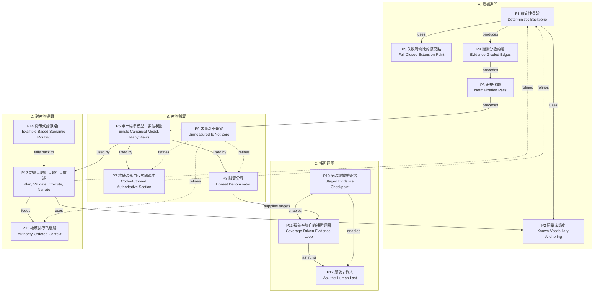

# DepWeaver Pattern 候選目錄（AsianPLoP 投稿前・與指導老師討論用）

> **狀態**：討論稿（2026-09-14）。回應老師 9/14 反饋：「思考這個生成依賴報告和依賴圖裡面可以泛用的 pattern（要拿來投 AsianPLoP）」。
> 定案要收哪幾個 pattern 之後，才寫英文論文。
>
> **怎麼讀這份文件**：第 1 節講範圍與萃取方法；第 2 節是 pattern 之間的關係圖；第 3 節是 15 個候選 pattern；第 4 節是證據不夠、暫時不收的；第 5 節是選題組合與推薦；第 6 節是要老師決定與要作者查證的事。
>
> **引用慣例**：
> - 程式碼路徑一律省略前綴 `src/main/java/ntou/soselab/chatops4msa/Service/`，例如 `DependencyAnalysis/Graph/CoverageAnalyzer.java`。
> - 行號以 commit `cd4332f` 為準。`Qa/` 目前有人在改，行號可能會跑掉，寫論文前要重新對一次。
> - Known Uses 裡 DepWeaver 以外的系統都標 `（待查證）`。那些只是「我確定這個系統／做法存在，而且看起來符合這個 pattern」，**細節與是否真的符合，要作者自己查過才能寫進論文**。本文沒有引用任何論文或外部資料。

---

## 1. 前言

### 1.1 範圍

這份目錄的對象是一類系統：**從多種異質證據，自動產生「依賴報告」與「依賴圖」**。這類系統通常有下列特徵：

- 證據來源的可信度差很多。有些是量測來的（執行期遙測），有些是從結構抽出來的（程式碼、設定檔），有些是別人寫的文字（文件）。
- 其中有一部分要靠 LLM 讀非結構化的東西，或把結果講成人話。
- 產物不只一種，至少會有一張圖、一個數字（覆蓋率、完整度）、一份文字報告，可能還有問答介面。
- 讀者會拿這些產物做決策，例如部署順序或影響範圍，所以「看起來合理但其實是錯的」比「當掉」更危險。

DepWeaver 做的是微服務依賴，但這些 pattern 不限微服務。以下這些系統也有同樣的結構：資料血緣（data lineage）工具、軟體物料清單（SBOM）與授權分析、架構還原（architecture recovery）、基礎設施盤點、組織內的服務目錄、LLM 輔助的程式碼稽核報告。所以第 3 節每個 pattern 的 Context／Problem／Solution 都寫成泛化的形式，DepWeaver 的細節只放在 Known Uses 和例子裡。

### 1.2 萃取方法

這些 pattern 不是事先設計出來的，是從 **2026-07 到 2026-09 的真實疊代**裡回頭整理的。來源有三種：

1. **專案決策史**：每次改動的「為什麼」都有留紀錄（對話記憶檔、`docs/` 下的計劃、驗證步驟與會議講稿）。
2. **真環境事件**：三個目標系統，分別是 spring-petclinic-microservices（runtime）、Bank of Anthos（runtime 與 greenfield）、train-ticket（greenfield，53 節點）。每次真跑逼出來的 bug 與修法都有 commit 可查。
3. **程式碼中的設計註解**：關鍵類別的 Javadoc 大多直接寫了「以前怎麼錯、為什麼改成這樣」，可以直接當證據。

**判準**：一個做法要收成 pattern 候選，至少要符合下列兩項：

- (a) 在 DepWeaver 裡出現**兩次以上**，而且是由不同事件觸發的（例如「程式碼產生權威內容」先出現在覆蓋率分母，後來又出現在報告第 5 節和問答事實表）；
- (b) 背後有**可以指出來的失敗事件**（有數字或 commit），不只是「覺得這樣比較好」；
- (c) 抽掉 DepWeaver 的名詞之後，還能說得出在其他領域的樣子。

找不到事件依據的做法，放在第 4 節，不列入候選。

### 1.3 主要事件年表（萃取的原料）

| 時間 | 事件 | 逼出的 pattern |
|---|---|---|
| 2026-07-13 | 發現 Docker image 沒有 `git`，程式碼抽取在容器裡**從來沒成功過**。fail-soft 讓它靜默退化成「只看文件」，報告看起來一樣 | P9 未量測不是零 |
| 2026-07-13 | tree-sitter 的 Java binding 不會求值述詞（predicate）。沒察覺的話，`logger.send("this-is-not-a-topic")` 會被當成 Kafka topic | P3 失敗時關閉的擴充點 |
| 2026-07-13 | 「暫停補流量」只能整條重跑；補的流量查了 Prometheus 卻**沒寫回**狀態 | P10 分段證據檢查點 |
| 2026-07-21 | 老師：只有 runtime 的圖「比較像流量圖，不像依賴圖」 | P4 證據分級的邊 |
| 2026-07-23 | 老師：「DB 是否真的有使用要注意」；同時發現**完全沒有程式化的覆蓋率**，漏了哪些邊全靠 LLM 眼睛比對 | P4、P8、P11 |
| 2026-07-24 | DeepWiki 用別名與技術名造出幽靈節點（`netflix-eureka`、`all-services`、`caffeine` 被當 DB） | P2 詞彙表錨定 |
| 2026-07-29 | 修好 petclinic 服務發現後，覆蓋率反而掉到**假的 45%**（分母 20 條含雜訊）→ 修正後是 **4/4=100%** | P5 正規化層、P8 誠實分母 |
| 2026-07-29 | LLM 完整性檢查宣稱「API Gateway 往下游全是 unknown」，但確定性帳本記錄 59/19/13 次請求 | P1 確定性骨幹 |
| 2026-08-13 | BoA greenfield 餵進去是**空圖（0 節點、50 條無法解析）**；train-ticket 只有 5 條邊 | P2 |
| 2026-08-13 | greenfield 報告幻覺出「25 Services observed / 50 Pods Running」 | P9 |
| 2026-08-26~09-01 | BoA 真環境逼出 7 個 bug：報告與圖矛盾、文件幻覺讓覆蓋率 7/7 變 7/10、程序內快取被當資料庫、半組憑證、200 不等於成功… | P6、P7、P8、P12 |
| 2026-09-01 | BoA 業務邊 5/7 卡住 → 工具主動問人 → **7/7** | P12 最後才問人 |
| 2026-09-05~08 | 報告問答：regex 路由在第一次真環境的前四題就漏了兩題；語意路由校準 23/33 → 遮名後 33/33、有把握但錯為 0 | P13、P14、P15 |
| 2026-09-08 | greenfield 問答把「未量測」講成「覆蓋率 0%」、未部署狀態多猜「可能是 StatefulSet」 | P9 |

### 1.4 Pattern 格式

每個 pattern 用同一組欄位：**名稱（中英）／一句話摘要／Context／Problem／Forces／Solution／Consequences（好處、代價）／Known Uses／Related Patterns**。
Forces 只列**真的互相拉扯**的力量；拉扯不存在的話，就不叫 pattern，而是常識。

---

## 2. Pattern language 地圖

15 個候選分成四群：

- **A. 證據進門**：P1–P5，處理證據怎麼進到模型裡。
- **B. 產物誠實**：P6–P9，處理模型怎麼變成圖、數字與報告。
- **C. 補證迴圈**：P10–P12，處理證據不夠時怎麼補。
- **D. 對產物提問**：P13–P15，處理報告之後的問答。



**圖例**：實線是 *uses / precedes*（使用或前後順序），虛線是 *refines*（前者是後者在某個特定情境下的特化）。

**閱讀順序建議**：

1. **先讀 P1**。它是整個 language 的根：「確定性優先，LLM 只補語言」。其他 pattern 幾乎都是 P1 在某個位置上的具體化。
2. **沿證據流讀 P2 → P4 → P5 → P6**：名字怎麼對上 → 邊怎麼分信心 → 雜訊怎麼清 → 清完之後建成一個模型。
3. **再讀 B 群的 P7、P8、P9**：同一個模型怎麼變成「不會自相矛盾、不會灌水、不會把沒量到講成零」的產物。這三個是論文最好寫的一組，因為每個都有具體數字。
4. **C 群（P10–P12）是時間軸**：證據不夠時怎麼一輪一輪補，補到最後才找人。
5. **D 群（P13–P15）是互動層**：把 P1 延伸到「使用者用自然語言問問題」。P3 是 A 群裡比較獨立的一個，讀到擴充機制時再讀即可。

---

## 3. Patterns

---

### P1 確定性骨幹，LLM 只處理殘餘（Deterministic Backbone, LLM for the Residue）

**一句話**：能用程式算出來的事實先算完，只把算不出來的**殘餘**交給 LLM，而且 LLM 的輸出要先通過驗證才准進入結果。

**Context**
系統要從異質來源整理出一份結構化結果。有些來源可以確定性地解析（語法樹、遙測指標、設定檔），有些只能靠 LLM 讀（散文文件、不支援的語言、命名不一致的名稱）。結果之後會被當成事實使用。

**Problem**
怎麼借用 LLM 讀非結構化資料的能力，又不讓它每次不一樣的輸出污染原本可以確定的事實？

**Forces**
- **廣度 vs 可重現**：LLM 什麼都能讀，但同一份輸入跑兩次可能給出不同答案；確定性規則每次一樣，卻只涵蓋寫到的情況。
- **規則是窮舉**：每個語言、框架、慣例都要寫規則，維護成本高，也常被批評是「寫死」。
- **LLM 會自信地錯**：它不會說「我沒看懂」，會給一個看起來合理的答案。
- **殘餘可能很大**：遇到規則完全不支援的輸入時，幾乎全部變成殘餘，確定性骨幹就很「薄」。
- **成本與延遲**：全交給 LLM 的話，每次執行都要付錢、要等。

**Solution**
把處理流程排成「確定性在前、LLM 在後、驗證在中間」：

```
異質證據 ──► [確定性抽取器] ──► 事實（結構化） + 殘餘（明確列出）
                                          │
殘餘 ──► [LLM：只給封閉詞彙表與殘餘本身] ──► 候選
                                          │
候選 ──► [驗證器：端點必須在詞彙表內、格式正確] ──► 事實（標記來源 = LLM、信心較低）
```

1. 確定性抽取器產出事實時，**同時產出「我解不出來的東西」清單**，不是默默丟掉。
2. LLM 只看到殘餘，加上一份封閉的詞彙表（已知實體），不看全部原始資料。
3. LLM 的每一筆輸出都要通過驗證（見 P2）才能加入，而且標記來源，信心預設低一級。
4. LLM 那一步整段包在防護裡：LLM 失敗、逾時或輸出垃圾時，確定性結果**原封不動**。
5. 判斷一件事該給誰做的準則是：「這件事有沒有正確答案？」有的話給程式，沒有（措辭、摘要、猜意圖）才給 LLM。

**Consequences**
- 好處：
  - 核心結果可重現，可以寫純程式的單元測試（DepWeaver 的圖層測試從 14 條長到 100 條以上，都不需要 LLM）。
  - LLM 壞掉時系統降級，不會崩潰。
  - 讀者可以分辨哪些結論是量出來的、哪些是模型推的。
  - LLM 呼叫量與成本隨殘餘大小變化，不隨總資料量變化。
- 代價：
  - 每個新語言或慣例都要寫規則，這是持續的工作量。
  - 殘餘的邊界必須對讀者可見，否則確定性骨幹很薄時，看起來仍像完整結果（見 P8 的「薄證據警告」）。
  - 驗證器太嚴會丟掉 LLM 的正確答案，這是故意用 recall 換 precision。

**Known Uses**
1. **DepWeaver**
   - 程式碼抽取分三層：有 grammar 和框架查詢包的走 tree-sitter（`DependencyAnalysis/CodeExtraction/TreeSitterExtractor.java`）；沒有 grammar 的語言才交 LLM 讀原始碼（`CodeExtraction/LlmCodeExtractor.java`）。交給 LLM 之前還有確定性的 grep 預篩，上限 40 檔 / 240KB（`LlmCodeExtractor.java` 第 40–48 行）。三層輸出同一份 `EdgeLedger`。
   - 建圖時 `Graph/CodeGraphMerger.merge()` 回傳 `List<Unresolved>`（殘餘），`DependencyReportService.resolveResidueWithLlm()`（第 479–511 行）只把殘餘交給 LLM。`addLlmEdge()`（第 514–543 行）規定 **source 必須是已知節點**、target 必須已知或明確標為 `external:`／`queue:`，否則丟棄；通過的標記 `code (LLM-aligned)`。
   - **觸發事件 1**：2026-07-29 petclinic 端到端執行時，LLM 的完整性檢查宣稱「API Gateway 到下游服務沒有一條 runtime-observed 邊，全部 unknown」。實際上確定性的 Istio 帳本記錄 `api-gateway→customers/vets/visits` 各有 59/19/13 次請求，確定性覆蓋率是 4/4。從此覆蓋率改以確定性計算為準，LLM 的檢查降為參考。
   - **觸發事件 2**：原本用 LLM 問 DeepWiki「這是不是 Spring Boot 專案？回答 YES/NO」，改成直接讀 build manifest（`CodeExtraction/StackDetector.java`，見 `docs/dependency-analysis-improvements.md` §2.1）。這個架構判斷本來就有正確答案，不需要 LLM 猜。
   - 這條原則後來延伸到報告（P7）和問答（P13），是整個 language 的根。
2. **GitHub Copilot Autofix**：以 CodeQL 的靜態分析警示為基礎，再由 LLM 產生修正建議（待查證）。
3. **Semgrep Assistant**：規則引擎先找出 finding，LLM 再做分流與解釋（待查證）。

**Related Patterns**
- P2：驗證器怎麼判斷一個名字「已知」。
- P3：確定性規則本身遇到不懂的東西時怎麼辦。
- P7、P13：P1 在「報告文字」和「問答」這兩個位置上的特化。
- P8：骨幹很薄時要誠實揭露。

---

### P2 詞彙表錨定：只補強、不發明（Known-Vocabulary Anchoring / Enrich, Don't Invent）

**一句話**：比較鬆散的來源（文件、LLM）只能把資訊**掛到已知實體上**；已知實體的詞彙表由最強的來源建立。對不上的名字不建新實體，有多個候選時也不猜。

**Context**
多個來源用不同寫法稱呼同一個實體，例如模組目錄名、類別名、顯示名、技術名、分組名。系統要把它們合併成一個實體清單。

**Problem**
每冒出一個新名字就建一個實體，圖上會長滿幽靈；比對太嚴，又會漏掉真的只存在於某個來源的實體。怎麼取捨？

**Forces**
- **Recall vs precision**：有些真實體確實只有弱來源提到，例如有程式碼但沒部署的服務。
- **別名無窮**：`CustomersServiceClient`、`spring-petclinic-customers-service`、`Customers Service` 其實是同一個東西。
- **沒有強來源時沒有詞彙表**：靜態分析（沒有執行期）時，詞彙表從哪來？
- **模糊比對可能對到兩個以上**：這時選哪個都是猜。
- **不同種類的實體風險不同**：錯建一個「服務」會改變拓樸與分數；錯建一個「外部主機」影響比較小。

**Solution**
1. **建詞彙表**：用最強的可用來源建立已知實體清單。有執行期時用執行期工作負載；沒有的話用建置描述檔、服務根目錄、設定檔裡的位址。
2. **正規化比對**：比對前把寫法正規化（大小寫、分隔符、慣用前後綴，例如 `-client`、`-service`、模組共同前綴、DNS 後綴）。
3. **只允許唯一解**：正規化後對到多個候選就視為對不上，**不猜**。
4. **依實體種類決定能不能新建**：「主要實體」（服務、呼叫方）只能對上既有的，不准由弱來源新建；「末端實體」（資料庫、外部主機、佇列）可以憑自身證據新建，因為它們不會成為呼叫方，不會亂拓樸。
5. **對不上的記錄下來**（殘餘、警告），不要默默丟掉，也不要默默建立。

**Consequences**
- 好處：
  - 幽靈節點不會從文件或 LLM 那一側流進來。
  - 查詢層可以保證「模型說的名字都真的存在」。
  - greenfield 也有詞彙表可用。
- 代價：
  - 只存在於弱來源的真實體會被漏掉，需要另一個來源補（例如有部署資訊時才現形）。
  - 正規化規則會累積專案慣例（前後綴清單），有「寫死」的味道。
  - 唯一解規則讓一些人類一看就懂的簡寫對不上，要靠其他機制補（DepWeaver 用 LLM planner 看 id 清單）。

**Known Uses**
1. **DepWeaver**
   - `Graph/DocGraphMerger.java` 的類別註解明寫「a source/target that does not resolve to a plausible node leaves the graph untouched rather than inventing a dependency」。`alignToKnown()`（第 189 行起）做正規化比對；`IN_PROCESS_CACHES`（第 226 行）排除 caffeine、ehcache、guava 這類程序內快取，不當 DB。
   - **觸發事件（2026-07-24）**：第二次真跑，DeepWiki 的顯示名造出 `spring-petclinic-admin-server`、`netflix-eureka`、`spring-cloud-config`、`all-services`、`open-ai-api` 幽靈節點，還把 `caffeine` 畫成 DB。修法是改成「enrich 而非 invent」：文件側的服務若對不上已知 workload 就丟棄。
   - **greenfield 詞彙表**：`CodeExtraction/ServiceRootScanner.java` 從服務目錄建立名稱；`ConfigExtractor` 讀 k8s ConfigMap 的 env 位址（`TRANSACTIONS_API_ADDR→ledgerwriter`）來補詞彙表。**觸發事件（2026-08-13）**：BoA 靜態分析原本得到 **0 節點、0 邊、50 條無法解析**，修完是 11 節點、6 邊，與官方架構一致。train-ticket 又逼出「呼叫目標編碼在 URL 路徑段」的情況（commit `527a118`），服務邊從 **5 條變 52 條**。
   - 查詢層：`Qa/GraphQuery.resolveNode()`（第 116–122 行）依序試精確、不分大小寫、寬鬆拼法，而且**只接受唯一解**。
   - LLM 殘餘對齊：`DependencyReportService.addLlmEdge()` 規定 source 必須是既有節點（「never invent a caller」）。
2. **SQL 查詢處理的名稱綁定（binder）**：欄位名必須解析到 catalog 中唯一的欄位，有歧義就報 ambiguous column 錯誤，不會自己選一個（待查證，各資料庫錯誤訊息不同）。
3. **實體連結（entity linking）到知識庫**：例如把文字中的名稱連到 Wikidata 既有條目（待查證）。

**Related Patterns**
- P1：P2 是 P1 驗證器的核心。
- P5：P2 擋住進門的幽靈；已經混進來的由 P5 事後清。
- P13：查詢參數的驗證就是 P2。

---

### P3 失敗時關閉的擴充點（Fail-Closed Extension Point）

**一句話**：由宿主解讀的規則檔、外掛或查詢語言，遇到**看不懂的構件時一律當作不成立**並留下警告，不要當作不存在而放行。

**Context**
系統把抽取規則做成資料（查詢檔、DSL、設定），由宿主程式解讀，好讓使用者不改程式就能擴充。規則作者會打錯字，宿主也可能不支援某些語法。

**Problem**
宿主遇到一個不認得的條件（未知運算子、拼錯的述詞、格式錯的參數）時，應該忽略它繼續比對，還是拒絕這筆比對？

**Forces**
- **放行看起來比較友善**：輸出不會突然變少，使用者不會抱怨「怎麼沒結果」。
- **放行的失效模式最惡劣**：過濾條件被靜默略過，產出一堆看似合理的假結果，而且不報錯。
- **拒絕會降低 recall**：一個拼錯的述詞會讓整條規則沒有輸出。
- **可診斷性**：不管哪種選擇，作者都需要知道是哪個檔案的哪條規則出事。
- **何時發現**：啟動時驗證能早點發現，但有些錯誤（例如 regex 語法）只有真的執行時才會出現。

**Solution**
1. 規則中任何**不認得的構件**（運算子、修飾詞、參數形狀），都讓那一筆比對**不成立**。
2. 同時把錯誤帶著位置（哪個規則檔、哪個 pattern）寫進**產物本身的警告區**，不只寫 log，讓讀報告的人也看得到。
3. 規則集在**啟動時編譯與冒煙測試**，語法錯誤在啟動就失敗，不要跑到一半才發現。
4. 用**誘餌測試**驗證過濾條件真的有生效：放入應該被過濾掉的樣本，確認它沒被抽出來。
5. 「指示」與「過濾」分開：只附加中繼資料的構件（例如 `#set!`）不會影響比對結果；只有過濾類構件套用 fail-closed。

**Consequences**
- 好處：
  - 規則寫錯的最壞結果是「少抓」，不會「錯抓」。
  - 錯誤可以在產物裡被看見。
  - 可以放心開放規則給使用者擴充。
- 代價：
  - 一個錯字會讓整條規則靜默沒有輸出，如果沒人看警告區，一樣會漏抓。
  - 宿主要自己實作所有它宣稱支援的構件，否則合法規則也會被擋。
  - 需要誘餌測試這種額外的測試紀律。

**Known Uses**
1. **DepWeaver**
   - `CodeExtraction/predicate/PredicateEngine.java` 的 `holds()`（第 116–136 行）：解不出的述詞名稱會回報 `"unknown predicate #... (match rejected)"` 並回傳 `false`；`#match?` 的 regex 壞掉時也回傳 `false`（第 236–242 行）。`CodeExtraction/TreeSitterQueryEngine.java` 第 153–155 行在錯誤訊息前加上查詢包名稱，指到正確的 `.scm` 檔。以 `!` 結尾的指示不過濾（第 121 行）。
   - **觸發事件（2026-07-13）**：tree-sitter 的 C 引擎依設計**不會**求值述詞，交給宿主 binding；而專案用的 `io.github.bonede` binding 也不會求值（反編譯確認）。如果沒察覺，`logger.send("this-is-not-a-topic")`、`metrics.record("user-clicked")` 都會被抽成 Kafka topic，而且不報錯。修法是自己實作述詞求值，並決定「無法辨識的述詞一律丟棄：寧可漏抓，不可錯抓」（`docs/dependency-analysis-improvements.md` §1.3）。驗證用誘餌：植入 `logger.send(...)` 與 `someRandomObject.getForObject(...)`，確認沒被抽出來。
   - 同一原則的其他出現處：
     - `Traffic/AskItem.isUsableKey()`：無法往返的變數名**不問**，那條邊維持未覆蓋，是「可見的缺口」而不是「壞掉的表單」。
     - `Qa/GraphQuery.validate()`（第 88–105 行）：未知算子、參數個數不對、節點解析不到，整條計畫丟掉。
2. **Kubernetes RBAC**：沒有規則明確允許的操作一律拒絕（deny by default）（待查證）。
3. **Open Policy Agent（Rego）**：常見慣用寫法 `default allow := false`，規則沒有成立就拒絕（待查證）。

**Related Patterns**
- P1：確定性骨幹的規則本身也要可信。
- P9：被丟棄的比對要留下可見的警告，否則「沒抓到」和「規則壞了」看起來一樣。

---

### P4 證據分級的邊（Evidence-Graded Edges）

**一句話**：圖上的每條關係都帶一個**有序的證據等級**（量測到 > 有使用證據 > 只被提到）；合併時取最高等級，並用最醒目的視覺通道（線型）呈現。

**Context**
依賴圖由多個來源合成。執行期量測精確但看不全（非 HTTP 協定、沒部署的元件看不到）；靜態分析看得全但包含死碼；文件最鬆散。

**Problem**
所有關係畫成同一種線，讀者會以為每條都一樣真；只畫量測到的，又會丟掉那些量測不到但確實存在的依賴（資料庫、還沒部署的服務）。

**Forces**
- **不同來源 precision／recall 相反**：執行期高 precision、低 recall；靜態分析高 recall、中 precision；文件兩者都低。
- **讀者要一眼看懂**：等級太多就看不懂，太少又分不出差異。
- **同一條關係會被多個來源重複提到**：不能畫成平行的多條線。
- **後處理可能偷偷升級**：文字報告、摘要、問答都可能把「只被提到」講成「確定」。
- **視覺通道有限**：線型、顏色、粗細、標籤要分配給不同資訊（證據、類型、流量大小）。

**Solution**
1. 定義**小而有序**的證據等級，建議三級：
   - `observed`：量測到
   - `documented`：有使用證據，例如持久化程式碼或連線設定
   - `inferred`：只有宣告或只被提到
2. 關係以 `(source, target)` 為鍵，合併時：等級**取最大值**、來源集合**取聯集**、佐證清單**取聯集**、量測旗標**取 OR**。
3. **等級（多可信）與來源（誰說的）分開存**。一條邊可以有多個來源，但只有一個等級。
4. 視覺編碼：等級用**線型**（實線／虛線／點線），這是最醒目的通道；類型用**標籤或顏色**；數量**降級**成粗細或不顯示，否則依賴圖會讀起來像流量圖。
5. 每個產物都附**圖例**。
6. 所有下游消費者（指標、報告、問答）讀取等級時**不准升級**。

**Consequences**
- 好處：
  - 量測不到的真依賴仍然在圖上，但不會被誤認為已確認。
  - 多來源合成不需要特殊邏輯，取最大值就自然疊合。
  - 下游可以依等級決定要不要計分（P8）。
- 代價：
  - 等級的判準（什麼算「使用證據」）需要領域知識，而且不同語言或框架要各寫一份。
  - 取最大值代表一個強來源的誤判會蓋掉弱來源的正確判斷（目前沒有降級機制）。
  - 讀者要學會看圖例。

**Known Uses**
1. **DepWeaver**
   - `Graph/DependencyGraph.java`：`CONF_OBSERVED/DOCUMENTED/INFERRED` 三級；`addEdge()`（第 197–218 行）以 `rank()` 取最大值、聯集 provenance 與 evidence、OR `runtimeObserved`。`Graph/DotEmitter.java` 與 `Graph/MermaidEmitter.java` 分別畫實線／虛線／點線，並加 `db?` 標記與圖例。
   - DB「真的有用」的三層：`CodeGraphMerger.promoteReallyUsedDbs()` 用持久化程式碼標記（JPA／SQLAlchemy／Django）把 DB 邊從 `inferred` 升到 `documented`；`DocGraphMerger` 依文件的 `configured` 旗標決定等級。
   - **觸發事件 1（2026-07-21）**：老師看了只有 runtime 的圖，說它「比較像流量圖不像依賴分析」。修法是讓 code／doc 成為一等公民、**以 provenance 為主要編碼**、請求數降級成線寬。
   - **觸發事件 2（2026-07-23）**：老師提醒「DB 是否真的有使用要注意」。只有 datasource 宣告的 DB 邊從此畫成點線 `db?`，不會看起來像真的有用。
   - **升級實例**：
     - BoA 部署真的資料庫，並補上 in-mesh TCP 查詢（commit `852de69`）後，`userservice → accounts-db` 等 DB 邊由虛線升為實線，Data layer 5/5。
     - petclinic 的 `config-server → github.com` 在套用 ServiceEntry 並修好 egress 查詢後，由虛線升為實線。
2. **Kiali**（Istio 的服務圖）：有顯示「閒置邊／閒置節點」（idle edges / idle nodes）的選項，區分有流量和沒流量的關係（待查證，確認選項名稱與語意）。
3. **情報分析的來源可靠度分級**，例如北約的 Admiralty Code，對「來源可靠度」與「資訊可信度」分開評級（待查證）。這可以當成「等級與來源分開存」的先例。

**Related Patterns**
- P5：分級之後、建模之前的清理。
- P8：誠實分母依等級決定計分。
- P7、P15：下游不准升級等級。

---

### P5 正規化層（Normalization Pass）

**一句話**：所有來源合併、補完部署資訊之後，**在任何衍生計算之前**跑一道專門的清理：刪框架／函式庫的偽實體、刪分組詞、把別名併回真實體。清理只碰「沒有獨立存在證據」的實體。

**Context**
合成後的模型裡混著抽取雜訊：函式庫名被當成服務、文件的「所有服務」被當成節點、同一個服務以控制器名或 client 名重複出現。

**Problem**
這些偽實體會扭曲圖、灌大分母、多佔一層分層。在每個抽取器裡各自過濾不完整；在每個下游各自排除又會互相不一致。

**Forces**
- **清理規則是清單**：函式庫名、別名後綴、分組詞都有領域色彩，會被質疑「只對這個專案有效」。
- **清太兇會刪到真的**：資料庫工作負載可能就叫 `mysql`；合法的未部署服務不能被當成幽靈刪掉。
- **順序敏感**：太早清，後面的合併又帶進雜訊；太晚清，分層與分數已經算歪了。
- **併別名時證據要保留**：不能把邊一起丟掉。

**Solution**
1. 在管線中放一個**單一的正規化步驟**：所有合併與補完（例如部署狀態）之後、所有衍生計算（分層、分數、繪圖）之前。
2. **只處理沒有獨立存在證據的實體**，例如叢集裡找不到對應部署的節點。已確認存在的實體永遠不碰。
3. 三種操作：
   - **刪偽實體**：函式庫、框架、驅動程式名，連同邊一起刪。
   - **刪分組詞**：「所有服務」這類文件簡寫。
   - **併別名**：把 `X-controller`、`X-client` 併回**已確認存在**的 `X`，邊的來源、佐證、等級依合併規則折疊，自我迴圈丟掉。
4. 清單以**設定檔（profile）**形式存在，並讓報告揭露清了什麼。
5. 刻意**不**在清單裡放「看起來像函式庫、其實可能是工作負載名」的詞（例如資料庫引擎名）。

**Consequences**
- 好處：
  - 下游所有計算看到的是同一份乾淨模型。
  - 別名的證據不會遺失。
  - 清理邏輯集中一處，好測、好審。
- 代價：
  - 清單需要持續維護。DepWeaver 目前還是寫死在類別裡，設定檔化尚未完成。
  - 「只處理沒有存在證據的」在 greenfield（沒有部署資訊）下保護比較弱。
  - 沒進清單的雜訊仍會留在圖上（見 Known Uses 的殘留項目）。

**Known Uses**
1. **DepWeaver**
   - `Graph/GraphNormalizer.java`：`normalize()`（第 66–84 行）跳過 `deployed == TRUE` 的節點；`LIBRARY_PHANTOMS`（第 47–56 行）、`ALIAS_SUFFIXES`（第 59–60 行）、`isGrouping()`。`DependencyGraph.renameNode()`（第 245–261 行）在併別名時折疊證據。
   - 管線順序在 `DependencyReportService.buildGraph()` 第 324–340 行：k8s enrich → normalize → layer。`GraphLayerAssigner.assign()` 的註解明寫要在 normalize 之後，否則幽靈會佔一層。
   - **觸發事件（2026-07-29）**：修好 petclinic 服務發現、重跑之後，覆蓋率反而**從 56% 掉到 45%**。原因有三個污染源：控制面邊、`resilience4j`／`jolokia`／`spring-cloud-gateway`／`netflix-eureka` 被當服務、`api-gateway-controller` 與 `api-gateway` 分裂成兩個節點。加上 GraphNormalizer 與 P8 的分母修正之後，含雜訊的 20 條變成真實的 **4/4=100%**。
   - 後續補充：BoA 把 Redis client `lettuce` 冒成孤立服務節點，因此把驅動程式名加入清單（`GraphNormalizer.java` 第 52–56 行註解）。
   - **誠實的殘留**：`postgresql`（BoA）、`ts-common`、`rest-service-external`（train-ticket）這些噪音節點目前仍在圖上；清單設定檔化（roadmap A1）尚未做。
2. **資料整合中的實體解析（entity resolution / record linkage）**，例如 Python 的 `dedupe` 函式庫（待查證）。
3. **SBOM 工具用 Package URL（purl）統一套件識別**，避免同一套件因寫法不同而重複（待查證）。

**Related Patterns**
- P2：進門時就擋住的那一半。
- P6：正規化之後才建成單一模型。
- P8：分母依賴乾淨的實體清單。

---

### P6 單一標準模型、多個視圖（Single Canonical Model, Many Views）

**一句話**：每次執行只建**一個**標準模型物件，圖、數字、報告的事實段落、問答答案都是**同一個物件**的函式，所以彼此不可能矛盾。

**Context**
一次分析要交付好幾種產物：一張圖、一個覆蓋率、一份文字報告，之後還有問答。各產物的作者（或模組）不同，有的由程式產生，有的由 LLM 產生。

**Problem**
各產物各自從原始證據推導時，推導邏輯會分岔，讀者會看到「報告說 A、圖畫 B」，而且無從判斷誰對。

**Forces**
- **各產物都想要最適合自己的輸入**：LLM 想讀原始文字，繪圖想讀結構。
- **推導邏輯重複就會分岔**：修了一處忘了另一處。
- **單一模型要承載所有視圖需要的欄位**（等級、來源、部署狀態、層級），schema 會變胖。
- **有些視圖發生得很晚**：問答在原始檢查點刪掉之後才發生，模型要能保存與還原。
- **耦合**：所有視圖綁在同一個 schema 上，改 schema 影響面大。

**Solution**
1. 每次執行**先建模型、再產視圖**，模型物件只建一次。
2. 每個視圖是模型的**純函式**：emitter、指標計算、報告的事實段落（P7）、問答查詢（P13）。
3. **衍生計算只實作一次**，例如分數與分層，由所有視圖呼叫同一個實作，不各自重算。
4. 模型可以**序列化與還原**，晚發生的視圖讀回同一份模型，不從原始證據重推。
5. LLM 需要的事實也從模型產生文字給它，不讓它讀原始證據自己推。

**Consequences**
- 好處：
  - 「報告與圖矛盾」這類錯誤在結構上消失。
  - 視圖可以隨時增加（DepWeaver 後來加上問答，不必再建一次圖）。
  - 測試集中在模型與衍生計算。
- 代價：
  - 模型 schema 變成所有視圖的共同介面，改動要照顧所有消費者。
  - 模型建構失敗時所有視圖一起失敗，需要降級策略（DepWeaver 建圖失敗時回傳 null，報告照貼、圖不貼）。
  - 原始證據裡有、但模型沒收的資訊，所有視圖都拿不到（例如問答答不出原始 Prometheus 資料，這是刻意的界線）。

**Known Uses**
1. **DepWeaver**
   - `DependencyAnalysis/DependencyReportService.java`：`generateAndPost()` 第 86–88 行「Build the graph FIRST… both the report's dependency section and the posted picture are derived from it」；`buildGraph()` 第 279–287 行的註解「One source, one answer」。同一個 `graph` 餵給 `MermaidEmitter`、`DotEmitter`、`coverageMessage()`（`CoverageAnalyzer`）、`infrastructureSection()` 和 `reportQaService.openQaThread()`。
   - 晚發生的視圖：`Qa/ReportArchive` 保存 `DependencyGraph.toJson()`，`DependencyGraph.fromJson()`（第 288–329 行）還原；`Qa/GraphQueryEngine.uncovered()`（第 106–128 行）直接呼叫 `CoverageAnalyzer.analyze()`，`deployOrder()`（第 147–183 行）用 `GraphLayerAssigner` 算好的 layer，所以 thread 的答案和頻道貼的覆蓋率、圖是同一份。
   - **觸發事件（2026-08-26~09-01，BoA）**：報告說 DB 邊「Runtime observed: Unknown」，旁邊貼的圖卻把同一條邊畫成實線（commit `8424538`）。最終解法是讓報告與圖共用同一個 `buildGraph()` 物件（commit `9c13354`）。
2. **Model–View–Controller**：同一個 model 供多個 view 呈現（待查證，找經典出處）。
3. **Pandoc**：各種輸入格式先轉成同一個文件 AST，再輸出成多種格式（待查證）。
4. **Backstage Software Catalog**：以同一份實體模型供多個外掛呈現（待查證）。

**Related Patterns**
- P5：建模之前先清理。
- P7、P8、P13：都是這個模型的視圖。
- P10：模型的原料來自分段檢查點。

---

### P7 權威段落由程式碼產生（Code-Authored Authoritative Section）

**一句話**：LLM 撰寫的報告裡，**純事實的段落**改由程式碼從模型產生，再拼接進 LLM 的文字；LLM 被告知跳過那一段。

**Context**
報告由 LLM 撰寫，才讀得通順、有解釋。但報告中有一部分是可以從結構化模型直接列出來的事實（例如哪個元件依賴哪個資料庫、有沒有被量測到、證據等級）。

**Problem**
LLM 重述事實時會漂移，而且**收緊 prompt 通常只是把錯誤換一個樣子**。怎麼讓報告保有 LLM 的可讀性，事實段落又不會出錯？

**Forces**
- **一份報告的連貫性**：讀者想看到一份完整文件，不想看到「LLM 部分」和「程式部分」拼得很生硬。
- **範本文字很僵硬**：程式產生的段落讀起來像表格。
- **LLM 輸出的段落邊界不可靠**：它可能照樣寫了那一段，或改了標題編號。
- **prompt 修補的誘惑**：改 prompt 很便宜，改一次看起來好了，下次換個方式錯。
- **維護兩套**：報告結構改變時，產生器也要跟著改。

**Solution**
1. 把報告段落分成「**事實型**」（有正確答案、模型裡都有）和「**詮釋型**」（角色描述、風險、建議）。
2. 事實型段落由程式碼從標準模型（P6）產生，**措辭固定**，而且要精確（例如「連線數，不是請求數」）。
3. prompt 告訴 LLM 跳過該段；另外把同樣的事實以「已確認清單」形式餵給 LLM，讓它寫詮釋段落時不會和事實段落矛盾。
4. 用**結構錨點**拼接：找到下一段的標題就插在前面；如果 LLM 自己也寫了該段就**丟掉它的版本**；找不到錨點就附在最後。事實永遠不會因為格式意外而遺失。
5. 段落結尾加一行來源註記：「本段由程式碼從依賴圖產生，因此一定與圖一致」。

**Consequences**
- 好處：
  - 報告中讀者最可能拿去對照圖的部分，保證與圖一致。
  - 不再需要反覆修 prompt。
  - 該段落可以單元測試。
- 代價：
  - 報告風格不一致（一段是範本文字）。
  - 拼接依賴標題慣例，LLM 格式大改時要靠「附在最後」的退路。
  - 事實型與詮釋型的界線要人判斷，劃錯的話，LLM 仍會在詮釋段落重述事實。

**Known Uses**
1. **DepWeaver**
   - `DependencyAnalysis/DependencyReportService.java`：
     - `infrastructureSection()`（第 173–237 行）從圖產生報告第 5 節。
     - `spliceInfrastructureSection()`（第 142–154 行）以 `# 6.` 為錨點拼接，丟掉 LLM 自己寫的第 5 節，找不到錨點就附加。
     - `dataLayerLedger()`（第 257–277 行）把 TCP 量測到的 DB 邊當成「CONFIRMED」清單餵給 LLM，並註明「an empty section reads as an omission and invites the model to fill it in」。
   - **觸發事件（BoA，commit `8424538` → `9c13354`）**：報告稱 DB 邊「Runtime observed: Unknown」，圖卻畫實線。**改 prompt 兩次都只是換一種錯法**：第二次變成列出 Micrometer、Log4j2 等建置期函式庫，以及 Cloud SQL、GKE 等雲端替代方案，這些都不是被分析部署的依賴。最後改由程式碼產生第 5 節，LLM 不碰（見 `infrastructureSection()` 的 Javadoc）。
   - 相關的前一次事件：greenfield 報告幻覺出「25 Services observed / 50 Pods Running」。修法是在 greenfield 模式下關掉那四個會空跑的 runtime 摘要 prompt，並把模式傳進報告 prompt（commit `40f7448`）。
2. **R Markdown／knitr 的行內程式碼**：報告散文中的數字由行內 R 運算式產生，不手打（待查證）。
3. **由 OpenAPI 規格產生的 API 參考文件**（例如 Swagger UI、Redoc），與手寫的使用指南並存（待查證）。

**Related Patterns**
- P1：P7 是 P1 在「報告文字」這個位置的特化。
- P6：事實段落是模型的一個視圖。
- P9：事實段落裡「未知」要寫成未知。
- P15：問答層的同一個想法（事實排在前、散文排在後）。

---

### P8 誠實分母（Honest Denominator）

**一句話**：比率型指標的分母只算「**量測機制做得到**」而且「**有足夠證據存在**」的項目；不同性質的項目分開算；被排除的項目**數量與理由一定揭露**，排除太多時加警告。

**Context**
系統會產出一個比率，例如覆蓋率或完整度，讀者拿它判斷「做得夠不夠」。分母來自合成後的模型，裡面混有不可能被量測的項目、證據很弱的項目，以及性質不同的項目。

**Problem**
把不可能達成的項目算進分母，分數會被永久壓低；把弱證據項目算進去，文件多說幾句就會稀釋分數；排除太多又會讓分數虛高。讀者只看到一個百分比，分不出是哪一種。

**Forces**
- **全算看起來保守**，但會懲罰那些「怎麼做都不可能覆蓋」的項目，讀者會去修一個修不好的缺口。
- **排除會虛高**：證據層很薄時，分母縮到剩幾條，100% 沒有意義。
- **排除規則需要領域知識**（什麼是控制面、什麼是程序內元件）。
- **跨次比較**：分母定義改了，歷史數字就不可比。
- **不同機制混在同一個比率裡會改變數字的意義**：請求被驅動和連線被觀測是兩種量測。

**Solution**
1. 分母 = 同時滿足下列條件的項目：
   - **量測機制做得到**：兩端都實際存在、不是被刻意排除在量測範圍外的元件、不是程序內部元件；
   - **有證據存在**：等級高於「只被提到」（P4）；已量測到的一律算。
2. 性質不同的項目用**獨立比率**，例如「業務邊請求覆蓋率」與「資料層連線觀測率」，不要混在一起。
3. 分數旁邊**一定揭露**：「未計分：N 項（理由）」。
4. 被排除的數量**多於**計分數量時，加上「此分數建立在很小的基礎上」警告。
5. 同時列出**未覆蓋清單**，讓分數可以直接變成下一步行動（見 P11）。
6. 排除規則寫在一處，所有產生這個數字的地方共用（P6）。

**Consequences**
- 好處：
  - 分數回答的是它宣稱回答的問題。
  - 文件幻覺不會讓分數下降。
  - 「永遠到不了 100%」的假缺口消失。
  - 讀者看得到分母組成，可以自行判斷。
- 代價：
  - 排除規則是清單，要持續維護，也可能有漏網之魚（見 Known Uses 的程序內快取事件）。
  - 多一行揭露文字，訊息變長。
  - 排除規則改變後，要說明與舊數字的可比性。

**Known Uses**
1. **DepWeaver**
   - `Graph/CoverageAnalyzer.java`：
     - `analyze()`（第 151–178 行）；
     - `isBusinessSync()`、`isCountableWorkload()`（排除 `deployed == FALSE` 與 `PLATFORM_INFRA`）；
     - `isEvidenced()`（第 229–231 行，`inferred` 不進分母，但量測到的一律算）；
     - `isDataStore()` 與 `isProcessLocal()`（資料層獨立計算，排除程序內快取）；
     - `Report.mentionedOnly` 與 `isThinlyEvidenced()`（第 124–126 行）。
   - 揭露文字在 `DependencyReportService.coverageMessage()` 第 454–468 行（「Not scored: N edge(s)…」與 ⚠️ 警告）。
   - **觸發事件**：
     - **2026-07-29 petclinic**：覆蓋率被控制面、幽靈、別名稀釋成**假 45%** → 改成只算可驅動業務邊之後是 **4/4=100%**。
     - **BoA，commit `03ba052`**：同一個叢集、同一段流量，覆蓋率從 **7/7 變成 7/10**。原因是 DeepWiki 多講了三條不存在的 `userservice → ledger` 邊，以及四條連到泛稱 `postgresql` 的邊。修法：`inferred` 不進分母，圖照畫。
     - **BoA，commit `99bb7d0`**：`balancereader → in-memory-cache`（Guava cache）永遠觀測不到，把 Data layer 卡在 5/6，還建議「重啟 pod」這種不可能有效的修法。修法：程序內元件不進分母。
     - **commit `bcd1c8d`**：誠實評估時發現，沒有 grammar 的語言可能讓真實邊全落在 `inferred`，分母縮小、分數虛高。修法：**不准靜默排除**，一律揭露未計分數量，排除多於計分時加警告。
   - **刻意的設計**：Data layer 用獨立百分比，因此加入 DB 量測後，業務邊的 4/4 仍能與先前報告比較（`docs/verification-2026-08-26.md` 末節）。
2. **CONSORT 臨床試驗報告的流程圖**：要求列出每個階段被排除的受試者人數與理由（待查證）。
3. **coverage.py**：報告中把被排除（excluded）的行數與執行、遺漏的行數分開列出（待查證）。

**Related Patterns**
- P4：分母依證據等級決定。
- P5：分母依乾淨的實體清單。
- P9：分母為零或根本沒量測時，不能輸出 0%。
- P11：未覆蓋清單是補證迴圈的目標。

---

### P9 未量測不是零（Unmeasured Is Not Zero）

**一句話**：「沒量測」「量不到」「量了是零」「功能壞了」是四件不同的事，模型與產物都要能分辨；未知就寫成未知，並說明原因，以及要補什麼證據才會知道。

**Context**
管線有多種執行模式（例如有沒有連叢集），也有 fail-soft 設計（某步驟失敗不中斷整條流程）。下游有程式預設值，也有 LLM，兩者都會「填空」。

**Problem**
沒收集的資料在程式裡變成 `false` 或 `0`，在 LLM 手上變成猜測；失敗的步驟在報告裡看起來和「什麼都沒找到」一模一樣。讀者把一個從未發生的量測當成結果。

**Forces**
- **二值欄位簡單**：三值邏輯（true/false/unknown）會擴散到每個讀取點。
- **空白會邀請填補**：空的段落在 LLM 看來像「漏寫了」。
- **fail-soft 讓系統不中斷**，卻會隱藏失效。
- **讀者想要一個數字**：「未量測」看起來像沒做完。
- **原因要傳到很遠的下游**：模式資訊從入口一路要帶到問答層。

**Solution**
1. 模型中的狀態欄位用**三值**，預設值是「未知」（`null`），不是 `false`。只有在有證據時才設定為 false，而且只對**會被誤判風險低**的實體種類設定。
2. **執行模式（哪些證據沒收集）**當成中繼資料，隨模型傳到每個視圖。
3. 視圖遇到未知時，**寫一句話**：為什麼未知，以及要補什麼證據才會知道。
4. **絕不把數值佔位（0/N、0%）交給 LLM** 代表未量測；直接給它「NOT MEASURED」的敘述。
5. 步驟失敗時在證據帳本裡記錄**失敗狀態與原因**，不是回傳空結果。
6. 空段落寫成「無，原因是…」，不要留白。
7. 「抽取沒抽到東西」的實體獨立成一組（例如分層圖的最後一層），把它當成誠實的缺口清單。

**Consequences**
- 好處：
  - 讀者不會把沒發生的量測當成結果。
  - 靜態模式和執行期模式可以共用同一套產物而不誤導。
  - 失效可以被看見。
- 代價：
  - 每個讀取點都要處理三值。
  - 產物多了很多「未知，因為…」的文字。
  - 要維護模式資訊的傳遞；只要漏一個地方（例如某個 prompt），幻覺就從那裡回來。

**Known Uses**
1. **DepWeaver**
   - 三值狀態：`Graph/DependencyGraph.java` 第 90–98 行 `Boolean deployed`（null = 未判定）。`K8sGraphBuilder` 只把 **service** 類型對不上的節點標成 FALSE，gateway／db／external 維持 null，避免誤報。
   - 報告：`DependencyReportService.infrastructureSection()` 的 Deployed 欄位寫「Not determined (externally managed, or a StatefulSet rather than a Deployment)」。
   - 問答層：
     - `Qa/ReportQaService.buildContext()` 第 366–370 行（greenfield 時寫「NOT MEASURED… Do not present any coverage percentage as a result」，註解「handing the model "0%" invites it to report a measurement that never happened」）；
     - `Qa/GraphQueryEngine.uncovered()` 第 110–117 行、`undeployed()` 第 141–143 行；
     - `Qa/GraphGrounding.java` 第 452 行。
   - 失敗狀態：`CodeExtraction/EdgeLedger.fail()`（第 118–121 行）。
   - **觸發事件**：
     1. **2026-07-13**：base image 沒有 `git`，clone 必定失敗；fail-soft 讓分析**靜默退化**成只看文件，「程式碼確定性抽取」在容器中的貢獻其實是零。之後所有失敗路徑都在 Ledger 內記錄原因（`docs/dependency-analysis-improvements.md` §0：「fail-soft 設計若缺乏可觀測性，會把『功能失效』偽裝成『功能無所發現』」）。
     2. **2026-08-13**：greenfield 報告幻覺出「25 Services observed / 50 Pods Running / EndpointSlices」，因為中間四個 runtime 摘要 prompt 在空資料上空跑（commit `40f7448`）。
     3. **2026-09-08**：greenfield 問答把「未量測」講成「運行時覆蓋率 0%」，還把部署狀態多猜成「可能是 StatefulSet」（commit `89402dc`）。
   - 分層：`Graph/GraphLayerAssigner` 把完全沒有邊的節點放在最後一層「no dependencies found」（`docs/dependency-analysis-flow.md` 分層表：「這層本身就是誠實的缺口清單」）。
2. **SQL 的 NULL 與三值邏輯**：NULL 表示未知，與 0 或空字串不同（待查證）。
3. **Kubernetes 的 condition status**：取值 `True`／`False`／`Unknown`（待查證）。
4. **Grafana 的「No data」**：與數值 0 分開呈現；Prometheus 另有 `absent()` 用來偵測序列不存在（待查證）。

**Related Patterns**
- P8：分母為零時的特例。
- P7、P15：事實段落與脈絡中「未知」的寫法。
- P3：被丟棄的規則比對要留痕跡，也是這個想法。

---

### P10 分段證據檢查點（Staged Evidence Checkpoint）

**一句話**：證據依來源分段、落盤保存；續跑時只重算過期的階段與其下游。**收集與產出分開**：產出只讀檢查點，從不重新收集。

**Context**
一次分析要走很多成本差異很大的步驟（clone repo、問文件服務、查叢集、驅動流量、查遙測）。使用者常在中途暫停，去補其中一種證據（例如多打一些流量、填一個值），再回來繼續。

**Problem**
整包重跑太慢太貴；只存一大包狀態，又不知道哪一部分過期。回答可能是非同步的（人十分鐘後才回），程式也可能在中間重啟。

**Forces**
- **持久化的複雜度**：格式、TTL、重啟後讀回。
- **過期判斷**：哪個階段依賴哪個階段。
- **檢查點裡有祕密**（使用者填的密碼、原始遙測），不能永久保留，也不能拿去給問答層用。
- **LLM 摘要不能再解析**：如果只存 LLM 寫的文字版證據，下游的確定性計算就沒有原料。
- **使用者可能按錯順序**：例如先產報告又想續跑。

**Solution**
1. 以**階段鍵**為單位的持久化狀態，每個收集器完成時寫入自己的階段。
2. 每一種證據**同時保存原始、機器可讀的版本**（raw），不只保存 LLM 的文字摘要。確定性下游只讀 raw。
3. 續跑時只重跑過期階段與其下游；昂貴而未過期的階段直接取用。
4. **收集與產出分開**：「產生報告」讀檢查點建模型（P6），不重新收集。
5. 非同步的人類輸入（問題與答案）也是階段，所以跨時間、跨重啟都還在。
6. 結束時刪除檢查點**之前**，先抽出一份**去敏的封存**（報告、模型、人讀證據，不含祕密與原始遙測），供之後的視圖（問答）使用。

**Consequences**
- 好處：
  - 補證據時不用重付最貴的步驟。
  - 重啟不遺失進度。
  - 確定性下游有穩定的原料。
  - 祕密的生命週期有明確終點。
- 代價：
  - 階段依賴關係要人維護，漏寫就會拿到過期資料。
  - 磁碟上多一份狀態要管 TTL 與清理。
  - 「產生報告就刪檢查點」讓使用者按了之後就不能再續跑（真實操作陷阱）。

**Known Uses**
1. **DepWeaver**
   - `DependencyAnalysis/DependencyAnalysisStateStore.java`：階段常數與「per stage rather than one blob」的類別註解（第 17–28 行），每位使用者一份 JSON、TTL 24 小時；`STAGE_TRAFFIC_RAW` 與 `STAGE_TRAFFIC`（第 51–58 行）是 raw 與 LLM 摘要並存的例子；`STAGE_PENDING_ASKS`／`STAGE_USER_VALUES`（第 89–101 行）存非同步的人類輸入。
   - 續跑流程是 `capability/devops-tool/dependency.yml` 的 `resume-dependency-analysis`。產出端是 `DependencyReportService.generateAndPost()`：讀檢查點 → `openQaThread()` 存封存（第 126–128 行）→ `stateStore.remove()`（第 130 行）。
   - **觸發事件（2026-07-13，`docs/dependency-analysis-improvements.md` §3）**：
     - 原本的檢查點是記憶體中一整包，重啟就沒了；
     - 「Pause」按鈕只會叫使用者整條重跑（DeepWiki 五問、clone、K8s 查詢全部重來）；
     - `supplement-dependency-traffic` 重新查了 Prometheus 卻**沒寫回**狀態，補的流量根本沒進入最終報告。
   - 改成分段之後，補流量時 DeepWiki 與 clone 完全不重跑。
   - 2026-09-05 問答功能上線時發現「產完報告就刪檢查點」，事後沒有東西可查。因此在刪除前另存封存，而且刻意不存 raw Prometheus 與 Tier 3 使用者填的值（`docs/report-qa-design.md` §2.1）。
2. **GNU Make**：只重建比依賴項舊的目標（待查證）。
3. **Apache Airflow**：可以清除某個 task 並連同下游重跑（待查證）。
4. **DVC（Data Version Control）pipeline**：依輸入雜湊決定哪些 stage 要重跑（待查證）。

**Related Patterns**
- P6：產出時從檢查點建立單一模型。
- P11、P12：迴圈與非同步提問都需要這個基礎。

---

### P11 覆蓋率導向的補證迴圈（Coverage-Driven Evidence Loop）

**一句話**：每輪結束後**確定性地**算出還沒被證實的項目，當成下一輪產生測試流量的**權威目標**；成功與否以「預期的證據有沒有出現」判斷，不看回應碼。

**Context**
執行期證據要靠實際操作系統才會產生，而操作計畫（使用者旅程、請求序列）需要 LLM 依 API 與文件來產生。一輪通常不夠。

**Problem**
下一輪該打哪裡？讓 LLM 自己看報告決定目標，它會看錯；用回應碼判斷成功，會把被拒絕的請求當成成功。什麼時候該停？

**Forces**
- **產生操作計畫是創造性的**，需要 LLM；**判斷缺什麼是有正確答案的**，不該交給 LLM。
- **成功回應不等於產生了預期效果**：伺服器端渲染的應用拒絕表單時也回 200。
- **遙測有延遲**：量得太早會漏掉最晚發生的深層呼叫。
- **每輪都有成本**；有些缺口怎麼打都打不到（見 P12）。
- **停止條件**要由人決定，但人要看得到進度。

**Solution**
1. 每輪結束後用誠實分母（P8）算出**未覆蓋清單**。
2. 把這份清單當成 prompt 裡的**權威目標**，LLM 的健康檢查只當次要提示。
3. 產生的操作計畫執行完之後，**等遙測穩定**（大於一個 scrape 週期）再量測。
4. 以「**這一步預期出現的邊有沒有出現**」判斷成功；動作回應成功但預期的邊沒出現，就視為被拒絕。
5. 失敗回應的內容（錯誤訊息）回饋給下一輪。
6. 每輪貼出**覆蓋率軌跡**（X% → Y%），由人決定何時停止。

**Consequences**
- 好處：
  - 迴圈有明確目標與可見進度。
  - LLM 只負責「怎麼打」，不負責「打哪裡」。
  - 同一套數字貫穿迴圈與最終報告。
- 代價：
  - 迴圈上限受限於產生器能不能湊出正確的請求內容，這就是 P12 要處理的。
  - 等待遙測穩定讓每輪變慢。
  - 「預期的邊沒出現」也可能是系統真的沒有這條依賴，需要人判斷。

**Known Uses**
1. **DepWeaver**
   - `DepstateToolkit.toolkitDepstateCoverage()`（low-code 函式 `toolkit-depstate-coverage`）從檢查點組圖、呼叫 `CoverageAnalyzer`，回傳未覆蓋清單。`capability/devops-tool/dependency.yml` 的 `resume-dependency-analysis` 以 `${deterministic_coverage}` 作為 prompt 的 MISSING EDGES 權威目標。每輪前後都在 Discord 貼覆蓋率。
   - 等待遙測：`Traffic/TrafficRunner` 導完流量後等 20 秒（commit `208504b`）。
   - **觸發事件**：
     - **2026-07-23**：專案原本**完全沒有程式化覆蓋率**，漏了哪些邊全靠 LLM 健康檢查比對。
     - **2026-07-29 petclinic**：續跑兩輪之間，同一批邊的累積請求數上升（ingress 77→95、`api-gateway→customers` 47→59）。round 1 打 `/owners` 得到 404，round 2 學會 gateway 前綴 `/api/customer/owners`。
     - **BoA 遙測競態**：第一張圖只有 `frontend→userservice`；直接查 Prometheus，5 條邊其實全在，是工具查得太早（commit `208504b`）。
     - **BoA「200 不等於成功」**：SSR 應用拒絕表單也回 200，修成「動作 200 但預期的邊沒出現就當被拒絕」（commit `5e644b7`）。
2. **覆蓋率導向的模糊測試（coverage-guided fuzzing）**，例如 AFL、libFuzzer：以新覆蓋到的路徑引導下一批輸入（待查證）。
3. **EvoSuite**：以覆蓋率目標驅動的搜尋式單元測試產生（待查證）。

**Related Patterns**
- P8：提供目標。
- P10：讓迴圈可以跨輪次、跨暫停。
- P12：迴圈卡住時的最後一階。

---

### P12 最後才問人（Ask the Human Last）

**一句話**：自動補證卡在「靜態分析推不出來的值」時，照固定的**升級階梯**處理：先挖專案自己的範例，再用失敗回饋自我修正，真的推不出來才**明確地開口問人**；問了也沒用的，誠實標成無法到達。

**Context**
自動化流程需要一些只存在於操作者腦中或其他系統的值，例如一組真的憑證、一個存在的帳號、一個租戶 ID。猜錯只會得到錯誤回應，後面的深層操作永遠不會發生。

**Problem**
一直猜，會卡在最後幾個缺口；什麼都問人，又失去自動化的意義。問了之後，答案要怎麼安全地用、答錯要怎麼改？

**Forces**
- **自主 vs 完成度**：多問一次就多一次人工成本。
- **非同步**：人可能過很久才回，或程式在中間重啟。
- **祕密**：答案可能是密碼，不能進 log、不能進 prompt、不能回顯。
- **半套答案比沒答更危險**：只給帳號沒給密碼時，工具自己編一個密碼，會得到看似成功的回應。
- **答錯要能更正**：「不准再問」會讓錯的值改不掉。
- **介面限制**：例如一次表單只能放 5 格。
- **證明沒有濫用**：需要能展示「有其他來源時它不問」。

**Solution**
升級階梯，每一階失敗才往下一階：

```
階 1  挖掘專案自己的產物（負載測試腳本、e2e、OpenAPI、Postman）→ 照抄真實欄位
階 2  失敗回應內容回饋給產生器 → 自我修正
階 3  明確宣告「要問人的值」（ASK）→ 相依步驟扣住不送（WAIT）→ 問 → 答案存檢查點 → 自動續跑
階 4  問人也沒用的（需要真實金流、外部系統）→ 誠實標 UNREACHABLE
```

階 3 的細節：
1. 「要問的值」直接宣告在操作計畫這個產物裡（例如空值變數加上 `ASK:` 描述），讓產物維持標準格式、可以在工具外執行。
2. 依賴該值的步驟**扣住不送**，不要半填就送出。
3. 相關的值**整組問**（憑證一定帳號密碼一起），不准自行補齊。
4. 答案存進檢查點（P10）；prompt 裡**只放變數名，不放值**；看起來像祕密的值一律遮罩；值經過清理（長度上限、去除會再展開的佔位符）。
5. 答完**自動續跑**；允許用新的變數名重問，讓答錯可以更正。
6. 用**對照實驗**證明沒有濫用：關掉階 1 才會問，開著時不問。

**Consequences**
- 好處：
  - 補上自動化本來到不了的最後幾個缺口。
  - 人只在不可約的地方介入。
  - 祕密不會流進模型。
  - 有對照組可以量化每一階的價值。
- 代價：
  - 流程變成非同步，使用者體驗依賴聊天平台的元件能力（Modal、按鈕）。
  - 答案的正確性仍依賴人；DepWeaver 的例子裡，收款帳號要填「別人的」才會觸發目標依賴，這種領域知識工具給不了。
  - 階梯的順序本身是設計假設，換個領域可能需要不同的階。

**Known Uses**
1. **DepWeaver**
   - 階 3 的程式在 `Traffic/AskItem.java`：`ASK_PREFIX`、`SECRET_HINTS` 與 `maskIfSecret()`、`sanitize()`（長度 200、移除 `{{ }}`）、`isUsableKey()`。狀態在 `DependencyAnalysisStateStore.STAGE_PENDING_ASKS／STAGE_USER_VALUES`，互動在 `DiscordService/ModalListener`（存值並自動續跑），扣住步驟在 `Traffic/TrafficRunner`（`[WAIT]`）。
   - 階 1 是 `CodeExtraction/ExampleRequestHarvester.java`，可用 `DEPENDENCY_EXAMPLE_REQUESTS_ENABLED` 關閉做對照；階 2 是 `TrafficRunner` 保存 4xx／5xx 回應片段。
   - **觸發事件（BoA，commit `3e0cdb6` 起）**：業務邊自動跑到 **5/7 卡住**。缺的兩條都需要「真的成功寫入一筆交易」，需要這個部署的密碼和一個存在的收款帳號 → 工具開口問 → 人回答 → 自動續跑 → 6/7 → **7/7**，最後一條是 `ledgerwriter → balancereader`。
   - 階 1 的依據：BoA 自己的 `src/loadgenerator/locustfile.py` 就有 deposit／payment 的 `{account_num, routing_num, amount, uuid}`。
   - 真環境逼出的階 3 修正：
     - **半組憑證**（commit `ac01bf1`）：問了 username 沒問 password，工具自己編一個，登入回 200（跟隨了 redirect），之後每一步都 401。
     - **值錯了改不掉**（commit `5e644b7`）：prompt 寫死「NEVER ask again」，使用者給的帳號不適合時只能宣告 UNREACHABLE。
2. **Terraform**：沒有給值的輸入變數，在互動執行時會提示使用者輸入（待查證）。
3. **Ansible 的 `vars_prompt`**：playbook 宣告需要在執行時向使用者詢問的變數（待查證）。
4. **主動學習（active learning）**：只把模型最不確定的樣本交給人標註（待查證）。

**Related Patterns**
- P11：P12 是迴圈的最後一階。
- P10：非同步答案的保存。
- P3：無法往返的變數名不問，也是失敗時關閉。

---

### P13 規劃→驗證→執行→敘述（Plan, Validate, Execute, Narrate）

**一句話**：使用者用自然語言問結構化模型時，LLM 只負責把問題轉成**封閉算子目錄**裡的查詢計畫；計畫經程式驗證後由程式確定性執行；LLM 最後只把執行結果講成人話。

**Context**
系統已經有一個結構化模型（圖），使用者想用自然語言問它：誰依賴誰、某元件壞了影響誰、哪些還沒被證實、部署順序。

**Problem**
把整個模型塞進 prompt 讓 LLM 自己讀，它會漏掉需要遍歷的答案，也會編造不存在的關係；自己寫自然語言解析器，又是無窮窮舉。

**Forces**
- **自然語言的變化無窮** vs **算子必須封閉**才能保證安全。
- **表達力 vs 安全**：算子越多越能回答，但每多一個就要多驗證與測試。
- **LLM planner 會輸出格式錯誤的 JSON**，或用不存在的名字。
- **名稱模糊**：「登入服務」到底是哪個節點。
- **成本與延遲**：多一次 LLM 呼叫。
- **一致性**：查詢結果必須和其他產物（覆蓋率、圖）一致。
- **「漏答」vs「說錯」**：限制 LLM 只能選查詢，代價是選錯時會漏答。

**Solution**

```
問句 ──► [Planner：LLM 或 P14 路由] ──► JSON 計畫 [{op, args}]，最多 N 條
          │  （只看得到算子目錄 + 模型的實體 id 清單）
          ▼
       [驗證器] 算子在目錄內？參數個數對？每個實體參數解析到唯一 id？（P2）
          │  不合法 → 整條丟掉；全部不合法 → 空計畫（退回只有摘要的模式）
          ▼
       [執行器] 查表、遍歷；衍生計算重用產物用的同一個實作（P6）
          ▼
       [敘述器：LLM] 結果放在脈絡最前面（P15），只准依結果回答，不准新增實體
```

1. 定義**小而封閉**的算子目錄：固定名稱、固定參數個數、參數型別（實體 id 或列舉值）。
2. Planner 的輸出**只准是計畫**，不准是答案。
3. 驗證失敗的條目**丟棄**，不嘗試修補；Planner 整個失敗時系統仍可運作。
4. 執行器全部是確定性的，而且**呼叫產物用的同一套計算**（覆蓋率、分層），不另寫一份。
5. 敘述的 LLM 被規定不得新增實體或升級證據等級（P4）。

**Consequences**
- 好處：
  - 模型最壞只能「選錯查詢」，不可能「說錯事實」。
  - 答案與其他產物同源。
  - 查詢結果可測試。
  - 加一種問法 = 加一個算子（加上 P14 的一張意圖卡）。
- 代價：
  - 目錄外的問題（例如業務流程「訂票會經過哪些服務」不在圖上）只能用推測語氣回答，或回答沒有。
  - 選錯算子會漏答。
  - 每題多一次 LLM 呼叫（可以用 P14 省下多數）。

**Known Uses**
1. **DepWeaver**
   - `Qa/GraphQuery.java`：`OPS` 目錄 15 個算子（第 25–43 行）、`parse()` 容忍 markdown 包裝但不合法就回空、`validate()`（第 88–105 行）檢查算子、個數與唯一解。
   - `Qa/GraphQueryPlanner.java` 搭配 `resources/prompts/graph_query_plan.txt`，只輸出 JSON 計畫、最多 3 條。
   - `Qa/GraphQueryEngine.java`：`uncovered()` 呼叫 `CoverageAnalyzer`，`deployOrder()` 用 `GraphLayerAssigner` 的 tier。結果放進 `ReportQaService.buildContext()` 的 GRAPH FACTS 最前面。
   - **由來**：2026-08-14 報告比較「A1：把 graph JSON 直接塞 prompt」與「A2：NL → 圖查詢 DSL → 確定性執行 → LLM 講結果」，定案 A2（`docs/report-2026-08-14.md`）。9/05 先做了只有 grounding 的 GraphRAG，9/06 補上查詢層。
   - **真環境結果**：
     - 三輪 greenfield（BoA 兩輪、train-ticket 一輪）共 36 題，人工逐題判定**零編造**；問不存在的服務會回「圖上沒有」並列出相近 id。
     - train-ticket 的 `impact-of(ts-station-service)` 回傳 18 個服務，分三層深度。
   - 修過的錯：`deploy-order` 曾把 `github.com` 排第一步，改成外部主機排除，並註明「假設可達」（`GraphQueryEngine.java` 第 161–166 行）。
   - **尚未驗證**：runtime 模式的問答。
2. **LangChain 的 `GraphCypherQAChain`**：LLM 產生 Cypher 查詢、在 Neo4j 執行、再由 LLM 依結果回答（待查證，確認有沒有驗證步驟）。
3. **Text-to-SQL 系統**：LLM 產生 SQL，由資料庫的解析、綁定、執行把關（待查證，挑一個有明確驗證步驟的產品或開源專案）。
4. **SQL 查詢處理的 parse → bind → plan → execute 分段**，是「計畫要先綁定到 catalog 才執行」的結構先例（待查證）。

**Related Patterns**
- P1：P13 是 P1 在互動層的特化。
- P2：驗證器。
- P6：執行器共用衍生計算。
- P14：放在 planner 前面、省掉多數 LLM 呼叫。
- P15：結果怎麼放進脈絡。

---

### P14 例句式語意路由，附校準門檻與 LLM 備援（Example-Based Semantic Routing with Calibrated Fallback）

**一句話**：每個意圖用一組例句定義；問句先**遮掉實體名**再算與例句的向量相似度。分數過門檻、而且領先第二名一段差距才直接決定；否則交給 LLM。門檻由 hold-out 校準決定，目標是「有把握但錯」為零。

**Context**
自然語言要分派到少數固定的意圖或算子（P13）。每題都呼叫 LLM planner 太貴、太慢，也不夠可預測；關鍵字規則是窮舉。

**Problem**
怎麼便宜、可預測、可解釋地做意圖路由，又能涵蓋換句話說，而且不會「有把握地選錯」？

**Forces**
- **泛化 vs 可預測**：向量相似度會泛化，但分數分布跟著模型與語料走。
- **門檻的兩個方向代價不對稱**：太高只是多一次 LLM 呼叫；太低會有把握地選錯，導致漏答。
- **實體名扭曲向量**：問句帶具體服務名時，分數被名字拉低。
- **功能詞被向量忽略**：否定（「沒」被觀測）、語序（「誰依賴 X」和「X 依賴誰」）。
- **校準樣本少**，而且修正時容易把 hold-out 句加進例句，污染評估。
- **換 embedding 模型要重新校準。**

**Solution**
1. **意圖卡**：每個意圖包含對應的查詢、需要幾個實體參數，以及十來句涵蓋所有支援語言的例句（用佔位符 X、Y 代替實體名）。
2. 例句啟動時 embed 一次；問句向量盡量重用檢索本來就算的那一個。
3. **遮名**：問句中偵測到的實體名換成 X／Y／Z 再 embed，讓問句與例句同形。
4. 分數 = 每個意圖所有例句中的最高 cosine。**有把握**的條件：
   - `最高分 ≥ T` 且 `最高分 − 第二名 ≥ M`；或
   - `最高分 ≥ H`（已經等同例句原句）。
   - 需要實體但問句沒點名時，一律視為沒把握。
5. 只保留**最少的明確規則**，處理向量模型忽略的功能詞（否定、方向）。
6. 沒把握 → 交給 LLM planner（P13）。
7. **校準**：用不在例句裡的 hold-out 問句對真實模型跑，印出每句最高分與第二名；T 設在「正確分數帶下緣」與「無對應意圖分數帶上緣」之間；**斷言有把握但錯為 0**。記錄每題分數以便重新校準；被加進例句的 hold-out 句不再算成績。

**Consequences**
- 好處：
  - 多數問題零額外 LLM 呼叫。
  - 加意圖 = 加句子，不是加 regex。
  - 錯誤可以追到是哪一句例句造成的（沒有訓練過程）。
  - 門檻有資料依據。
- 代價：
  - 需要 embedding 服務；服務掛了路由就不啟動，全部交給 LLM。
  - 遮名多一次 embedding 呼叫。
  - 門檻只對當前模型與樣本有效；小樣本的門檻可信度有限。
  - 例句本身要人寫、要維護。

**Known Uses**
1. **DepWeaver**
   - `Qa/SemanticRouter.java`：
     - `INTENTS` 共 14 張意圖卡（第 85–128 行），另有一張 `about-report` 不查圖、也不呼叫 planner；
     - `NEGATION`、`UPSTREAM`／`DOWNSTREAM` 兩條功能詞規則（第 130–139 行、第 242–253 行）；
     - 門檻 `0.58 / 0.04 / 0.85` 與校準註解（第 141–149 行）；
     - 信心判定在第 255 行。
   - 遮名：`Qa/GraphGrounding.maskMentions()`、`SemanticRouter.routeQuestion()`（第 206–216 行）。校準測試：`SemanticRouterCalibrationTest`（`-Dqa.calibrate=true`）。
   - **疊代事件（2026-09-08）**：
     - **v1 regex**：第一次真環境跑的前四題就有兩題是規則沒列到的說法（`docs/report-qa-design.md` 第 125 行）。
     - **v2 語意路由**：第一次校準 33 句對 23 句、有把握但錯 2 句；發現帶服務名的問句分數普遍被拉低 0.1–0.2，錯的幾乎都是這類。另外，undeployed 的例句「宣告了但沒上線」讓「程式碼有宣告但流量沒跑到」誤判為 undeployed（0.65）。
     - **v3 遮名**：33/33 全對、有把握且對 22、有把握但錯 0、最低正確分數 0.541。分數帶：例句原句 0.97–1.00、換句話說 0.64–0.73、沒有對應意圖 0.38–0.50。同一句「frontend 依賴誰」從 0.56 升到 0.98。
     - **誠實揭露**：其中 5 句在修 v3 時被加進例句，真正的 hold-out 只有 28 句。
   - **待補**：老師 2026-09-14 要求「門檻設計要說明並做實驗」，目前只有 33 句校準，尚未做系統性實驗。
2. **Rasa 的 `FallbackClassifier`**：同時有 `threshold` 與 `ambiguity_threshold`（最高兩個意圖差距太小時觸發 fallback），結構與 T、M 條件幾乎相同（待查證）。
3. **Google Dialogflow**：意圖以訓練例句定義，分數低於分類門檻時進入 fallback intent（待查證）。
4. **Aurelio AI 的 `semantic-router` 函式庫**：以例句（utterances）向量相似度做路由（待查證）。

**Related Patterns**
- P13：沒把握時交給它。
- P2：遮名依賴實體偵測。
- P3：功能詞規則是最少的明確規則，未知的一律交給備援。

---

### P15 權威排序的脈絡（Authority-Ordered Context）

**一句話**：給 LLM 的脈絡依**權威**分區並排序：程式算出的事實最前、程式算出的指標次之、檢索到的散文最後。system prompt 明定衝突時誰贏，而且不准升級證據等級。

**Context**
檢索增強生成（RAG）的脈絡同時包含程式算出來的事實，以及過去由 LLM 寫的散文（報告段落）。兩者可能矛盾。

**Problem**
LLM 讀到互相矛盾的脈絡時，可能跟著散文走，因為散文比較像答案。只放事實又會失去措辭、角色描述、限制說明。

**Forces**
- **散文提供可讀性與背景**，但它本身是 LLM 產物，會漂移。
- **排序與標籤會影響模型，但不是保證。**
- **脈絡預算有限**：事實、指標、散文要搶空間。
- **「沒有量測」要比散文裡的數字更有力**（P9）。

**Solution**
1. 脈絡分成帶標籤的區塊：`1. GRAPH FACTS（authoritative）`、`2. COVERAGE（authoritative）`、`3. RETRIEVED PASSAGES`。
2. 查詢結果（P13）放在事實區的最前面。
3. system prompt 寫明：衝突時以前面的區塊為準，而且要指出衝突；散文只能用於措辭、角色與限制，不得推翻事實。
4. 未量測時，在權威區**明寫 NOT MEASURED**，不要讓散文中的數字填補空白。
5. 最低權威區設預算上限（段數、字數）。
6. 回答時要分辨證據等級，不准升級。

**Consequences**
- 好處：
  - 同一套事實與其他產物一致。
  - 散文漂移被限制在措辭層。
  - 規則簡單，好寫進 prompt。
- 代價：
  - 效果依賴模型遵守指令，**不是結構保證**（和 P7 不同）。
  - 散文裡只有它才有的正確資訊（例如 file:line）可能被預算擠掉。
  - 需要以問題集人工驗證。

**Known Uses**
1. **DepWeaver**
   - `Qa/ReportQaService.buildContext()`（第 347–385 行）依序組 `GRAPH FACTS`（查詢結果最前）→ `RUNTIME COVERAGE`（greenfield 寫 NOT MEASURED）→ `RETRIEVED PASSAGES`。
   - `resources/prompts/report_qa.txt` 第 7–16 行定權威序，並說明「The report text was written by a language model… may drift; use it for wording, roles, and limitations, not to overrule 1 or 2」；第 24–30 行規定不准升級等級、DB 數字是連線數、greenfield 沒有 runtime 事實。
   - 段落預算：`ChunkRetriever`，前 8 段、24k 字。
   - **由來**：延續 P7 的教訓（報告文字會和圖矛盾），在問答層改用排序加規則處理。2026-09-08 greenfield 問答把「未量測」講成 0% 之後，權威區改為明寫 NOT MEASURED（commit `89402dc`）。
2. **其他 known uses 目前說不出有把握的 LLM 系統實例**。可以當結構類比的是「多個設定來源依優先序覆蓋」的機制，例如 Spring Boot externalized configuration 的來源優先序（類比，待查證）。**寫論文前需要另外找 LLM 領域的實例；找不到的話建議把 P15 併入 P13。**

**Related Patterns**
- P13：結果的放置位置。
- P7：同一想法的結構保證版。
- P9：權威區中「未量測」的寫法。
- P4：不准升級等級。

---

## 4. 暫不收錄的候選（證據不足，或比較像技術而不是 pattern）

| 候選 | 為什麼暫不收 |
|---|---|
| **依呼叫深度分層繪圖**（`GraphLayerAssigner`：最長路徑、Tarjan SCC 縮點、無邊節點放最後一層） | 有真實事件（train-ticket 分層後 51 條邊 100% 由上往下、入口層 31→12），但本質是已知的圖分層演算法，比較像技術。「無邊節點當缺口清單」已經併入 P9 |
| **按鈕確認後才變更外部系統**（ServiceEntry apply 按鈕） | 只出現一次，而且端到端未驗證 |
| **直接查量測系統確認 ground truth**（「懷疑圖漏邊，先直接查 Prometheus」） | 是除錯實務，不是系統結構 |
| **對照組反證**（petclinic 用 fork 的 repo 名與上游 repo 名各跑一次，確認工具如實反映程式碼） | 是驗證方法，可以寫進論文的「pattern 萃取方法」段落，但不是 pattern |
| **產物帶工具名**（`DependencyGraph.TOOL_NAME` 印在 PNG、.mmd、報告上） | 太小，比較像慣例 |
| **Raw 與 LLM 摘要並存** | 已經併入 P10 的 Solution 第 2 點；如果老師認為要獨立，也可以拆出來 |

---

## 5. 選題建議

AsianPLoP 論文通常收 3–5 個緊密相關的 pattern。以下三種組合都能獨立成一篇，差別在主軸與證據強度。

### 組合 A：「依賴圖的誠實呈現」（Honest Dependency Views）

- **主軸**：多來源合成的依賴圖，怎麼變成**不自相矛盾、不灌水、不把沒量到講成零**的圖、數字與報告。
- **收錄**：P6 單一標準模型（根）→ P4 證據分級的邊 → P8 誠實分母 → P9 未量測不是零；第 5 個可選 P7 權威段落由程式碼產生。
- **優點**：
  - 每個 pattern 都有**具體數字的失敗事件**：假 45% → 4/4、7/7 → 7/10、報告與圖矛盾、greenfield 講成 0%。
  - 最不依賴 LLM 熱度，泛化性最好，可以直接套到資料血緣、SBOM、監控儀表板、測試覆蓋率報告。
  - 五個 pattern 在地圖上本來就相連（P6 → P7/P8，P9 refines P8/P7）。
- **缺點**：
  - LLM 只在 P7 出場，比較看不出「LLM 時代」的新意。
  - P9 與 P8 有部分重疊，要寫清楚界線。
  - 各 pattern 的其他 known uses（CONSORT、SQL NULL、Kubernetes condition）來自不同領域，需要說服 shepherd 它們是同一個 pattern。

### 組合 B：「可信的 LLM 輔助架構還原」（Trustworthy LLM-Assisted Architecture Recovery）

- **主軸**：LLM 參與抽取與撰寫時，怎麼讓事實保持確定性。
- **收錄**：P1 確定性骨幹（根）→ P2 詞彙表錨定 → P3 失敗時關閉的擴充點 → P7 權威段落由程式碼產生；第 5 個可選 P5 正規化層。
- **優點**：
  - 主題貼近目前 LLM + 軟體工程的關注點。
  - P1 是整個碩論的核心主張（「確定性優先、LLM 只補殘餘」），論文與碩論敘事一致。
  - 有一個教科書級的故事：**改 prompt 兩次只是換一種錯法**（P7）。
- **缺點**：
  - P3 的觸發事件是 tree-sitter binding 的特殊情況，泛化時要多花篇幅。
  - 「確定性優先」容易被評為常識，Forces 要寫得很紮實才站得住。
  - 其他 known uses（Copilot Autofix、Semgrep Assistant）的內部做法公開資訊有限，查證難度最高。

### 組合 C：「對產物提問：確定性優先的報告問答」（Asking the Report）

- **主軸**：報告產出後，讓使用者用自然語言追問，而答案不編造。
- **收錄**：P13 規劃→驗證→執行→敘述（根）→ P14 例句式語意路由 → P15 權威排序的脈絡；搭配 P6 單一標準模型。
- **優點**：
  - 最新的工作，有完整的疊代資料（v1→v3、23/33→33/33、36 題零編造）。
  - 與老師 9/14 的第 3 點（門檻要說明並做實驗）同一條線，實驗做完可以直接放進論文。
- **缺點**：
  - **只驗證過 greenfield**，runtime 問答尚未跑。
  - 校準樣本只有 33 句，而且 5 句已被污染。
  - P15 的 known uses 薄弱。
  - 範圍偏離老師原話「生成依賴報告和依賴圖」，比較像「報告之後」。

### 補充：組合 D「漸進式補證」（P10 + P11 + P12）

故事完整（BoA 5/7 → 問人 → 7/7），但三個 pattern 在其他領域的 known uses 主要是 Make、fuzzing、Terraform，各自很成熟，新意比較容易被質疑。建議當成**第二篇**或碩論章節，不當第一篇。

### 推薦

**推薦組合 A（依賴圖的誠實呈現），收 P6、P4、P8、P9，加上 P7 共五個。**

理由：
1. **最貼老師原話**：「生成依賴報告和依賴圖裡面可以泛用的 pattern」，A 正好是從圖到報告的那一段。
2. **證據最硬**：每個 pattern 都有「前後數字」與 commit，而且都是真環境逼出來的，不是設計時想像的。
3. **泛化最容易說服人**：讀者就算不做微服務，也都遇過「儀表板上的 0% 其實是沒資料」「分數被不可能的項目壓低」。
4. **加入 P7 可以保留 LLM 的面向**，也把 P1 的精神帶進來，碩論的核心主張在論文裡有一席之地；P1 本身可以在論文引言當成「language 的根」，只寫一段，不展開成完整 pattern。
5. 組合 B 與 C 保留成後續論文或碩論章節。

---

## 6. 待老師決定／待查證清單

### 6.1 待老師決定

1. **選哪個組合**（A／B／C），以及 4 個還是 5 個 pattern。
2. **範圍界定**：問答層（P13–P15）算不算老師說的「生成依賴報告和依賴圖」？如果不算，組合 C 應該排除。
3. **P1 要不要獨立成 pattern**，還是只放在引言當根原則。它最像整篇論文的主張，但單獨成篇容易被評為常識。
4. **P9 與 P8 要合還是要分**：P9 可以看成 P8 在「分母為零或沒量測」時的特化，也可以獨立（它還涵蓋部署狀態、失敗狀態，不只分數）。
5. **P15 要不要保留**：LLM 領域的 known uses 目前說不出來；找不到的話建議併入 P13。
6. **Pattern 名稱的語氣**：論文要用 PLoP 常見的名詞片語（例如 *Honest Denominator*），還是動詞祈使句（例如 *Say What You Did Not Measure*）？
7. **論文要不要以 DepWeaver 的真實事件當 running example**，還是改用虛構的中性例子，DepWeaver 只放在 Known Uses？前者證據強，後者泛化感比較好。
8. **是否需要 shepherd 前先找研究室以外的人讀一次**（PLoP 慣例有 shepherding 與 writers' workshop）。

### 6.2 待作者查證

**外部 known uses（全部都要查）**

| Pattern | 要查的 | 查什麼 |
|---|---|---|
| P1 | GitHub Copilot Autofix、Semgrep Assistant | 是否真的是「規則引擎先、LLM 後」，官方文件怎麼描述 |
| P2 | SQL binder 的 ambiguous column、Wikidata entity linking | 找一份具體可引用的文件 |
| P3 | Kubernetes RBAC 預設拒絕、OPA `default allow := false` | 官方文件出處 |
| P4 | Kiali 的 idle edges／idle nodes、NATO Admiralty Code | 選項名稱與語意、分級的正式名稱 |
| P5 | Python `dedupe`、Package URL（purl） | 確認用途描述正確 |
| P6 | MVC 經典出處、Pandoc AST、Backstage Software Catalog | 出處與描述 |
| P7 | knitr／R Markdown 行內程式碼、OpenAPI 產生的參考文件 | 確認說法 |
| P8 | CONSORT 流程圖、coverage.py 的 excluded 計數 | 版本與報告格式 |
| P9 | SQL NULL、Kubernetes condition `Unknown`、Grafana No data 與 Prometheus `absent()` | 官方文件出處 |
| P10 | GNU Make、Airflow clear downstream、DVC stage | 功能名稱 |
| P11 | AFL／libFuzzer、EvoSuite | 描述是否正確 |
| P12 | Terraform 互動輸入、Ansible `vars_prompt`、主動學習 | 行為細節（例如 Terraform 在非互動模式下的行為） |
| P13 | LangChain `GraphCypherQAChain`、某個有驗證步驟的 text-to-SQL 系統 | 有沒有驗證步驟，否則不算同一個 pattern |
| P14 | Rasa `FallbackClassifier` 的 `threshold`／`ambiguity_threshold`、Dialogflow 分類門檻、`semantic-router` 函式庫 | 參數名稱與語意 |
| P15 | LLM 系統中「依來源權威排序脈絡」的實例 | **目前沒有，要找** |

**AsianPLoP 本身**
- 投稿格式、頁數限制、截止日、是否要求 shepherding：**本文沒有查，全部待查證**。
- 「約 3 個 known uses」是依照作者指示的 PLoP 慣例，要確認 AsianPLoP 的實際要求。

**DepWeaver 內部資料**
- 引用的 17 個 commit 都已確認存在於 git log，commit 訊息與本文描述一致。但事件中的數字（例如 7/7→7/10、假 45%）是從記憶檔與 docs 引用的，寫論文前最好回頭對照當次的 Discord 產物或截圖。
- 第 632 行附近的「運行時覆蓋率 0%」是**當時 bot 的原始錯誤措辭**（用語也錯），引用時要標成引文。
- **regex 漏答的數字不一致**：`docs/report-qa-design.md` 寫「第一次真環境**四題**就有兩題」，`docs/meeting-script-2026-09-10.md` P7／P13 寫「第一輪 **12 題**就有 2 句」。論文要統一。
- **校準樣本污染**：33 句中有 5 句已加進例句，真 hold-out 28 句；老師已要求補實驗，論文數字要用新一批 hold-out。
- **Runtime 模式的問答尚未真環境驗證**（機器 A 關機期間只跑了 greenfield）。P13–P15 的 known use 目前只有 greenfield 證據。
- **P5 的清單仍寫死**（`CoverageAnalyzer.PLATFORM_INFRA`、`GraphNormalizer.LIBRARY_PHANTOMS`），設定檔化（roadmap A1）尚未完成。論文如果寫「以設定檔形式存在」，要改成「應該」或先把它做完。
- **P8 的程序內元件判斷是用名稱比對**（`CoverageAnalyzer.PROCESS_LOCAL`）。程式註解自己承認比較可靠的判準是「有沒有 Kubernetes Service」，但目前沒做。
- **P1 的 Tier 3 LLM 抽取**：`docs/dependency-analysis-improvements.md` §4.2 寫「尚未對真實 API 端到端驗證（建議以 Go 或 Node 專案為標的）」。之後有沒有補驗證，素材裡找不到，要確認。
- **仍在圖上的噪音節點**（`postgresql`、`ts-common`、`rest-service-external`）：論文如果展示圖，要先處理或註明。
- **行號**：以 `cd4332f` 為準；`Qa/` 與 `src/test` 正在修改，寫論文前要重對。
